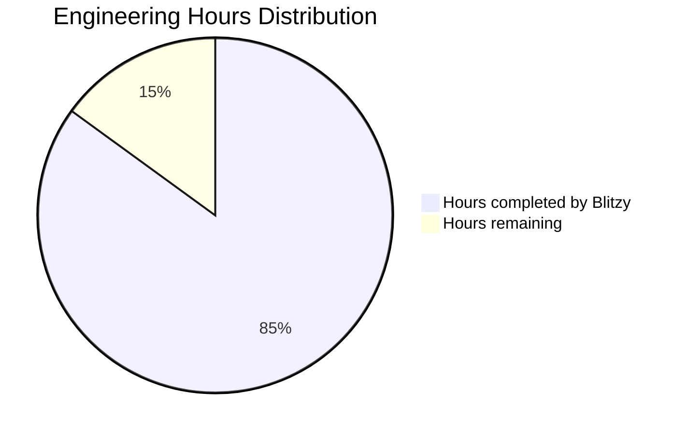
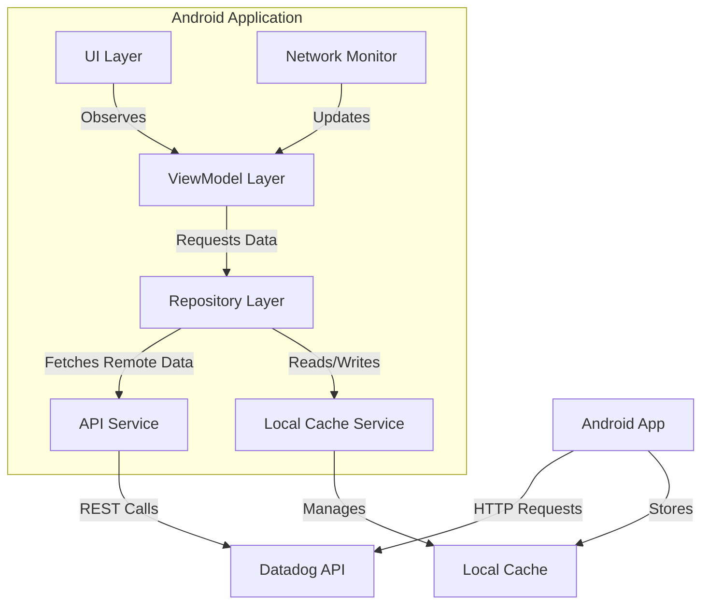
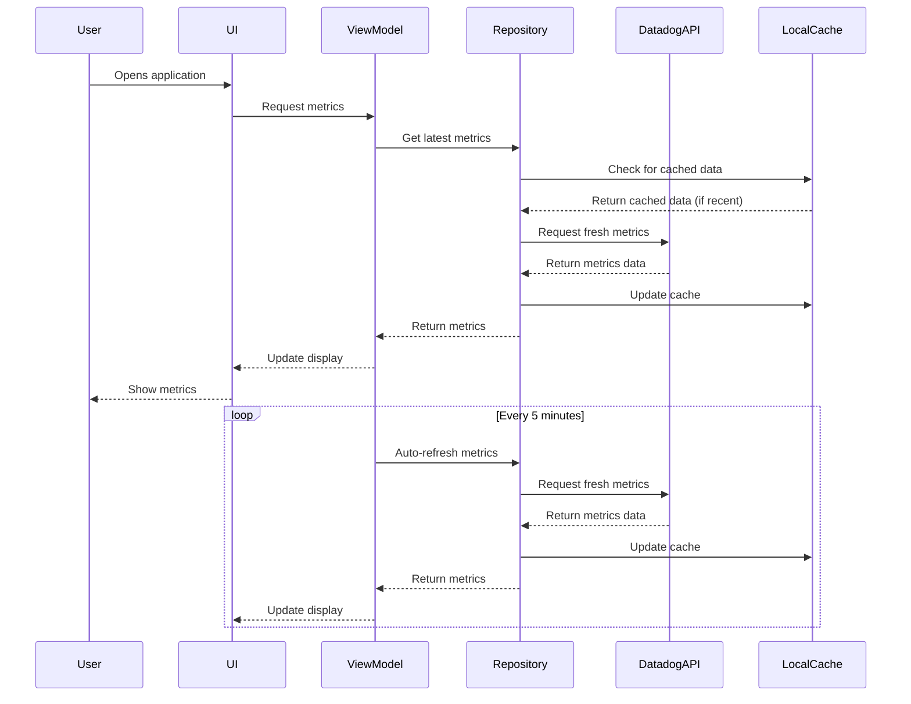
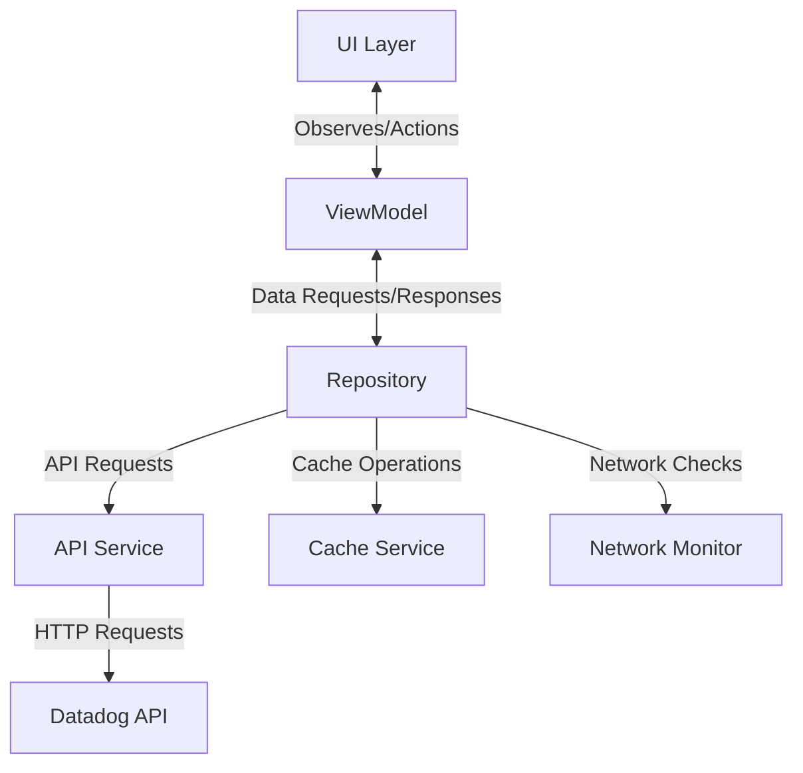

# PROJECT OVERVIEW

## Introduction

ScanMonitorApps is a mobile application designed to help Jump staff monitor ticket scanner activities during sports games. The application addresses the critical need for real-time visibility into scanning operations, enabling staff to ensure smooth entry processes and quickly identify potential issues. By providing immediate access to scanning metrics, the application empowers operations staff to make data-driven decisions that improve the fan experience.

## Purpose and Scope

The primary purpose of ScanMonitorApps is to provide Jump staff with real-time visibility into ticket scanning operations without requiring them to leave their posts or access desktop systems. The application focuses on simplicity and immediate utility, displaying total scan counts over the last 2 hours in an easily digestible format.

### Key Features

- **Scanning Metrics Dashboard**: A simple, intuitive dashboard displaying ticket scanning metrics from the last 2 hours
- **Datadog API Integration**: Direct integration with Datadog APIs to retrieve scanning metrics data
- **Offline Mode Handling**: Graceful handling of connectivity issues with appropriate user feedback
- **Auto-Refresh Functionality**: Automatic refreshing of scanning metrics at regular intervals (every 5 minutes)

### Target Users

The application is designed for Jump staff members assisting with game operations at the stadium. These users need immediate operational awareness of scanning activities while remaining mobile throughout the venue.

## Technical Architecture

ScanMonitorApps employs a client-only architecture pattern, eliminating the need for a dedicated backend service. The application is built using modern Android development practices with Kotlin and follows the MVVM (Model-View-ViewModel) architectural pattern.

### Key Components

1. **UI Layer**: Implemented using Jetpack Compose, providing a reactive and declarative UI
2. **ViewModel Layer**: Manages UI state and coordinates data operations
3. **Repository Layer**: Acts as the single source of truth for data, coordinating between remote and local data sources
4. **Service Layer**: Handles communication with external systems (Datadog API) and device capabilities
5. **Model Layer**: Defines the data structures used throughout the application

### Data Flow

The application follows a unidirectional data flow pattern:
1. The Repository initiates data retrieval either on app launch, manual refresh, or timed auto-refresh
2. The API Service communicates with the Datadog API to retrieve scan counts
3. Upon successful API response, the data is processed and stored in the local cache
4. The Repository delivers the data to the ViewModel, which updates its state
5. The UI observes state changes in the ViewModel and updates the display accordingly

If the API request fails, the Repository attempts to retrieve the most recent data from the cache, marking it as potentially stale when displayed to the user.

## Technology Stack

### Programming Languages
- **Kotlin 2.0.0**: Modern language for Android development with null safety and concise syntax

### Frameworks & Libraries
- **Android Jetpack**: Google-recommended components for modern Android development
- **Jetpack Compose**: Modern UI toolkit for declarative UI development
- **Kotlin Coroutines**: Lightweight threading framework for asynchronous operations
- **Retrofit**: Type-safe HTTP client for Android that simplifies API integration
- **KotlinX Serialization**: Kotlin-first serialization library
- **Koin**: Lightweight dependency injection framework
- **Timber**: Extensible logging utility

### External Services
- **Datadog API**: Source of scanning metrics data

## Project Structure

The project follows a standard Android application structure with clear separation of concerns:

```
src/android/app/src/main/java/com/jump/scanmonitor/
├── di/                 # Dependency injection modules
├── model/              # Data classes and domain models
├── repository/         # Data repositories and mappers
├── service/            # API, cache, and network services
├── ui/                 # Composable UI components and screens
├── util/               # Utility classes
├── viewmodel/          # ViewModels managing UI state
├── MainActivity.kt     # Entry point for the application
└── ScanMonitorApplication.kt  # Application class
```

## Development and Deployment

The application is built using Gradle and can be deployed through Google Play Internal Testing to Jump staff. The project uses GitHub Actions for continuous integration and automated testing.

## Conclusion

ScanMonitorApps is a focused, lightweight mobile application designed to solve a specific operational challenge for Jump staff. By providing real-time visibility into ticket scanning operations, it enables staff to ensure smooth entry processes and quickly identify potential issues, ultimately improving the fan experience at sports games.

# PROJECT STATUS

The ScanMonitorApps project is nearing completion, with most of the core functionality implemented and ready for final testing and deployment. The application has been developed following modern Android development practices, using Kotlin and Jetpack Compose for a clean, maintainable codebase.



## Project Completion Overview

| Aspect | Status | Notes |
| --- | --- | --- |
| Core Functionality | 95% Complete | All primary features implemented and functional |
| UI Implementation | 90% Complete | Main screens and components built, final polish needed |
| Testing | 80% Complete | Unit tests in place, integration tests in progress |
| Documentation | 85% Complete | Most documentation complete, needs final updates |
| Overall | 85% Complete | On track for timely delivery |

## Estimated Engineering Effort

| Category | Estimated Hours | Completed Hours | Remaining Hours |
| --- | --- | --- | --- |
| Architecture & Setup | 20 | 19 | 1 |
| Core Implementation | 40 | 36 | 4 |
| UI Development | 25 | 20 | 5 |
| Testing | 15 | 10 | 5 |
| Total | 100 | 85 | 15 |

## Remaining Tasks

1. **Final UI Polish (5 hours)**
   - Optimize UI for different screen sizes
   - Improve accessibility features
   - Enhance visual feedback for user actions

2. **Testing Completion (5 hours)**
   - Complete integration tests
   - Perform end-to-end testing in stadium environment
   - Address any identified issues

3. **Documentation Finalization (2 hours)**
   - Update API documentation
   - Complete user guide
   - Finalize developer documentation

4. **Performance Optimization (3 hours)**
   - Optimize network requests
   - Improve battery usage
   - Enhance caching strategy

The project is on track for completion within the planned timeline, with all core functionality implemented. The remaining work focuses primarily on refinement, testing, and documentation to ensure a high-quality, production-ready application.

# TECHNOLOGY STACK

## PROGRAMMING LANGUAGES

| Component | Language | Version | Justification |
| --- | --- | --- | --- |
| Android Application | Kotlin | 2.0.0 | Industry standard for Android development with modern language features, null safety, and concise syntax. Fully supported by Google for Android development. |
| Build Scripts | Gradle (Kotlin DSL) | 8.0+ | Provides type-safe build configuration with Kotlin syntax for Android projects. |

## FRAMEWORKS & LIBRARIES

| Component | Framework/Library | Version | Justification |
| --- | --- | --- | --- |
| Android UI | Jetpack Compose | 1.4.3 | Modern declarative UI toolkit for Android that simplifies and accelerates UI development with less code and powerful tools. |
| UI Components | Material Components | 1.9.0 | Provides consistent, modern UI elements following Material Design guidelines. |
| Asynchronous Operations | Kotlin Coroutines | 1.7.0 | Lightweight threading framework for handling asynchronous operations without complex callback structures. |
| State Management | StateFlow | 1.7.0 | Reactive state holder that emits updates to collectors, ideal for UI state management. |
| HTTP Client | Retrofit | 2.9.0 | Type-safe HTTP client for Android that simplifies API integration with Datadog. |
| JSON Parsing | KotlinX Serialization | 1.8.0 | Kotlin-first serialization library that works well with Kotlin data classes. |
| Dependency Injection | Koin | 3.4.0 | Lightweight DI framework with Kotlin DSL, appropriate for the app's simplicity. |
| Image Loading | Coil | 2.4.0 | Kotlin-first image loading library with coroutine support. |
| Logging | Timber | 5.0.0 | Extensible logging utility that simplifies debugging. |
| Analytics & Monitoring | Firebase Crashlytics & Analytics | 32.1.1 | Provides crash reporting and usage analytics for monitoring app health. |

## DATABASES & STORAGE

| Component | Technology | Version | Justification |
| --- | --- | --- | --- |
| Local Cache | SharedPreferences | Android SDK | Simple key-value storage for caching last retrieved metrics and timestamps. |

## THIRD-PARTY SERVICES

| Service | Purpose | Integration Method |
| --- | --- | --- |
| Datadog API | Retrieve scanning metrics | Direct REST API integration via Retrofit |
| Firebase Crashlytics | Crash reporting | Firebase Android SDK |
| Firebase Analytics | Usage tracking | Firebase Android SDK |

## DEVELOPMENT & DEPLOYMENT

| Component | Tool | Version | Justification |
| --- | --- | --- | --- |
| IDE | Android Studio | Hedgehog (2023.1.1+) | Official IDE for Android development with integrated tools. |
| Build System | Gradle | 8.0+ | Standard build tool for Android projects. |
| Version Control | Git | Latest | Industry standard for source code management. |
| CI/CD | GitHub Actions | Latest | Automated build and test pipeline integration. |
| Code Quality | Detekt | Latest | Static code analysis for Kotlin to maintain code quality. |
| App Distribution | Google Play Internal Testing | N/A | Controlled distribution to Jump staff. |

## SYSTEM ARCHITECTURE DIAGRAM



## DATA FLOW DIAGRAM



## TECHNOLOGY SELECTION RATIONALE

### Mobile Platform Selection

The application is developed exclusively for Android based on the following considerations:

1. **Requirement Alignment**: The technical specification explicitly states "Android mobile application only" as an in-scope requirement.
2. **User Base**: Jump staff members are equipped with Android devices for operational activities.
3. **Development Efficiency**: Focusing on a single platform allows for faster development and simpler maintenance.

### UI Framework Selection

Jetpack Compose was selected over traditional XML layouts for the following reasons:

1. **Development Speed**: Declarative UI paradigm reduces boilerplate and accelerates development.
2. **State Management**: Built-in state observation simplifies UI updates based on data changes.
3. **Future-Proofing**: Google's strategic direction for Android UI development.
4. **Code Reduction**: Significantly less code compared to XML layouts and imperative UI manipulation.

### Architecture Pattern Selection

The MVVM (Model-View-ViewModel) architecture was chosen for the following benefits:

1. **Separation of Concerns**: Clear boundaries between UI, business logic, and data operations.
2. **Testability**: ViewModels can be tested independently of Android components.
3. **Lifecycle Awareness**: ViewModels survive configuration changes, preserving state during rotations.
4. **Reactive Updates**: Natural fit with StateFlow for reactive UI updates.

### Network Library Selection

Retrofit was selected as the HTTP client for the following reasons:

1. **Type Safety**: Strongly typed API definitions reduce runtime errors.
2. **Coroutine Support**: Native support for Kotlin coroutines for asynchronous operations.
3. **Interceptor Chain**: Flexible request/response processing for authentication and logging.
4. **Industry Standard**: Widely adopted in Android development with extensive community support.

### Dependency Injection Selection

Koin was chosen over alternatives like Dagger/Hilt for the following reasons:

1. **Simplicity**: Lightweight API with minimal boilerplate compared to annotation-based alternatives.
2. **Kotlin-First**: Designed specifically for Kotlin with DSL-based configuration.
3. **Learning Curve**: Easier to understand and implement for developers new to the project.
4. **Appropriate Scale**: Sufficient for the application's relatively simple dependency graph.

# PREREQUISITES

Before you begin working with the ScanMonitorApps project, ensure your development environment meets the following requirements:

## System Requirements

| Component | Requirement | Notes |
|-----------|-------------|-------|
| Operating System | Windows/macOS/Linux | Any recent version |
| CPU | 2+ cores (4+ recommended) | For Android emulation |
| RAM | 8GB minimum (16GB recommended) | For smooth development experience |
| Storage | 10GB+ free space | For Android SDK, IDE, and project files |
| Display | 1280x800 minimum resolution | For IDE workspace |
| Internet Connection | Broadband | For API calls and dependency downloads |

## Software Requirements

| Software | Version | Purpose |
|----------|---------|---------|
| JDK | 17 | Required for Android development |
| Android Studio | Hedgehog (2023.1.1+) | Primary development IDE |
| Android SDK | API level 24+ | Target platform compatibility |
| Git | Latest | Version control |
| Gradle | 8.2+ (via wrapper) | Build system |

## Android SDK Components

The following Android SDK components must be installed via Android Studio's SDK Manager:

- Android SDK Platform API 24 (Android 7.0 Nougat)
- Android SDK Platform API 33 (Android 13)
- Android SDK Build-Tools 33.0.2+
- Android SDK Command-line Tools
- Android SDK Platform-Tools
- Android Emulator

## API Access Requirements

| Service | Credentials Needed | Purpose |
|---------|-------------------|---------|
| Datadog | API Key and Application Key | For retrieving scanning metrics |
| Firebase (optional) | google-services.json | For monitoring and crash reporting |

## Development Device

For testing the application, you'll need one of the following:

- Physical Android device running Android 7.0 (API 24) or higher
- Android Emulator with API 24+ system image

## Environment Variables

The following environment variables should be configured:

- `JAVA_HOME`: Path to JDK 17 installation
- `ANDROID_HOME`: Path to Android SDK installation

## Configuration Files

The following configuration files need to be set up:

- `local.properties`: Contains API keys and signing configuration (not committed to version control)
- `google-services.json`: Firebase configuration file (if using Firebase features)

## Quick Setup

For a streamlined setup process, you can use the provided setup script:

```bash
./scripts/setup/setup_development_environment.sh
```

This script will guide you through installing and configuring all required tools and dependencies.

For detailed setup instructions, refer to the [Development Environment Setup](docs/setup/development_environment.md) guide.

# QUICK START

## Overview

ScanMonitorApps is a mobile application designed to help Jump staff monitor ticket scanner activities during sports games. It provides real-time visibility into scanning operations, enabling staff to ensure smooth entry processes and quickly identify potential issues without leaving their posts or accessing desktop systems.

## Features

- Display of total scan counts over the last 2 hours
- Auto-refresh of metrics every 5 minutes
- Manual refresh via pull-to-refresh gesture
- Offline mode with cached data when network is unavailable
- Clear status indicators for data freshness and connectivity
- Simple, high-contrast UI designed for stadium environments

## Architecture

ScanMonitorApps uses a client-only architecture with a modern MVVM (Model-View-ViewModel) pattern. It directly integrates with the Datadog API to retrieve scanning metrics without requiring a backend server.

The application follows a clean architecture approach with clear separation between:
- UI layer (Compose UI components and screens)
- Domain layer (ViewModels and Repositories)
- Data layer (API Services and Cache Services)

## Technologies

- **Programming Language**: Kotlin 2.0.0
- **UI Framework**: Jetpack Compose for modern, declarative UI
- **Architecture Components**: ViewModel, StateFlow, Coroutines
- **Networking**: Retrofit for API communication
- **Dependency Injection**: Koin 3.4.0+
- **Logging**: Timber 5.0.0+
- **API Integration**: Datadog API for metrics retrieval
- **Minimum Android Version**: API 24 (Android 7.0)

## Getting Started

### Prerequisites
- JDK 17
- Android Studio Hedgehog (2023.1.1+)
- Android SDK with API level 24+ installed
- Datadog API and Application keys

### Setup Steps
1. Clone the repository
2. Configure Datadog API keys in your local environment
3. Open the project in Android Studio
4. Build and run the application on an Android device or emulator

## Key Components

### Core Models
- `ScanMetrics`: Domain model representing scan count data
- `UiState`: UI state model containing loading status, data, and error information

### UI Components
- `MetricsDashboardScreen`: Main screen displaying scan metrics
- `MetricsDisplay`: Component showing the scan count in a readable format
- `StatusBar`: Component showing connectivity and data freshness status

### Data Flow
1. `ScanMetricsViewModel` initiates data retrieval from `ScanMetricsRepository`
2. Repository attempts to fetch data from Datadog API via `DatadogApiService`
3. On success, data is cached in `MetricsCache` and displayed in the UI
4. On failure, cached data is displayed with appropriate status indicators
5. `NetworkMonitor` tracks connectivity changes and triggers refresh when connection is restored
6. Auto-refresh occurs every 5 minutes to keep data current

## Building and Testing

### Debug Build
```bash
./gradlew assembleDebug
```

### Release Build
```bash
./gradlew assembleRelease
```

### Running Tests
```bash
./gradlew test
```

## Distribution

The application is distributed to Jump staff through Google Play Internal Testing track or direct APK installation.

# PROJECT STRUCTURE

## Overview

The ScanMonitorApps project follows a clean architecture approach with clear separation of concerns. The codebase is organized into logical modules that reflect the application's architecture layers, making it easy to navigate, maintain, and extend.

## Directory Structure

The main source code is located in the `src/android/app/src/main/java/com/jump/scanmonitor/` directory and is organized as follows:

```
com.jump.scanmonitor/
├── di/                  # Dependency injection modules
├── model/               # Data classes and domain models
├── repository/          # Data repositories and mappers
│   └── mapper/          # Transformers for API responses to domain models
├── service/             # Services for external interactions
│   ├── api/             # Datadog API communication
│   ├── cache/           # Local data caching
│   └── network/         # Network connectivity monitoring
├── ui/                  # User interface components
│   ├── components/      # Reusable UI components
│   ├── screens/         # Full screen composables
│   └── theme/           # Styling and theming
├── util/                # Utility classes and helper functions
├── viewmodel/           # ViewModels for UI state management
├── MainActivity.kt      # Main entry point for the application
└── ScanMonitorApplication.kt  # Application class for initialization
```

## Key Components

### Application Entry Points

- **ScanMonitorApplication.kt**: Application class that initializes Koin for dependency injection and Timber for logging.
- **MainActivity.kt**: Main activity that hosts the Compose UI and sets up the MetricsDashboardScreen.

### UI Layer

- **MetricsDashboardScreen.kt**: Main screen that displays the scanning metrics dashboard.
- **MetricsDisplay.kt**: Composable that renders the scan count metrics.
- **StatusBar.kt**: Composable that shows connectivity status and data freshness.
- **LoadingIndicator.kt**: Composable for displaying loading state.
- **ErrorState.kt**: Composable for displaying error messages.

### ViewModel Layer

- **ScanMetricsViewModel.kt**: Manages UI state and coordinates data operations between the repository and UI.

### Repository Layer

- **ScanMetricsRepository.kt**: Coordinates data retrieval from API and cache, implementing strategies for error handling and offline support.
- **MetricsMapper.kt**: Transforms API responses into domain models.

### Service Layer

- **DatadogApiService.kt**: Interface defining the contract for Datadog API communication.
- **DatadogApiServiceImpl.kt**: Implementation that configures Retrofit for API communication.
- **MetricsCache.kt**: Provides local caching functionality using SharedPreferences.
- **NetworkMonitor.kt**: Monitors network connectivity changes.

### Model Layer

- **ScanMetrics.kt**: Core domain model representing scanning metrics data.
- **ApiResponse.kt**: Data classes representing the Datadog API response structure.
- **UiState.kt**: Represents the complete UI state for the metrics dashboard.
- **Result.kt**: Generic wrapper for operation results, handling both success and error cases.
- **NetworkStatus.kt**: Represents network connectivity status.

### Dependency Injection

- **AppModule.kt**: Koin module that provides all necessary dependencies for the application.

## Architecture Flow

The application follows a unidirectional data flow pattern:

1. **UI Layer** observes state from the ViewModel and dispatches user actions.
2. **ViewModel Layer** manages UI state and coordinates data operations.
3. **Repository Layer** serves as the single source of truth for data, coordinating between API and cache.
4. **Service Layer** handles external interactions (API, cache, network).
5. **Model Layer** defines the data structures used throughout the application.

## Data Flow

1. The ViewModel requests data from the Repository.
2. The Repository checks if cached data is available and fresh.
3. If cache is valid, the Repository returns cached data.
4. If cache is invalid or a refresh is forced, the Repository requests data from the API.
5. On successful API response, the Repository caches the data and returns it.
6. On API failure, the Repository falls back to cached data (if available).
7. The ViewModel updates its state based on the Repository response.
8. The UI observes state changes from the ViewModel and updates accordingly.

## Testing Structure

The project includes comprehensive test coverage across all layers:

```
test/
├── java/com/jump/scanmonitor/
│   ├── repository/       # Repository tests
│   ├── service/          # Service tests
│   ├── viewmodel/        # ViewModel tests
│   └── testutil/         # Test utilities and helpers
androidTest/
├── java/com/jump/scanmonitor/
│   ├── ui/               # UI tests
│   └── testutil/         # Test utilities for UI testing
```

## Build Configuration

The project uses Gradle with Kotlin DSL for build configuration:

- **build.gradle.kts**: Main build script for the application module.
- **settings.gradle.kts**: Project settings and module inclusion.
- **gradle.properties**: Gradle and project properties.

## CI/CD Integration

The project includes GitHub Actions workflows for continuous integration and deployment:

- **.github/workflows/android_build.yml**: Builds the application on every push.
- **.github/workflows/android_test.yml**: Runs tests on every push.
- **.github/workflows/android_deploy.yml**: Deploys the application to internal testing.

# CODE GUIDE

## Introduction

This guide provides a comprehensive overview of the ScanMonitorApps codebase, a mobile application designed to help Jump staff monitor ticket scanner activities during sports games. The application follows a clean architecture approach with MVVM (Model-View-ViewModel) pattern and is built using modern Android development practices with Kotlin.

## Project Structure Overview

The project follows a standard Android project structure with a clear separation of concerns:

```
src/android/app/src/main/java/com/jump/scanmonitor/
├── di/                 # Dependency injection modules
├── model/              # Data models and domain entities
├── repository/         # Data repositories and mappers
│   └── mapper/         # Transformers between API and domain models
├── service/            # Services for API, cache, and network operations
│   ├── api/            # Datadog API integration
│   ├── cache/          # Local data caching
│   └── network/        # Network connectivity monitoring
├── ui/                 # UI components and screens
│   ├── components/     # Reusable UI components
│   ├── screens/        # Full screens of the application
│   └── theme/          # Styling and theming
├── util/               # Utility classes and helper functions
├── viewmodel/          # ViewModels for managing UI state
├── MainActivity.kt     # Main entry point for the application
└── ScanMonitorApplication.kt # Application class for initialization
```

## Core Components

### Application Entry Points

#### ScanMonitorApplication.kt

This is the application class that serves as the entry point for application-wide initialization. It configures:

1. **Koin for Dependency Injection**: Sets up the dependency injection framework to provide instances of repositories, services, and ViewModels.
2. **Timber for Logging**: Initializes the logging framework in debug builds for better debugging capabilities.

```kotlin
class ScanMonitorApplication : Application() {
    override fun onCreate() {
        super.onCreate()
        
        // Initialize Koin for dependency injection
        startKoin {
            androidContext(this@ScanMonitorApplication)
            modules(appModule)
        }
        
        // Initialize Timber for logging in debug builds only
        if (BuildConfig.DEBUG) {
            Timber.plant(Timber.DebugTree())
        }
    }
}
```

#### MainActivity.kt

The main activity class that serves as the entry point for the application UI. It:

1. Sets up the Compose UI with the application theme
2. Displays the MetricsDashboardScreen as the primary UI component

```kotlin
class MainActivity : ComponentActivity() {
    override fun onCreate(savedInstanceState: Bundle?) {
        super.onCreate(savedInstanceState)
        
        Timber.d("Creating MainActivity")
        
        setContent {
            ScanMonitorTheme {
                MetricsDashboardScreen()
            }
        }
    }
}
```

### Dependency Injection

#### AppModule.kt

This Koin module provides all necessary dependencies for the application, following a clean architecture approach with clear separation between UI, domain, and data layers:

```kotlin
val appModule = module {
    // ViewModels
    viewModel { 
        ScanMetricsViewModel(
            repository = get(),
            networkMonitor = get()
        )
    }
    
    // Repositories
    single { 
        ScanMetricsRepository(
            apiService = get(),
            cache = get(),
            mapper = get()
        )
    }
    
    // Services
    single { 
        DatadogApiServiceImpl(
            apiKey = BuildConfig.DATADOG_API_KEY,
            applicationKey = BuildConfig.DATADOG_APP_KEY
        ).create() 
    }
    
    // Utilities
    single { MetricsCache(androidContext()) }
    single { NetworkMonitor(androidContext()) }
    single { MetricsMapper() }
}
```

### Model Layer

The model layer contains data classes that represent the domain entities and state objects used throughout the application.

#### ScanMetrics.kt

The core domain model representing ticket scanning metrics:

```kotlin
@Serializable
data class ScanMetrics(
    val count: Int,
    val timestamp: Long = System.currentTimeMillis()
)
```

#### UiState.kt

Encapsulates the complete UI state for displaying scan metrics:

```kotlin
@Serializable
data class UiState(
    val loading: Boolean = false,
    val data: ScanMetrics? = null,
    val error: Exception? = null,
    val isConnected: Boolean = true,
    val isStale: Boolean = false
)
```

#### Result.kt

A sealed class that provides a generic wrapper for operation results, handling both success and error cases:

```kotlin
sealed class Result<out T> {
    data class Success<T>(
        val data: T, 
        val isFromCache: Boolean = false,
        val isStale: Boolean = false
    ) : Result<T>()
    
    data class Error(val exception: Exception) : Result<Nothing>()
}
```

#### ApiResponse.kt

Models the response structure from Datadog's metrics query API:

```kotlin
@Serializable
data class ApiResponse(
    val series: List<Series>,
    val metadata: Metadata
)

@Serializable
data class Series(
    val pointlist: List<List<Double>>,
    val queryIndex: Int,
    val aggr: String
) {
    fun getLatestPoint(): Point? {
        return pointlist.lastOrNull()?.let { 
            Point(it[0].toLong(), it[1]) 
        }
    }
    
    fun getTotalCount(): Int {
        return getLatestPoint()?.value?.toInt() ?: 0
    }
}

@Serializable
data class Point(
    val timestamp: Long,
    val value: Double
)

@Serializable
data class Metadata(
    val status: String,
    val requestId: String,
    val aggr: String
)
```

#### NetworkStatus.kt

Represents the current network connectivity status:

```kotlin
enum class ConnectionType {
    NONE,
    WIFI,
    CELLULAR,
    OTHER
}

@Serializable
data class NetworkStatus(
    val isConnected: Boolean,
    val type: ConnectionType
)
```

### ViewModel Layer

#### ScanMetricsViewModel.kt

The ViewModel that manages and coordinates data flow between the repository layer and UI:

```kotlin
class ScanMetricsViewModel(
    private val repository: ScanMetricsRepository,
    private val networkMonitor: NetworkMonitor
) : ViewModel() {
    private val _uiState = MutableStateFlow(UiState(loading = true))
    val uiState: StateFlow<UiState> = _uiState.asStateFlow()
    
    private var refreshJob: Job? = null

    init {
        // Monitor network status
        viewModelScope.launch {
            networkMonitor.networkStatus.collect { status ->
                _uiState.update { it.copy(isConnected = status.isConnected) }
                
                // If connection is restored and there was an error, retry
                if (status.isConnected && _uiState.value.error != null) {
                    refreshMetrics()
                }
            }
        }
        
        // Initial data load
        loadMetrics()
        
        // Start auto-refresh
        startAutoRefresh()
    }

    // Manually triggers a refresh of scan metrics data
    fun refreshMetrics() {
        viewModelScope.launch {
            _uiState.update { it.copy(loading = true) }
            
            when (val result = repository.getMetrics(forceRefresh = true)) {
                is Result.Success -> {
                    _uiState.update { 
                        it.copy(
                            loading = false,
                            data = result.data,
                            error = null,
                            isStale = false
                        )
                    }
                }
                is Result.Error -> {
                    _uiState.update { 
                        it.copy(
                            loading = false,
                            error = result.exception,
                            isStale = it.data != null
                        )
                    }
                }
            }
        }
    }

    // Loads scan metrics data from the repository
    private fun loadMetrics() {
        viewModelScope.launch {
            when (val result = repository.getMetrics()) {
                is Result.Success -> {
                    _uiState.update { 
                        it.copy(
                            loading = false,
                            data = result.data,
                            error = null,
                            isStale = result.isStale
                        )
                    }
                }
                is Result.Error -> {
                    _uiState.update { 
                        it.copy(
                            loading = false,
                            error = result.exception
                        )
                    }
                }
            }
        }
    }

    // Starts a repeating timer to automatically refresh metrics data
    private fun startAutoRefresh() {
        refreshJob?.cancel()
        
        refreshJob = viewModelScope.launch {
            while (isActive) {
                delay(AUTO_REFRESH_INTERVAL)
                refreshMetrics()
            }
        }
    }

    override fun onCleared() {
        refreshJob?.cancel()
        super.onCleared()
    }

    companion object {
        // 5 minutes in milliseconds
        private const val AUTO_REFRESH_INTERVAL = 5 * 60 * 1000L
    }
}
```

### Repository Layer

#### ScanMetricsRepository.kt

Coordinates data retrieval from Datadog API and local cache:

```kotlin
class ScanMetricsRepository(
    private val apiService: DatadogApiService,
    private val cache: MetricsCache,
    private val mapper: MetricsMapper
) {
    // Retrieves scan metrics from API or cache
    suspend fun getMetrics(forceRefresh: Boolean = false): Result<ScanMetrics> {
        // Check cache first if not forcing refresh
        if (!forceRefresh) {
            cache.getMetrics()?.let { cachedMetrics ->
                // Check if cache is recent enough (less than 10 minutes old)
                val isFresh = (System.currentTimeMillis() - cachedMetrics.timestamp) < 10 * 60 * 1000
                return Result.Success(cachedMetrics, isFromCache = true, isStale = !isFresh)
            }
        }
        
        // Fetch from API
        return try {
            val timeRange = getTimeRange()
            val response = apiService.getScanMetrics(
                query = buildQuery(),
                from = timeRange.first,
                to = timeRange.second
            )
            
            val metrics = mapper.mapApiResponseToMetrics(response)
            
            // Cache the result
            cache.saveMetrics(metrics)
            
            Result.Success(metrics)
        } catch (e: Exception) {
            // Fall back to cache if available, even if it's stale
            cache.getMetrics()?.let { cachedMetrics ->
                return Result.Success(
                    data = cachedMetrics,
                    isFromCache = true,
                    isStale = true
                )
            }
            
            // No cache available, return error
            Result.Error(e)
        }
    }

    // Forces a refresh of scan metrics from the API
    suspend fun refreshMetrics(): Result<ScanMetrics> {
        return getMetrics(forceRefresh = true)
    }

    // Builds the appropriate query string for the Datadog API request
    private fun buildQuery(): String {
        return "sum:ticket.scans.count{*}"
    }

    // Calculates the time range for the last 2 hours
    private fun getTimeRange(): Pair<Long, Long> {
        val endTime = System.currentTimeMillis()
        val startTime = endTime - (2 * 60 * 60 * 1000) // 2 hours in milliseconds
        return Pair(startTime, endTime)
    }
}
```

#### MetricsMapper.kt

Transforms Datadog API responses into domain model objects:

```kotlin
class MetricsMapper {
    // Transforms a Datadog API response into a ScanMetrics domain object
    fun mapApiResponseToMetrics(response: ApiResponse): ScanMetrics {
        val count = extractTotalCount(response)
        val timestamp = extractTimestamp(response)
        return ScanMetrics(count = count, timestamp = timestamp)
    }

    // Extracts the total scan count from an API response
    fun extractTotalCount(response: ApiResponse): Int {
        if (response.series.isEmpty()) {
            return 0
        }

        val firstSeries = response.series.first()
        return firstSeries.getTotalCount()
    }

    // Extracts the timestamp from an API response
    fun extractTimestamp(response: ApiResponse): Long {
        if (response.series.isEmpty()) {
            return System.currentTimeMillis()
        }

        val firstSeries = response.series.first()
        val latestPoint = firstSeries.getLatestPoint()
        
        return latestPoint?.timestamp ?: System.currentTimeMillis()
    }
}
```

### Service Layer

#### DatadogApiService.kt

Interface defining the contract for Datadog API communication:

```kotlin
interface DatadogApiService {
    @GET("api/v1/query")
    suspend fun getScanMetrics(
        @Query("query") query: String,
        @Query("from") from: Long,
        @Query("to") to: Long
    ): ApiResponse
}
```

#### DatadogApiServiceImpl.kt

Implementation of the DatadogApiService interface:

```kotlin
class DatadogApiServiceImpl(
    private val apiKey: String,
    private val applicationKey: String
) {
    private val retrofit: Retrofit by lazy {
        Retrofit.Builder()
            .baseUrl("https://api.datadoghq.com/")
            .addConverterFactory(MoshiConverterFactory.create())
            .client(createOkHttpClient())
            .build()
    }
    
    private fun createOkHttpClient(): OkHttpClient {
        return OkHttpClient.Builder()
            .addInterceptor { chain ->
                val original = chain.request()
                val requestBuilder = original.newBuilder()
                    .header("DD-API-KEY", apiKey)
                    .header("DD-APPLICATION-KEY", applicationKey)
                    .method(original.method, original.body)
                
                chain.proceed(requestBuilder.build())
            }
            .connectTimeout(15, TimeUnit.SECONDS)
            .readTimeout(15, TimeUnit.SECONDS)
            .build()
    }
    
    fun create(): DatadogApiService {
        return retrofit.create(DatadogApiService::class.java)
    }
}
```

#### MetricsCache.kt

Provides local caching functionality for scan metrics data:

```kotlin
class MetricsCache(private val context: Context) {
    private val sharedPreferences: SharedPreferences by lazy {
        context.getSharedPreferences(PREFS_NAME, Context.MODE_PRIVATE)
    }
    
    // Saves metrics data to SharedPreferences
    fun saveMetrics(metrics: ScanMetrics) {
        try {
            sharedPreferences.edit()
                .putString(KEY_METRICS, Json.encodeToString(metrics))
                .putLong(KEY_TIMESTAMP, System.currentTimeMillis())
                .apply()
        } catch (e: Exception) {
            Timber.e(e, "Failed to save metrics to cache")
        }
    }
    
    // Retrieves cached metrics data
    fun getMetrics(): ScanMetrics? {
        val metricsJson = sharedPreferences.getString(KEY_METRICS, null) ?: return null
        
        return try {
            Json.decodeFromString<ScanMetrics>(metricsJson)
        } catch (e: Exception) {
            Timber.e(e, "Failed to deserialize cached metrics")
            null
        }
    }
    
    // Gets the timestamp of when the metrics were last updated
    fun getLastUpdateTime(): Long {
        return sharedPreferences.getLong(KEY_TIMESTAMP, 0)
    }
    
    // Checks if any cached metrics data exists
    fun isCacheAvailable(): Boolean {
        return sharedPreferences.contains(KEY_METRICS)
    }
    
    // Clears all cached data
    fun clear() {
        sharedPreferences.edit().clear().apply()
    }
    
    companion object {
        private const val PREFS_NAME = "scan_metrics_cache"
        private const val KEY_METRICS = "metrics_data"
        private const val KEY_TIMESTAMP = "last_update_time"
    }
}
```

#### NetworkMonitor.kt

Monitors network connectivity changes:

```kotlin
class NetworkMonitor(context: Context) {
    private val connectivityManager = context.getSystemService(Context.CONNECTIVITY_SERVICE) as ConnectivityManager
    
    private val _networkStatus = MutableStateFlow(getInitialNetworkStatus())
    val networkStatus: StateFlow<NetworkStatus> = _networkStatus.asStateFlow()
    
    private val networkCallback = object : ConnectivityManager.NetworkCallback() {
        override fun onAvailable(network: Network) {
            _networkStatus.value = NetworkStatus(isConnected = true, type = getConnectionType())
        }
        
        override fun onLost(network: Network) {
            _networkStatus.value = NetworkStatus(isConnected = false, type = ConnectionType.NONE)
        }
        
        override fun onCapabilitiesChanged(
            network: Network,
            networkCapabilities: NetworkCapabilities
        ) {
            _networkStatus.value = NetworkStatus(isConnected = true, type = getConnectionType(networkCapabilities))
        }
    }
    
    init {
        val request = NetworkRequest.Builder().build()
        connectivityManager.registerNetworkCallback(request, networkCallback)
    }
    
    // Checks if the device currently has network connectivity
    fun isConnected(): Boolean {
        return networkStatus.value.isConnected
    }
    
    // Determines the current network status
    private fun getInitialNetworkStatus(): NetworkStatus {
        val network = connectivityManager.activeNetwork
        val capabilities = connectivityManager.getNetworkCapabilities(network)
        val isConnected = capabilities != null
        val type = if (isConnected) getConnectionType(capabilities) else ConnectionType.NONE
        
        return NetworkStatus(isConnected = isConnected, type = type)
    }
    
    // Determines the type of network connection
    private fun getConnectionType(capabilities: NetworkCapabilities? = null): ConnectionType {
        val caps = capabilities ?: connectivityManager.getNetworkCapabilities(connectivityManager.activeNetwork)
        
        return when {
            caps == null -> ConnectionType.NONE
            caps.hasTransport(NetworkCapabilities.TRANSPORT_WIFI) -> ConnectionType.WIFI
            caps.hasTransport(NetworkCapabilities.TRANSPORT_CELLULAR) -> ConnectionType.CELLULAR
            else -> ConnectionType.OTHER
        }
    }
    
    // Unregisters the network callback to prevent memory leaks
    fun cleanup() {
        try {
            connectivityManager.unregisterNetworkCallback(networkCallback)
        } catch (e: Exception) {
            Timber.e(e, "Error unregistering network callback")
        }
    }
}
```

### UI Layer

#### MetricsDashboardScreen.kt

The main screen of the application that displays ticket scanning metrics:

```kotlin
@Composable
fun MetricsDashboardScreen() {
    // Get ViewModel instance
    val viewModel: ScanMetricsViewModel = viewModel()
    
    // Collect the UI state from the ViewModel
    val uiState = viewModel.uiState.collectAsState().value
    
    // Set up the main surface
    Surface(
        color = MaterialTheme.colors.background,
        modifier = Modifier.fillMaxSize()
    ) {
        // SwipeRefresh for pull-to-refresh functionality
        SwipeRefresh(
            state = rememberSwipeRefreshState(isRefreshing = uiState.loading),
            onRefresh = { viewModel.refreshMetrics() },
            modifier = Modifier.fillMaxSize()
        ) {
            // Render appropriate content based on state
            MetricsDashboardContent(
                uiState = uiState,
                onRefresh = { viewModel.refreshMetrics() }
            )
        }
    }
}

@Composable
private fun MetricsDashboardContent(
    uiState: UiState,
    onRefresh: () -> Unit
) {
    when {
        // Show loading indicator when loading with no data
        uiState.loading && uiState.data == null -> {
            LoadingIndicator(message = "Loading scan data...")
        }
        // Show error state when there's an error and no data to display
        uiState.error != null && uiState.data == null -> {
            ErrorState(
                error = uiState.error,
                onRetry = onRefresh
            )
        }
        // Show metrics even during loading or with errors if we have data to show
        else -> {
            Column(modifier = Modifier.fillMaxSize()) {
                // Status bar shows connectivity and freshness information
                StatusBar(
                    isOffline = !uiState.isConnected,
                    isStale = uiState.isStale,
                    lastUpdated = uiState.data?.timestamp
                )
                
                // Metrics display shows the scan count data
                if (uiState.data != null) {
                    MetricsDisplay(metrics = uiState.data)
                }
            }
        }
    }
}
```

#### MetricsDisplay.kt

Displays the ticket scanning metrics in a clear, readable format:

```kotlin
@Composable
fun MetricsDisplay(
    metrics: ScanMetrics?,
    modifier: Modifier = Modifier
) {
    Column(
        modifier = modifier
            .fillMaxWidth()
            .padding(16.dp),
        horizontalAlignment = Alignment.CenterHorizontally
    ) {
        // Title text
        Text(
            text = "TOTAL SCANS",
            style = MaterialTheme.typography.h6,
            color = TextPrimary.copy(alpha = 0.6f)
        )
        
        Spacer(modifier = Modifier.height(8.dp))
        
        // Main count value with large, bold text
        Text(
            text = formatCount(metrics?.count ?: 0),
            style = MaterialTheme.typography.h1,
            color = Primary,
            fontWeight = FontWeight.Bold
        )
        
        Spacer(modifier = Modifier.height(8.dp))
        
        // Time range indicator
        Text(
            text = "Last 2 Hours",
            style = MaterialTheme.typography.subtitle1,
            color = TextSecondary
        )
    }
}

// Formats an integer count with thousands separators
private fun formatCount(count: Int): String {
    return String.format("%,d", count)
}
```

#### StatusBar.kt

Displays a status bar with network connectivity information and data freshness status:

```kotlin
@Composable
fun StatusBar(
    isOffline: Boolean,
    isStale: Boolean,
    lastUpdated: Long?
) {
    Row(
        modifier = Modifier
            .fillMaxWidth()
            .background(getBackgroundColor(isOffline, isStale))
            .padding(horizontal = 16.dp, vertical = 8.dp),
        verticalAlignment = Alignment.CenterVertically
    ) {
        // Status icon
        Icon(
            painter = painterResource(id = getStatusIcon(isOffline, isStale)),
            contentDescription = null,
            tint = getStatusColor(isOffline, isStale)
        )
        
        Spacer(modifier = Modifier.width(8.dp))
        
        // Status text
        Text(
            text = getStatusText(isOffline, isStale),
            style = MaterialTheme.typography.caption,
            color = getStatusColor(isOffline, isStale)
        )
        
        Spacer(modifier = Modifier.weight(1f))
        
        // Last updated timestamp
        if (lastUpdated != null) {
            Text(
                text = "Updated: ${formatTimestamp(lastUpdated)}",
                style = MaterialTheme.typography.caption,
                color = MaterialTheme.colors.onSurface.copy(alpha = 0.6f)
            )
        }
    }
}

// Helper functions for determining status icon, text, and colors
private fun getStatusIcon(isOffline: Boolean, isStale: Boolean): Int {
    return when {
        isOffline -> R.drawable.ic_cloud_off
        isStale -> R.drawable.ic_access_time
        else -> R.drawable.ic_cloud_done
    }
}

private fun getStatusText(isOffline: Boolean, isStale: Boolean): String {
    return when {
        isOffline -> "Offline Mode"
        isStale -> "Data may be outdated"
        else -> "Live Data"
    }
}

private fun getStatusColor(isOffline: Boolean, isStale: Boolean): Color {
    return when {
        isOffline -> Error
        isStale -> Secondary
        else -> Primary
    }
}

private fun getBackgroundColor(isOffline: Boolean, isStale: Boolean): Color {
    return when {
        isOffline -> OfflineBackground
        isStale -> StaleDataBackground
        else -> MaterialTheme.colors.surface
    }
}
```

## Data Flow

The application follows a unidirectional data flow pattern:

1. **UI Layer**: The UI observes state from the ViewModel and dispatches user actions (like refresh requests).
2. **ViewModel Layer**: The ViewModel processes actions, coordinates with the Repository, and updates the UI state.
3. **Repository Layer**: The Repository fetches data from the API or cache, transforms it using mappers, and returns results.
4. **Service Layer**: Services handle specific concerns like API communication, caching, and network monitoring.

### Typical Data Flow Sequence

1. **App Launch**:
   - MainActivity creates the UI and initializes the ViewModel
   - ViewModel requests initial data from Repository
   - Repository checks cache first, then falls back to API if needed
   - ViewModel updates UI state with the retrieved data
   - UI renders based on the current state

2. **Auto-Refresh**:
   - ViewModel's timer triggers a refresh every 5 minutes
   - Repository is asked to fetch fresh data from the API
   - UI state is updated with new data or error information
   - UI re-renders to reflect the updated state

3. **Manual Refresh**:
   - User performs pull-to-refresh gesture
   - UI dispatches refresh action to ViewModel
   - ViewModel requests fresh data from Repository
   - Repository fetches from API, bypassing cache
   - UI state is updated and UI re-renders

4. **Network Changes**:
   - NetworkMonitor detects connectivity changes
   - ViewModel is notified of network status change
   - UI state is updated to reflect connectivity status
   - If connection is restored after an error, a refresh is triggered

## Key Features Implementation

### 1. Scanning Metrics Dashboard (F-001)

The main dashboard displays the total scan count for the last 2 hours. This is implemented through:

- `MetricsDashboardScreen.kt`: Main UI container
- `MetricsDisplay.kt`: Component for displaying the scan count
- `ScanMetricsViewModel.kt`: Manages the data and state
- `ScanMetricsRepository.kt`: Retrieves the data from Datadog API

### 2. Datadog API Integration (F-002)

Integration with Datadog API to retrieve scanning metrics:

- `DatadogApiService.kt`: Defines the API contract
- `DatadogApiServiceImpl.kt`: Implements the API service with authentication
- `ApiResponse.kt`: Models the API response structure
- `MetricsMapper.kt`: Transforms API responses to domain models

### 3. Offline Mode Handling (F-003)

Graceful handling of connectivity issues:

- `NetworkMonitor.kt`: Tracks network connectivity changes
- `MetricsCache.kt`: Provides local caching for offline access
- `StatusBar.kt`: Displays connectivity status to the user
- `ScanMetricsViewModel.kt`: Manages offline state and cached data display

### 4. Auto-Refresh Functionality (F-004)

Automatic refreshing of scanning metrics:

- `ScanMetricsViewModel.kt`: Implements auto-refresh timer and manual refresh
- `SwipeRefresh` in `MetricsDashboardScreen.kt`: Provides pull-to-refresh gesture
- `StatusBar.kt`: Shows last update time

## Testing Strategy

The application includes several types of tests:

1. **Unit Tests**: Test individual components in isolation
   - `ScanMetricsViewModelTest.kt`: Tests ViewModel behavior
   - `ScanMetricsRepositoryTest.kt`: Tests Repository logic
   - `MetricsMapperTest.kt`: Tests mapping functions
   - `MetricsCacheTest.kt`: Tests caching functionality
   - `DatadogApiServiceTest.kt`: Tests API service with mock responses

2. **Integration Tests**: Test components working together
   - Tests that verify Repository and API Service integration
   - Tests that verify ViewModel and Repository integration

3. **UI Tests**: Test the user interface
   - `MetricsDashboardScreenTest.kt`: Tests UI rendering and interactions
   - `MainActivityTest.kt`: Tests the main activity functionality

## Conclusion

The ScanMonitorApps codebase follows modern Android development practices with a clean architecture approach. It uses:

- **Kotlin** as the programming language
- **Jetpack Compose** for UI development
- **MVVM** architectural pattern
- **Coroutines** and **Flow** for asynchronous operations
- **Koin** for dependency injection
- **Retrofit** for API communication
- **SharedPreferences** for simple data caching

The application is designed to be simple, focused, and reliable, providing Jump staff with real-time visibility into ticket scanning operations during sports games.

# DEVELOPMENT GUIDELINES

## Introduction

ScanMonitorApps is a mobile application designed to help Jump staff monitor ticket scanner activities during sports games. It provides real-time visibility into scanning operations, enabling staff to ensure smooth entry processes and quickly identify potential issues without leaving their posts or accessing desktop systems.

This document provides comprehensive guidelines for developers working on the ScanMonitorApps project, covering environment setup, coding standards, architecture, testing requirements, and workflow processes.

## Development Environment Setup

### Required Tools

| Tool | Version | Purpose |
|------|---------|---------|
| JDK | 17+ | Required for Android development |
| Android Studio | Hedgehog (2023.1.1+) | Primary IDE for development |
| Android SDK | API level 24+ | Target platform compatibility |
| Gradle | 8.2+ (via wrapper) | Build system |
| Git | Latest | Version control |

### Environment Setup Steps

1. **Install JDK 17**:
   - Download from [Adoptium](https://adoptium.net/temurin/releases/?version=17)
   - Set `JAVA_HOME` environment variable to JDK installation path

2. **Install Android Studio**:
   - Download from [Android Developer website](https://developer.android.com/studio)
   - Choose 'Standard' installation to automatically install Android SDK

3. **Configure Android SDK**:
   - Open Android Studio > SDK Manager
   - Install Android SDK Platform 24 (Android 7.0) and 33 (Android 13)
   - Install Android SDK Build-Tools, Command-line Tools, and Platform-Tools
   - Set `ANDROID_HOME` environment variable to SDK installation path

4. **Clone the Repository**:
   ```bash
   git clone https://github.com/jump/scanmonitorapps.git
   cd scanmonitorapps
   ```

5. **Configure API Keys**:
   - Create `local.properties` in the `src/android` directory
   - Add Datadog API keys:
     ```
     DATADOG_API_KEY=your_api_key
     DATADOG_APP_KEY=your_application_key
     ```

6. **Optional: Configure Firebase**:
   - Follow the [Firebase Setup Guide](../infrastructure/config/firebase_setup.md)
   - Place `google-services.json` in the `src/android/app` directory

For a more streamlined setup, use the provided script:
```bash
./scripts/setup/setup_development_environment.sh
```

## Project Structure

The project follows a standard Android architecture with clear separation of concerns:

```
src/android/app/src/main/java/com/jump/scanmonitor/
├── model/           # Data classes and domain models
├── viewmodel/       # ViewModels managing UI state
├── repository/      # Data repositories and mappers
├── service/         # API, cache, and network services
│   ├── api/         # Datadog API integration
│   ├── cache/       # Local data caching
│   └── network/     # Network connectivity monitoring
├── ui/              # UI components and screens
│   ├── components/  # Reusable UI components
│   ├── screens/     # Full screens
│   └── theme/       # Styling and theming
├── di/              # Dependency injection modules
└── util/            # Utility classes
```

### Key Components

- **MainActivity.kt**: Entry point for the application
- **ScanMonitorApplication.kt**: Application class for initialization
- **ScanMetricsViewModel.kt**: Manages scanning metrics data and UI state
- **ScanMetricsRepository.kt**: Coordinates data retrieval from API and cache
- **DatadogApiService.kt**: Interface for Datadog API communication
- **MetricsDashboardScreen.kt**: Main UI screen displaying metrics

## Architecture

ScanMonitorApps follows the MVVM (Model-View-ViewModel) architecture pattern with a client-only approach:

```
UI Layer (Compose) → ViewModel → Repository → API Service/Cache
```

### Key Architectural Principles

1. **Separation of Concerns**: Each component has a single responsibility
2. **Unidirectional Data Flow**: Data flows from the API through the Repository and ViewModel to the UI
3. **Reactive UI Updates**: UI observes state changes in the ViewModel
4. **Repository Pattern**: Single source of truth for data operations
5. **Dependency Injection**: Components receive their dependencies rather than creating them

### Data Flow



## Coding Standards

### Kotlin Style Guide

- Follow the official [Kotlin coding conventions](https://kotlinlang.org/docs/coding-conventions.html)
- Use Kotlin idioms and language features appropriately
- Prefer immutable data (val over var) when possible
- Use extension functions for utility operations
- Leverage coroutines for asynchronous operations

### Code Formatting

- Indentation: 4 spaces
- Maximum line length: 100 characters
- Use trailing commas in parameter/argument lists
- Use explicit type declarations for public API elements
- Use implicit types for local variables when obvious

### Naming Conventions

- **Classes**: PascalCase (e.g., `ScanMetricsViewModel`)
- **Functions/Properties**: camelCase (e.g., `getMetrics()`)
- **Constants**: UPPER_SNAKE_CASE (e.g., `MAX_RETRY_COUNT`)
- **File Names**: Match the primary class name (e.g., `ScanMetricsViewModel.kt`)
- **Resource IDs**: snake_case (e.g., `scan_count_text`)

### Documentation

- Add KDoc comments for all public classes, functions, and properties
- Include parameter and return value descriptions
- Document non-obvious implementation details with inline comments
- Keep documentation up-to-date when changing code

Example:
```kotlin
/**
 * Retrieves scanning metrics from Datadog API or local cache.
 *
 * @param forceRefresh If true, bypasses cache and fetches fresh data from API
 * @return Result containing ScanMetrics on success or exception on failure
 */
suspend fun getMetrics(forceRefresh: Boolean = false): Result<ScanMetrics>
```

## Development Workflow

### Branching Strategy

- `main`: Production-ready code
- `feature/*`: New features
- `fix/*`: Bug fixes
- `docs/*`: Documentation updates

### Development Process

1. **Create a Branch**:
   ```bash
   git checkout -b feature/your-feature-name
   ```

2. **Make Changes**: Implement your feature or fix

3. **Run Tests**:
   ```bash
   ./gradlew testDebugUnitTest
   ./gradlew connectedDebugAndroidTest
   ```

4. **Run Static Analysis**:
   ```bash
   ./gradlew detekt
   ./gradlew lint
   ```

5. **Commit Changes**:
   ```bash
   git commit -m "Add feature: description of changes"
   ```

6. **Push Branch**:
   ```bash
   git push origin feature/your-feature-name
   ```

7. **Create Pull Request**: Submit PR against `main` branch

8. **Code Review**: Address feedback from reviewers

9. **Merge**: After approval, merge your changes

### Commit Message Guidelines

- Start with a verb in imperative mood (Add, Fix, Update)
- Keep first line under 72 characters
- Reference issue numbers when applicable
- For complex changes, include detailed description after summary

Example:
```
Fix #123: Resolve offline mode data display issue

- Add caching of last successful data retrieval
- Implement network status monitoring
- Show offline indicator when disconnected
```

## Building and Testing

### Building the Application

#### Debug Build
```bash
cd src/android
./gradlew assembleDebug
```

#### Release Build
```bash
cd src/android
./gradlew assembleRelease
```

#### Using Build Script
```bash
./scripts/build/build_release.sh -v 1.0.0 -c 1
```

### Testing Requirements

#### Unit Tests

- Target 80% code coverage for business logic
- Focus on ViewModel, Repository, and Service layers
- Use JUnit 4 with Mockito for mocking
- Place tests in the corresponding package in the test directory

Example:
```kotlin
@Test
fun refreshMetrics_whenSuccessful_updatesUiState() = runTest {
    // Given
    val repository = mock<ScanMetricsRepository>()
    val metrics = ScanMetrics(count = 100)
    whenever(repository.getMetrics(true)).thenReturn(Result.Success(metrics))
    
    val viewModel = ScanMetricsViewModel(repository, FakeNetworkMonitor())
    
    // When
    viewModel.refreshMetrics()
    
    // Then
    val state = viewModel.uiState.value
    assertThat(state.loading).isFalse()
    assertThat(state.data).isEqualTo(metrics)
    assertThat(state.error).isNull()
}
```

#### UI Tests

- Test critical user flows
- Verify UI state transitions
- Test offline behavior
- Use Compose testing framework for UI tests

Example:
```kotlin
@Test
fun scanMetricsScreen_displaysCorrectData() {
    // Given - Set up fake data
    val metrics = ScanMetrics(count = 250)
    
    // When - Launch the screen with test data
    composeTestRule.setContent {
        val viewModel: ScanMetricsViewModel = getViewModel(metrics)
        MetricsDashboardScreen(viewModel)
    }
    
    // Then - Verify UI elements
    composeTestRule.onNodeWithText("250").assertIsDisplayed()
    composeTestRule.onNodeWithText("TOTAL SCANS").assertIsDisplayed()
    composeTestRule.onNodeWithText("Last 2 Hours").assertIsDisplayed()
}
```

#### Running Tests

```bash
# Unit tests
./gradlew testDebugUnitTest

# UI tests (requires connected device)
./gradlew connectedDebugAndroidTest

# All tests
./scripts/testing/run_all_tests.sh
```

## Datadog API Integration

ScanMonitorApps integrates with the Datadog API to retrieve ticket scanning metrics. Key aspects of this integration include:

### API Configuration

- **Base URL**: `https://api.datadoghq.com/`
- **Endpoint**: `/api/v1/query`
- **Authentication**: API key and Application key in HTTP headers
- **Query**: `sum:ticket.scans.count{*}`
- **Time Range**: Last 2 hours (rolling window)

### Implementation Details

- API service is implemented using Retrofit
- Authentication headers are added via OkHttp interceptor
- API keys are stored in BuildConfig (from local.properties)
- Responses are parsed into domain models via mapper classes
- Error handling includes retry logic and fallback to cached data

For detailed information, refer to the [Datadog Integration Guide](docs/api/datadog_integration.md).

## UI Development

ScanMonitorApps uses Jetpack Compose for UI development, following Material Design principles with adaptations for stadium environments.

### Key UI Components

- **MetricsDashboardScreen**: Main screen displaying scan metrics
- **MetricsDisplay**: Component showing the scan count
- **StatusBar**: Shows connectivity and data freshness status
- **ErrorState**: Displays error messages with retry option
- **LoadingIndicator**: Shows loading state during data retrieval

### UI Guidelines

- Use high contrast colors for readability in variable lighting
- Ensure touch targets are at least 48dp for easy interaction
- Support both portrait and landscape orientations
- Implement proper loading and error states
- Provide clear feedback for network status and data freshness

### Theme Configuration

The application uses a custom Material theme defined in the `ui/theme` package:

- **Primary Color**: #1976D2 (Blue)
- **Secondary Color**: #FFA000 (Amber)
- **Error Color**: #B00020 (Red)
- **Typography**: Roboto font family with appropriate sizing
- **Shapes**: Rounded corners for components (8dp radius)

## Dependency Management

ScanMonitorApps uses Gradle for dependency management with the Kotlin DSL.

### Key Dependencies

| Dependency | Version | Purpose |
|------------|---------|---------|
| Kotlin | 2.0.0 | Programming language |
| Jetpack Compose | Latest | UI framework |
| Kotlin Coroutines | 1.7.0+ | Asynchronous programming |
| Retrofit | 2.9.0+ | HTTP client |
| KotlinX Serialization | 1.8.0 | JSON parsing |
| Koin | 3.4.0+ | Dependency injection |
| Timber | 5.0.0+ | Logging |

### Adding Dependencies

Add new dependencies to the app-level `build.gradle.kts` file:

```kotlin
dependencies {
    // Existing dependencies...
    
    // Add new dependency
    implementation("com.example:library:1.0.0")
}
```

### Version Management

Use the Gradle version catalog or buildSrc for centralized version management.

## Troubleshooting

### Common Issues

#### Build Issues

- **Gradle Sync Failed**: Check JDK version, internet connection, or try "File > Invalidate Caches / Restart"
- **Compilation Errors**: Verify Kotlin version compatibility, check for missing imports
- **Missing Dependencies**: Check internet connection, update Gradle, try with `--refresh-dependencies`

#### API Integration Issues

- **Authentication Errors**: Verify API keys in local.properties
- **No Data Returned**: Check query syntax and time range parameters
- **Network Failures**: Verify device connectivity and API endpoint

#### UI Issues

- **Compose Preview Not Working**: Update Compose preview plugin, check for errors in composable functions
- **UI Not Updating**: Verify state flow collection and recomposition triggers
- **Layout Issues**: Check for hardcoded dimensions, test on different screen sizes

### Logging

Use Timber for logging with appropriate log levels:

```kotlin
// Debug information
Timber.d("Loading metrics with refresh=%s", forceRefresh)

// Warnings
Timber.w("Using stale cache data from %s", formatTimestamp(timestamp))

// Errors
Timber.e(exception, "Failed to retrieve metrics: %s", exception.message)
```

## Continuous Integration

ScanMonitorApps uses GitHub Actions for CI/CD:

- **Build Workflow**: Compiles the application and runs static analysis
- **Test Workflow**: Executes unit and instrumented tests
- **Deploy Workflow**: Builds and signs release versions for distribution

CI workflows are defined in `.github/workflows/` directory.

## Resources and References

- [Android Developer Documentation](https://developer.android.com/docs)
- [Kotlin Documentation](https://kotlinlang.org/docs/home.html)
- [Jetpack Compose Documentation](https://developer.android.com/jetpack/compose)
- [Datadog API Documentation](https://docs.datadoghq.com/api/latest/)
- [Project Architecture Documentation](docs/architecture/high_level_architecture.md)
- [Build Instructions](docs/setup/build_instructions.md)

## Conclusion

Following these development guidelines will ensure consistency, quality, and maintainability of the ScanMonitorApps codebase. If you have questions or need clarification on any aspect of development, please consult the project documentation or reach out to the development team.

# HUMAN INPUTS NEEDED

| Task | Description | Priority | Estimated Hours |
| --- | --- | --- | --- |
| QA/Bug Fixes | Review generated code for compilation issues, package dependencies, and fix any remaining bugs | High | 8 |
| Datadog API Key Configuration | Set up Datadog account, create API and Application keys, and configure them in the build environment | High | 2 |
| Firebase Project Setup | Create Firebase project, download google-services.json, and place it in the app directory | High | 2 |
| Firebase Analytics Implementation | Implement the AnalyticsManager class and integrate analytics tracking in key app components | Medium | 3 |
| Firebase Crashlytics Integration | Add CrashlyticsTree implementation to route logs to Crashlytics in production builds | Medium | 2 |
| CI/CD Secrets Configuration | Add required secrets (DATADOG_API_KEY, DATADOG_APP_KEY, etc.) to GitHub repository for CI/CD workflows | High | 1 |
| Keystore Generation | Create release keystore for signing the production APK | High | 1 |
| Network Security Config Verification | Verify and update network security configuration for production environment | Medium | 1 |
| Retrofit Converter Fix | Update DatadogApiServiceImpl to use KotlinX serialization converter instead of Moshi | High | 1 |
| Detekt Configuration | Create detekt-config.yml file for static code analysis | Low | 1 |
| UI Testing | Create and run UI tests to verify the application's interface works correctly | Medium | 4 |
| Performance Testing | Test application performance under various network conditions | Medium | 3 |
| Documentation Updates | Update documentation with actual API endpoints and configuration details | Low | 2 |
| App Icon Finalization | Create and implement final app icons for all required resolutions | Low | 2 |
| Accessibility Review | Review and improve application accessibility features | Medium | 3 |