# Technical Specifications

## 1. INTRODUCTION

### EXECUTIVE SUMMARY

ScanMonitorApps is a mobile application designed to help Jump staff monitor ticket scanner activities during sports games. The application addresses the critical need for real-time visibility into scanning operations, enabling staff to ensure smooth entry processes and quickly identify potential issues. By providing immediate access to scanning metrics, the application empowers operations staff to make data-driven decisions that improve the fan experience.

| Key Aspect | Description |
| --- | --- |
| Core Problem | Lack of real-time visibility into ticket scanning operations during games |
| Primary Users | Jump staff members assisting with game operations at the stadium |
| Value Proposition | Enables immediate operational awareness without requiring staff to leave their posts or access desktop systems |

### SYSTEM OVERVIEW

#### Project Context

ScanMonitorApps positions itself as an operational support tool within the stadium management ecosystem. The application leverages existing Datadog monitoring infrastructure to surface critical scanning metrics directly to mobile devices used by operations staff.

| Context Element | Description |
| --- | --- |
| Business Context | Supporting efficient game-day operations through improved monitoring capabilities |
| Current Limitations | Staff currently lack mobile access to scanning metrics, potentially delaying response to scanning issues |
| Enterprise Integration | Integrates with existing Datadog monitoring infrastructure |

#### High-Level Description

The system is a lightweight Android mobile application that retrieves and displays ticket scanning metrics from Datadog. The application focuses on simplicity and immediate utility, requiring no user authentication and presenting critical metrics in an easily digestible format.

| Component | Description |
| --- | --- |
| Primary Capability | Display of scanning metrics (total scan counts over the last 2 hours) |
| Architecture | Android native application using Kotlin with direct Datadog API integration |
| Technical Approach | Standalone mobile application with no backend requirements |

#### Success Criteria

| Criteria | Measurement |
| --- | --- |
| Operational Awareness | Staff can access current scanning metrics within 5 seconds of opening the app |
| Adoption Rate | \>90% of operations staff regularly use the application during games |
| Issue Response Time | Reduction in time to identify and respond to scanning anomalies |

### SCOPE

#### In-Scope

**Core Features and Functionalities:**

- Display of total scan counts over the last 2 hours
- Integration with Datadog APIs to retrieve metrics
- Simple, intuitive mobile interface requiring no training

**Implementation Boundaries:**

- Android mobile application only
- Single user type (operations staff)
- No user authentication requirements
- Read-only access to scanning metrics

#### Out-of-Scope

- User authentication or authorization
- Backend server development
- iOS application version
- Historical data analysis or reporting
- Administrative functions or configuration options
- Real-time alerts or notifications
- Modification of scanning data
- Integration with ticketing systems beyond Datadog metrics

## 2. PRODUCT REQUIREMENTS

### FEATURE CATALOG

#### Feature Metadata

| ID | Feature Name | Feature Category | Priority Level | Status |
| --- | --- | --- | --- | --- |
| F-001 | Scanning Metrics Dashboard | Core Functionality | Critical | Proposed |
| F-002 | Datadog API Integration | Integration | Critical | Proposed |
| F-003 | Offline Mode Handling | User Experience | Medium | Proposed |
| F-004 | Auto-Refresh Functionality | User Experience | High | Proposed |

#### Feature Descriptions

**F-001: Scanning Metrics Dashboard**

*Overview*: A simple, intuitive dashboard displaying ticket scanning metrics from the last 2 hours.

*Business Value*: Provides Jump staff with immediate visibility into scanning operations without requiring access to desktop systems.

*User Benefits*: Enables staff to monitor scanning activities in real-time while remaining mobile throughout the stadium.

*Technical Context*: Primary interface component requiring minimal user interaction to display critical operational data.

**F-002: Datadog API Integration**

*Overview*: Integration with Datadog APIs to retrieve scanning metrics data.

*Business Value*: Leverages existing monitoring infrastructure to provide operational insights.

*User Benefits*: Ensures accurate, timely data is available to operations staff.

*Technical Context*: Core data retrieval mechanism that powers the application's primary functionality.

**F-003: Offline Mode Handling**

*Overview*: Graceful handling of connectivity issues with appropriate user feedback.

*Business Value*: Ensures application remains useful even in challenging network environments.

*User Benefits*: Prevents confusion when data cannot be retrieved due to connectivity issues.

*Technical Context*: Error handling and user feedback mechanisms for network failures.

**F-004: Auto-Refresh Functionality**

*Overview*: Automatic refreshing of scanning metrics at regular intervals.

*Business Value*: Ensures staff always have access to current data without manual intervention.

*User Benefits*: Reduces cognitive load by eliminating the need to manually refresh data.

*Technical Context*: Background data retrieval process with UI update mechanisms.

### FEATURE DEPENDENCIES

| ID | Prerequisite Features | System Dependencies | External Dependencies | Integration Requirements |
| --- | --- | --- | --- | --- |
| F-001 | None | Android OS | None | Requires F-002 for data |
| F-002 | None | Network connectivity | Datadog API access | API authentication |
| F-003 | F-001, F-002 | Local storage | None | None |
| F-004 | F-001, F-002 | Background processing | None | None |

### FUNCTIONAL REQUIREMENTS TABLE

**F-001: Scanning Metrics Dashboard**

| Requirement ID | Description | Acceptance Criteria | Priority | Complexity |
| --- | --- | --- | --- | --- |
| F-001-RQ-001 | Display total scan counts for the last 2 hours | Dashboard shows accurate scan count matching Datadog data | Must-Have | Low |
| F-001-RQ-002 | Present metrics in a clear, readable format | Text is legible at arm's length in various lighting conditions | Must-Have | Low |
| F-001-RQ-003 | Show timestamp of last data refresh | Last updated time is visible and accurate | Should-Have | Low |
| F-001-RQ-004 | Display loading indicator during data retrieval | Loading state is clearly indicated to the user | Should-Have | Low |

**F-002: Datadog API Integration**

| Requirement ID | Description | Acceptance Criteria | Priority | Complexity |
| --- | --- | --- | --- | --- |
| F-002-RQ-001 | Retrieve scanning metrics from Datadog API | Application successfully fetches data from Datadog | Must-Have | Medium |
| F-002-RQ-002 | Process API response into displayable format | Raw API data is transformed into user-friendly metrics | Must-Have | Medium |
| F-002-RQ-003 | Handle API errors gracefully | User is informed when API errors occur | Must-Have | Medium |
| F-002-RQ-004 | Optimize API calls to minimize data usage | API calls use efficient parameters and caching | Should-Have | Medium |

**F-003: Offline Mode Handling**

| Requirement ID | Description | Acceptance Criteria | Priority | Complexity |
| --- | --- | --- | --- | --- |
| F-003-RQ-001 | Detect network connectivity status | Application accurately identifies network state | Must-Have | Low |
| F-003-RQ-002 | Display appropriate message when offline | User sees clear offline status indication | Must-Have | Low |
| F-003-RQ-003 | Attempt to reconnect automatically | Application retries connection at reasonable intervals | Should-Have | Medium |
| F-003-RQ-004 | Display last retrieved data with timestamp | When offline, show last available data with retrieval time | Should-Have | Medium |

**F-004: Auto-Refresh Functionality**

| Requirement ID | Description | Acceptance Criteria | Priority | Complexity |
| --- | --- | --- | --- | --- |
| F-004-RQ-001 | Automatically refresh data every 5 minutes | Data updates without user intervention every 5 minutes | Should-Have | Medium |
| F-004-RQ-002 | Allow manual refresh via pull-to-refresh | User can manually trigger refresh with standard gesture | Must-Have | Low |
| F-004-RQ-003 | Indicate refresh in progress | Visual indicator shows when refresh is occurring | Should-Have | Low |
| F-004-RQ-004 | Prevent excessive API calls | Implement rate limiting to avoid API throttling | Must-Have | Medium |

### TECHNICAL SPECIFICATIONS

**F-001: Scanning Metrics Dashboard**

| Aspect | Specification |
| --- | --- |
| Input Parameters | None (passive display) |
| Output/Response | Visual display of scan count metrics |
| Performance Criteria | Dashboard loads within 3 seconds of application launch |
| Data Requirements | Total scan counts for previous 2 hours |

**F-002: Datadog API Integration**

| Aspect | Specification |
| --- | --- |
| Input Parameters | API endpoint, authentication credentials, time range parameters |
| Output/Response | JSON response containing scan count metrics |
| Performance Criteria | API response processed within 2 seconds |
| Data Requirements | API access credentials stored securely |

**F-003: Offline Mode Handling**

| Aspect | Specification |
| --- | --- |
| Input Parameters | Network connectivity status |
| Output/Response | User feedback on connectivity status |
| Performance Criteria | Network status detected within 1 second |
| Data Requirements | Cache of last successful data retrieval |

**F-004: Auto-Refresh Functionality**

| Aspect | Specification |
| --- | --- |
| Input Parameters | Timer events, manual refresh gestures |
| Output/Response | Updated dashboard display |
| Performance Criteria | Background refresh completes within 3 seconds |
| Data Requirements | None beyond those for F-002 |

### IMPLEMENTATION CONSIDERATIONS

**Technical Constraints**

- Application must function on standard Android devices (API level 24+)
- No backend server development required
- No user authentication mechanisms needed

**Performance Requirements**

- Application startup time under 3 seconds
- Data refresh operations complete within 3 seconds
- Minimal battery impact during extended use

**Scalability Considerations**

- Application should handle potential increases in scan volume during peak entry periods
- Design should accommodate potential future metrics without architectural changes

**Security Implications**

- Datadog API credentials must be securely stored
- No sensitive user data is collected or stored

**Maintenance Requirements**

- Code organization should facilitate easy updates to API integration
- Logging mechanisms should capture errors for troubleshooting

### FEATURE RELATIONSHIPS

**Integration Points**

- Datadog API is the sole external integration point
- Android system services for network connectivity monitoring

**Shared Components**

- Network connectivity manager used by multiple features
- Data formatting utilities shared across display components

**Common Services**

- API client service supporting all data retrieval operations
- Error handling and reporting service

## 3. TECHNOLOGY STACK

### PROGRAMMING LANGUAGES

| Component | Language | Version | Justification |
| --- | --- | --- | --- |
| Android Application | Kotlin | 2.0.0 | Industry standard for Android development with modern language features, null safety, and concise syntax. Fully supported by Google for Android development. |
| Build Scripts | Gradle (Kotlin DSL) | 8.0+ | Provides type-safe build configuration with Kotlin syntax for Android projects.  |

### FRAMEWORKS & LIBRARIES

| Component | Framework/Library | Version | Justification |
| --- | --- | --- | --- |
| Android UI | Android Jetpack | Latest | Google-recommended components for modern Android development with lifecycle awareness. |
| UI Components | Material Components | 1.9.0+ | Provides consistent, modern UI elements following Material Design guidelines. |
| Asynchronous Operations | Kotlin Coroutines | 1.7.0+ | Lightweight threading framework for handling asynchronous operations without complex callback structures. |
| HTTP Client | Retrofit | 2.9.0+ | Type-safe HTTP client for Android that simplifies API integration with Datadog. |
| JSON Parsing | KoltinX serialization | 1.8.0 | Lightweight JSON library that works well with Kotlin and Retrofit. |
| Dependency Injection | Koin | 3.4.0+ | Lightweight DI framework with Kotlin DSL, appropriate for the app's simplicity. |
| Image Loading | Coil | 2.4.0+ | Kotlin-first image loading library with coroutine support. |
| Logging | Timber | 5.0.0+ | Extensible logging utility that simplifies debugging. |

### DATABASES & STORAGE

| Component | Technology | Version | Justification |
| --- | --- | --- | --- |
| Local Cache | SharedPreferences | Android SDK | Simple key-value storage for caching last retrieved metrics and timestamps. |
| Temporary Storage | SQLDelight (optional) | 2.0.0+ | Only if more structured local caching becomes necessary. |

### THIRD-PARTY SERVICES

| Service | Purpose | Integration Method |
| --- | --- | --- |
| Datadog API | Retrieve scanning metrics | Direct REST API integration via Retrofit |
| Datadog RUM (optional) | Application performance monitoring | Datadog Android SDK |

### DEVELOPMENT & DEPLOYMENT

| Component | Tool | Version | Justification |
| --- | --- | --- | --- |
| IDE | Android Studio | Hedgehog (2023.1.1+) | Official IDE for Android development with integrated tools. |
| Build System | Gradle | 8.0+ | Standard build tool for Android projects. |
| Version Control | Git | Latest | Industry standard for source code management. |
| CI/CD | GitHub Actions | Latest | Automated build and test pipeline integration. |
| Code Quality | Detekt | 1.23.0+ | Static code analysis for Kotlin to maintain code quality. |
| App Distribution | Google Play Internal Testing | N/A | Controlled distribution to Jump staff. |

### SYSTEM ARCHITECTURE DIAGRAM

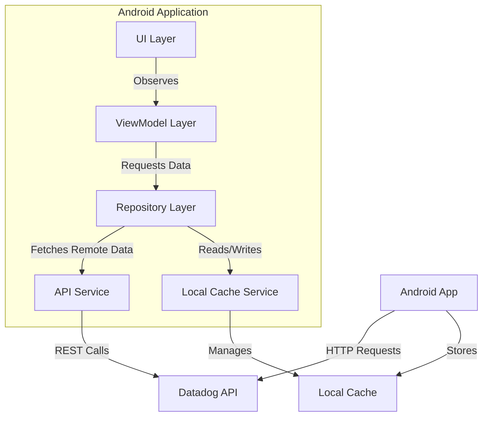
```mermaid
graph TD
    A[Android App] -->|HTTP Requests| B[Datadog API]
    A -->|Stores| C[Local Cache]
    
    subgraph "Android Application"
        D[UI Layer] -->|Observes| E[ViewModel Layer]
        E -->|Requests Data| F[Repository Layer]
        F -->|Fetches Remote Data| G[API Service]
        F -->|Reads/Writes| H[Local Cache Service]
    end
    
    G -->|REST Calls| B
    H -->|Manages| C
```

### DATA FLOW DIAGRAM

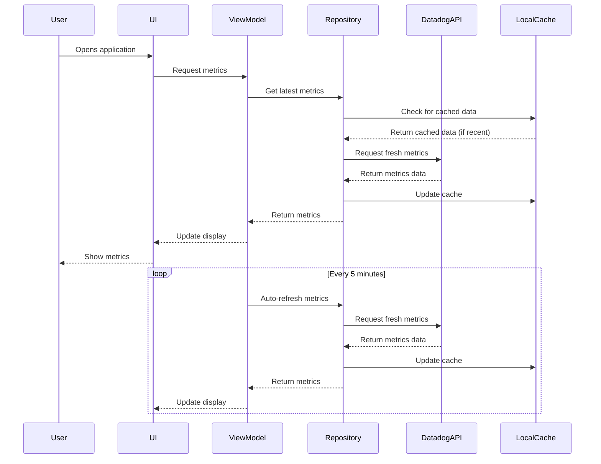
```mermaid
sequenceDiagram
    participant User
    participant UI
    participant ViewModel
    participant Repository
    participant DatadogAPI
    participant LocalCache
    
    User->>UI: Opens application
    UI->>ViewModel: Request metrics
    ViewModel->>Repository: Get latest metrics
    Repository->>LocalCache: Check for cached data
    LocalCache-->>Repository: Return cached data (if recent)
    Repository->>DatadogAPI: Request fresh metrics
    DatadogAPI-->>Repository: Return metrics data
    Repository->>LocalCache: Update cache
    Repository-->>ViewModel: Return metrics
    ViewModel-->>UI: Update display
    UI-->>User: Show metrics
    
    loop Every 5 minutes
        ViewModel->>Repository: Auto-refresh metrics
        Repository->>DatadogAPI: Request fresh metrics
        DatadogAPI-->>Repository: Return metrics data
        Repository->>LocalCache: Update cache
        Repository-->>ViewModel: Return metrics
        ViewModel-->>UI: Update display
    end
```

## 4. PROCESS FLOWCHART

### SYSTEM WORKFLOWS

#### Core Business Processes

The ScanMonitorApps application follows a straightforward workflow designed for operational efficiency. The primary user journey involves minimal interaction, focusing on delivering critical scanning metrics to Jump staff.

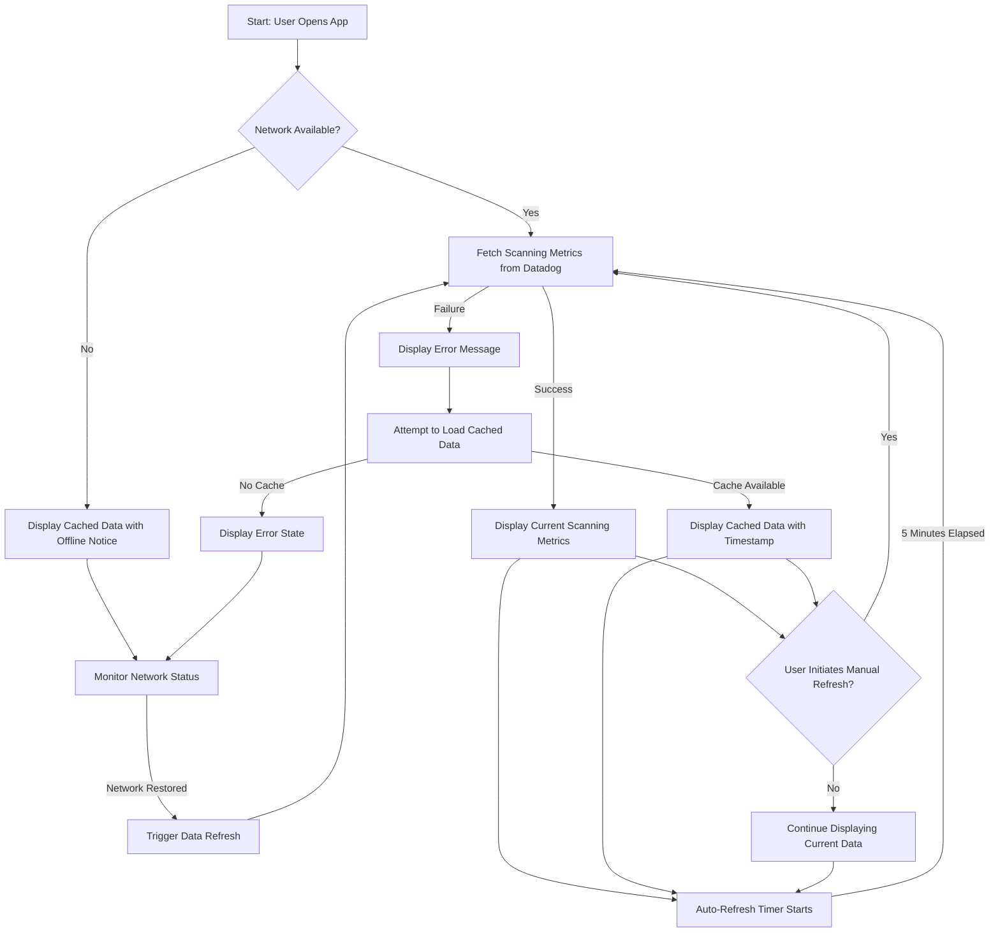
```mermaid
flowchart TD
    A[Start: User Opens App] --> B{Network Available?}
    B -->|Yes| C[Fetch Scanning Metrics from Datadog]
    B -->|No| D[Display Cached Data with Offline Notice]
    C -->|Success| E[Display Current Scanning Metrics]
    C -->|Failure| F[Display Error Message]
    F --> G[Attempt to Load Cached Data]
    G -->|Cache Available| H[Display Cached Data with Timestamp]
    G -->|No Cache| I[Display Error State]
    E --> J[Auto-Refresh Timer Starts]
    H --> J
    D --> K[Monitor Network Status]
    I --> K
    K -->|Network Restored| L[Trigger Data Refresh]
    L --> C
    J -->|5 Minutes Elapsed| C
    E --> M{User Initiates Manual Refresh?}
    H --> M
    M -->|Yes| C
    M -->|No| N[Continue Displaying Current Data]
    N --> J
```

#### Integration Workflows

The application's integration with Datadog is the critical data flow that powers the entire experience. This workflow details how data moves between systems and how the application processes API responses.

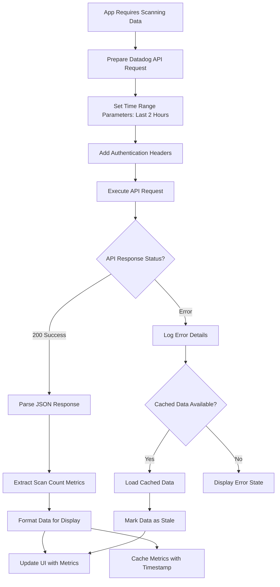
```mermaid
flowchart TD
    A[App Requires Scanning Data] --> B[Prepare Datadog API Request]
    B --> C[Set Time Range Parameters: Last 2 Hours]
    C --> D[Add Authentication Headers]
    D --> E[Execute API Request]
    E --> F{API Response Status?}
    F -->|200 Success| G[Parse JSON Response]
    F -->|Error| H[Log Error Details]
    G --> I[Extract Scan Count Metrics]
    I --> J[Format Data for Display]
    J --> K[Update UI with Metrics]
    J --> L[Cache Metrics with Timestamp]
    H --> M{Cached Data Available?}
    M -->|Yes| N[Load Cached Data]
    M -->|No| O[Display Error State]
    N --> P[Mark Data as Stale]
    P --> K
```

### FLOWCHART REQUIREMENTS

#### Validation Rules

The application implements several validation rules to ensure data integrity and proper functionality:

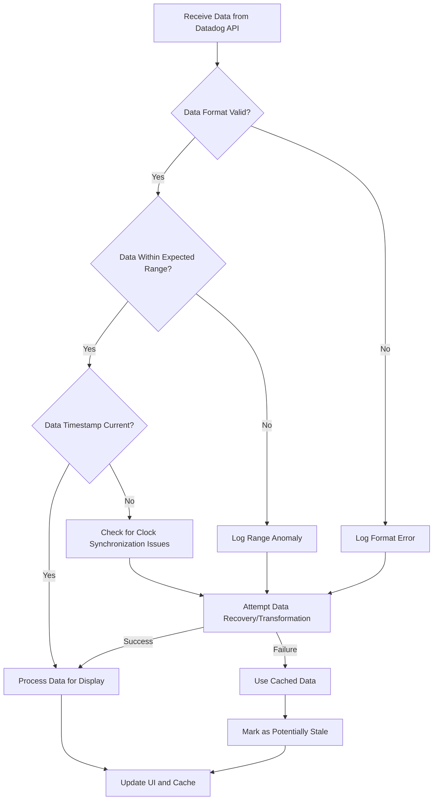
```mermaid
flowchart TD
    A[Receive Data from Datadog API] --> B{Data Format Valid?}
    B -->|Yes| C{Data Within Expected Range?}
    B -->|No| D[Log Format Error]
    C -->|Yes| E{Data Timestamp Current?}
    C -->|No| F[Log Range Anomaly]
    E -->|Yes| G[Process Data for Display]
    E -->|No| H[Check for Clock Synchronization Issues]
    D --> I[Attempt Data Recovery/Transformation]
    F --> I
    H --> I
    I -->|Success| G
    I -->|Failure| J[Use Cached Data]
    J --> K[Mark as Potentially Stale]
    G --> L[Update UI and Cache]
    K --> L
```

### TECHNICAL IMPLEMENTATION

#### State Management

The application maintains several states to ensure a smooth user experience even under varying conditions:

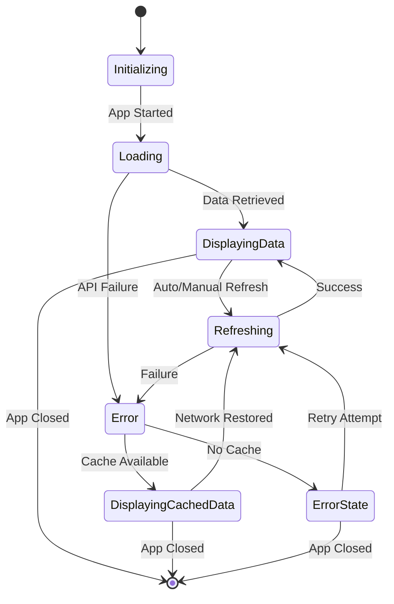
```mermaid
stateDiagram-v2
    [*] --> Initializing
    Initializing --> Loading: App Started
    Loading --> DisplayingData: Data Retrieved
    Loading --> Error: API Failure
    Error --> DisplayingCachedData: Cache Available
    Error --> ErrorState: No Cache
    DisplayingData --> Refreshing: Auto/Manual Refresh
    DisplayingCachedData --> Refreshing: Network Restored
    Refreshing --> DisplayingData: Success
    Refreshing --> Error: Failure
    ErrorState --> Refreshing: Retry Attempt
    DisplayingData --> [*]: App Closed
    DisplayingCachedData --> [*]: App Closed
    ErrorState --> [*]: App Closed
```

#### Error Handling

The application implements robust error handling to maintain functionality even when issues occur:

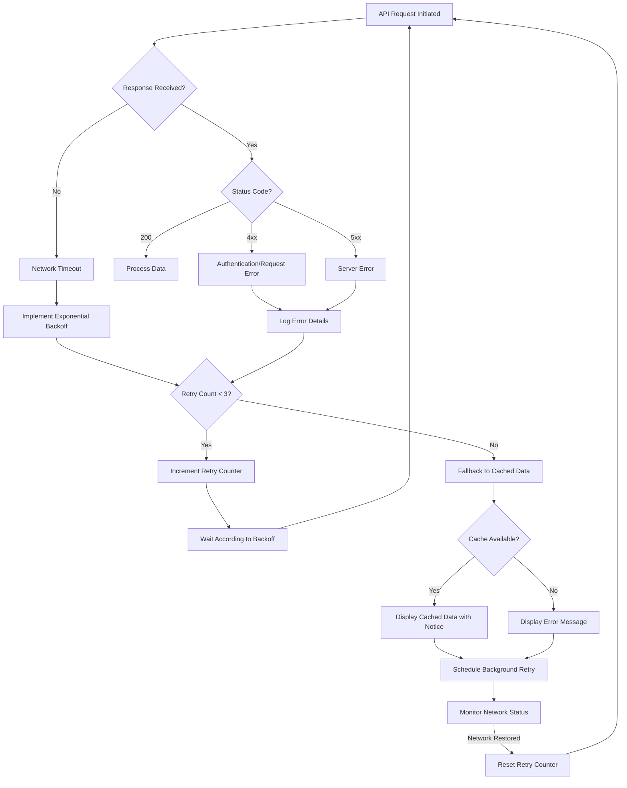
```mermaid
flowchart TD
    A[API Request Initiated] --> B{Response Received?}
    B -->|Yes| C{Status Code?}
    B -->|No| D[Network Timeout]
    C -->|200| E[Process Data]
    C -->|4xx| F[Authentication/Request Error]
    C -->|5xx| G[Server Error]
    D --> H[Implement Exponential Backoff]
    F --> I[Log Error Details]
    G --> I
    H --> J{Retry Count < 3?}
    I --> J
    J -->|Yes| K[Increment Retry Counter]
    J -->|No| L[Fallback to Cached Data]
    K --> M[Wait According to Backoff]
    M --> A
    L --> N{Cache Available?}
    N -->|Yes| O[Display Cached Data with Notice]
    N -->|No| P[Display Error Message]
    O --> Q[Schedule Background Retry]
    P --> Q
    Q --> R[Monitor Network Status]
    R -->|Network Restored| S[Reset Retry Counter]
    S --> A
```

### REQUIRED DIAGRAMS

#### High-level System Workflow

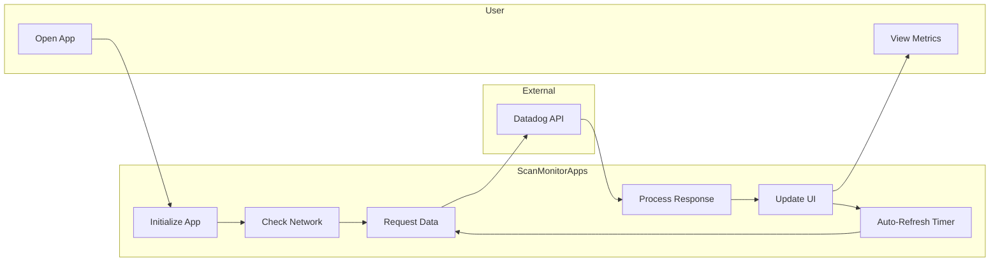
```mermaid
flowchart LR
    subgraph User
        A[Open App]
        Z[View Metrics]
    end
    
    subgraph ScanMonitorApps
        B[Initialize App]
        C[Check Network]
        D[Request Data]
        E[Process Response]
        F[Update UI]
        G[Auto-Refresh Timer]
    end
    
    subgraph External
        H[Datadog API]
    end
    
    A --> B
    B --> C
    C --> D
    D --> H
    H --> E
    E --> F
    F --> Z
    F --> G
    G --> D
```

#### Detailed Process Flow for Core Feature: Scanning Metrics Dashboard

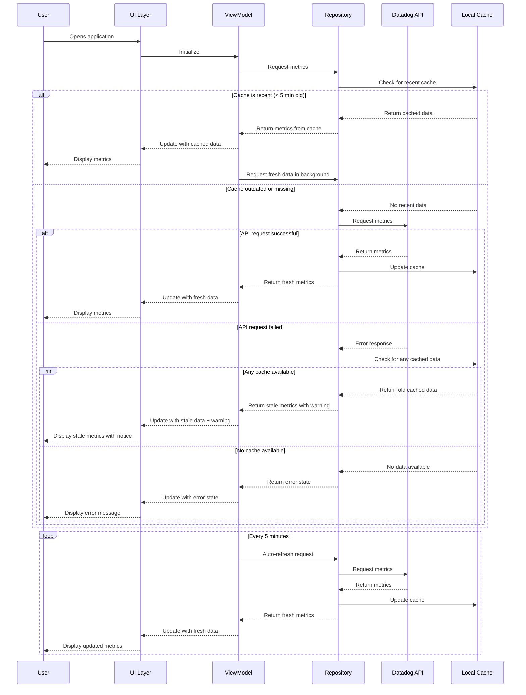
```mermaid
sequenceDiagram
    participant User
    participant UI as UI Layer
    participant VM as ViewModel
    participant Repo as Repository
    participant API as Datadog API
    participant Cache as Local Cache
    
    User->>UI: Opens application
    UI->>VM: Initialize
    VM->>Repo: Request metrics
    Repo->>Cache: Check for recent cache
    
    alt Cache is recent (< 5 min old)
        Cache-->>Repo: Return cached data
        Repo-->>VM: Return metrics from cache
        VM-->>UI: Update with cached data
        UI-->>User: Display metrics
        VM->>Repo: Request fresh data in background
    else Cache outdated or missing
        Cache-->>Repo: No recent data
        Repo->>API: Request metrics
        
        alt API request successful
            API-->>Repo: Return metrics
            Repo->>Cache: Update cache
            Repo-->>VM: Return fresh metrics
            VM-->>UI: Update with fresh data
            UI-->>User: Display metrics
        else API request failed
            API-->>Repo: Error response
            Repo->>Cache: Check for any cached data
            
            alt Any cache available
                Cache-->>Repo: Return old cached data
                Repo-->>VM: Return stale metrics with warning
                VM-->>UI: Update with stale data + warning
                UI-->>User: Display stale metrics with notice
            else No cache available
                Cache-->>Repo: No data available
                Repo-->>VM: Return error state
                VM-->>UI: Update with error state
                UI-->>User: Display error message
            end
        end
    end
    
    loop Every 5 minutes
        VM->>Repo: Auto-refresh request
        Repo->>API: Request metrics
        API-->>Repo: Return metrics
        Repo->>Cache: Update cache
        Repo-->>VM: Return fresh metrics
        VM-->>UI: Update with fresh data
        UI-->>User: Display updated metrics
    end
```

#### Error Handling Flowchart

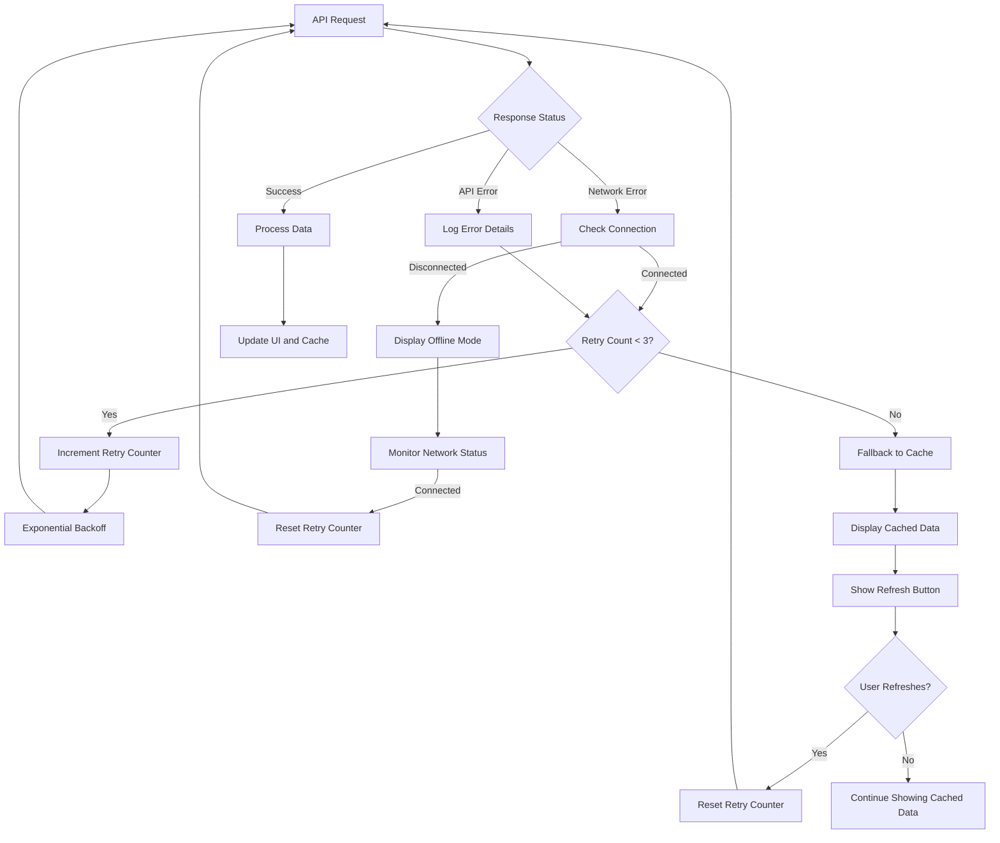
```mermaid
flowchart TD
    A[API Request] --> B{Response Status}
    B -->|Success| C[Process Data]
    B -->|Network Error| D[Check Connection]
    B -->|API Error| E[Log Error Details]
    
    D -->|Connected| F{Retry Count < 3?}
    D -->|Disconnected| G[Display Offline Mode]
    
    E --> F
    
    F -->|Yes| H[Increment Retry Counter]
    F -->|No| I[Fallback to Cache]
    
    H --> J[Exponential Backoff]
    J --> A
    
    G --> K[Monitor Network Status]
    K -->|Connected| L[Reset Retry Counter]
    L --> A
    
    I --> M[Display Cached Data]
    M --> N[Show Refresh Button]
    N --> O{User Refreshes?}
    O -->|Yes| P[Reset Retry Counter]
    P --> A
    O -->|No| Q[Continue Showing Cached Data]
    
    C --> R[Update UI and Cache]
```

#### Integration Sequence Diagram

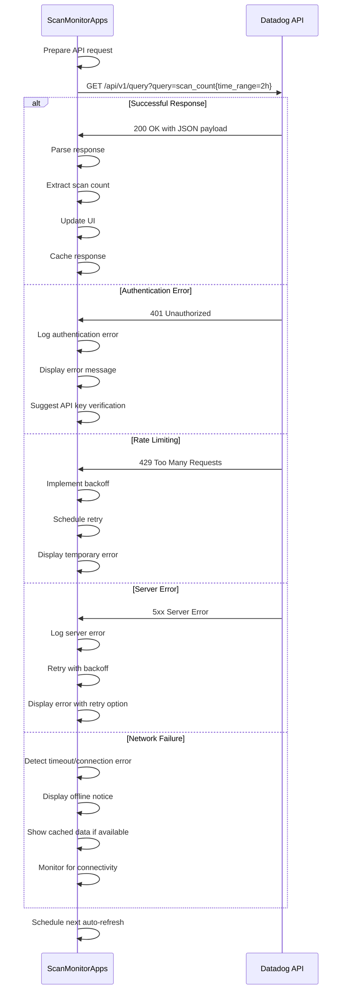
```mermaid
sequenceDiagram
    participant App as ScanMonitorApps
    participant API as Datadog API
    
    App->>App: Prepare API request
    App->>API: GET /api/v1/query?query=scan_count{time_range=2h}
    
    alt Successful Response
        API->>App: 200 OK with JSON payload
        App->>App: Parse response
        App->>App: Extract scan count
        App->>App: Update UI
        App->>App: Cache response
    else Authentication Error
        API->>App: 401 Unauthorized
        App->>App: Log authentication error
        App->>App: Display error message
        App->>App: Suggest API key verification
    else Rate Limiting
        API->>App: 429 Too Many Requests
        App->>App: Implement backoff
        App->>App: Schedule retry
        App->>App: Display temporary error
    else Server Error
        API->>App: 5xx Server Error
        App->>App: Log server error
        App->>App: Retry with backoff
        App->>App: Display error with retry option
    else Network Failure
        App->>App: Detect timeout/connection error
        App->>App: Display offline notice
        App->>App: Show cached data if available
        App->>App: Monitor for connectivity
    end
    
    App->>App: Schedule next auto-refresh
```

#### State Transition Diagram

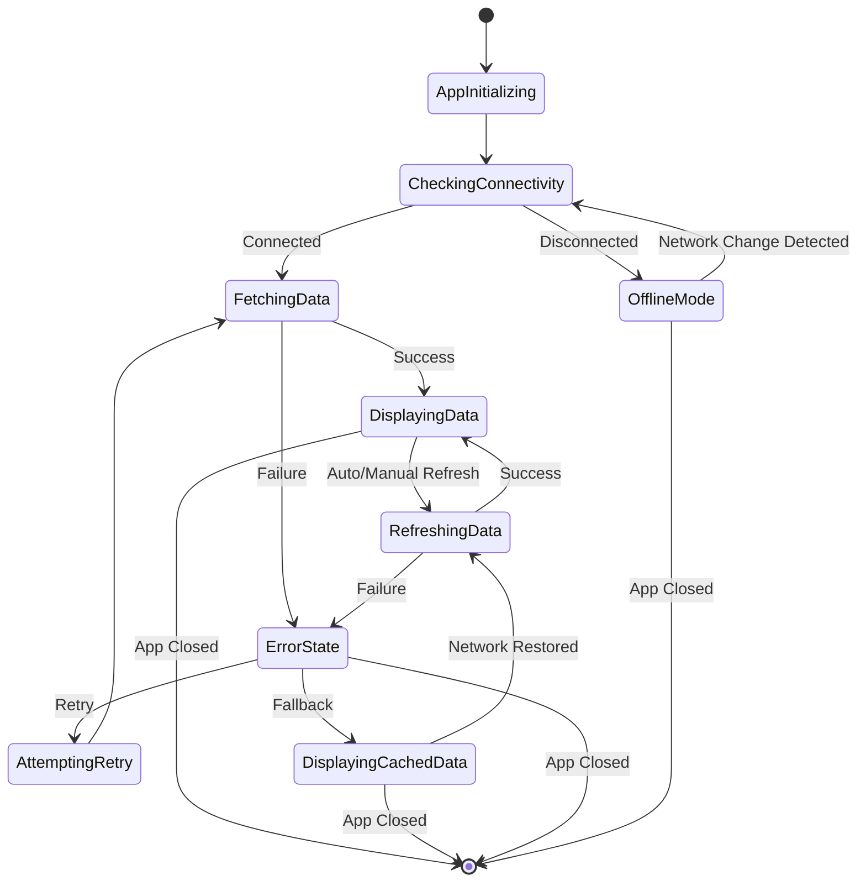
```mermaid
stateDiagram-v2
    [*] --> AppInitializing
    
    AppInitializing --> CheckingConnectivity
    
    CheckingConnectivity --> FetchingData: Connected
    CheckingConnectivity --> OfflineMode: Disconnected
    
    FetchingData --> DisplayingData: Success
    FetchingData --> ErrorState: Failure
    
    ErrorState --> AttemptingRetry: Retry
    ErrorState --> DisplayingCachedData: Fallback
    
    AttemptingRetry --> FetchingData
    
    DisplayingData --> RefreshingData: Auto/Manual Refresh
    DisplayingCachedData --> RefreshingData: Network Restored
    
    RefreshingData --> DisplayingData: Success
    RefreshingData --> ErrorState: Failure
    
    OfflineMode --> CheckingConnectivity: Network Change Detected
    
    DisplayingData --> [*]: App Closed
    DisplayingCachedData --> [*]: App Closed
    ErrorState --> [*]: App Closed
    OfflineMode --> [*]: App Closed
```

## 5. SYSTEM ARCHITECTURE

### HIGH-LEVEL ARCHITECTURE

#### System Overview

ScanMonitorApps employs a client-only architecture pattern, eliminating the need for a dedicated backend service. This lightweight approach was selected to minimize complexity while meeting the core requirement of displaying ticket scanning metrics from Datadog. The architecture follows these key principles:

- **Simplicity First**: A minimalist design that focuses solely on the core functionality of displaying scanning metrics
- **Direct Integration**: The mobile app communicates directly with the Datadog API without intermediary services
- **Offline Resilience**: Local caching mechanisms ensure limited functionality even when network connectivity is unavailable
- **Stateless Operation**: No user-specific state is maintained, eliminating the need for authentication or user profiles

The system boundary is clearly defined as the Android mobile application itself, with its primary external interface being the Datadog API for metrics retrieval.

#### Core Components Table

| Component Name | Primary Responsibility | Key Dependencies | Integration Points | Critical Considerations |
| --- | --- | --- | --- | --- |
| UI Layer | Display scanning metrics and status information | ViewModel | None | Must function in variable lighting conditions at stadium |
| ViewModel | Manage UI state and coordinate data operations | Repository, Android Lifecycle | UI Layer | Must handle configuration changes without data loss |
| Repository | Coordinate data retrieval from API and cache | API Service, Cache Service | Datadog API | Must implement appropriate retry and fallback strategies |
| API Service | Handle direct communication with Datadog | Retrofit, Network Services | Datadog API | Must handle API rate limits and authentication |
| Cache Service | Store and retrieve local copies of metrics | SharedPreferences | Repository | Must maintain timestamp information for stale data detection |
| Network Monitor | Track connectivity status | Android System Services | Repository | Must detect network changes promptly |

#### Data Flow Description

The data flow in ScanMonitorApps follows a unidirectional pattern:

1. The Repository initiates data retrieval either on app launch, manual refresh, or timed auto-refresh
2. The API Service constructs and executes a request to the Datadog API, including proper authentication and query parameters to retrieve scan counts for the last 2 hours
3. Upon successful API response, the data is parsed and transformed from Datadog's JSON format into the application's internal data model
4. The processed data is stored in the local cache with a timestamp for future reference
5. The Repository delivers the data to the ViewModel, which updates its state
6. The UI observes state changes in the ViewModel and updates the display accordingly

If the API request fails, the Repository attempts to retrieve the most recent data from the cache. This cached data is marked as potentially stale when displayed to the user.

#### External Integration Points

| System Name | Integration Type | Data Exchange Pattern | Protocol/Format | SLA Requirements |
| --- | --- | --- | --- | --- |
| Datadog API | REST API | Request-Response | HTTPS/JSON | Response time \< 2s, 99.9% availability |

### COMPONENT DETAILS

#### UI Layer

- **Purpose**: Provides the visual interface for displaying scanning metrics to Jump staff
- **Technologies**: Android Jetpack Compose for modern UI development
- **Key Interfaces**: Observes ViewModel state changes
- **Data Persistence**: None (stateless UI)
- **Scaling Considerations**: Must support various Android device screen sizes and densities

The UI layer consists of a single-screen application with a simple, high-contrast display of scanning metrics. It includes status indicators for data freshness and network connectivity.

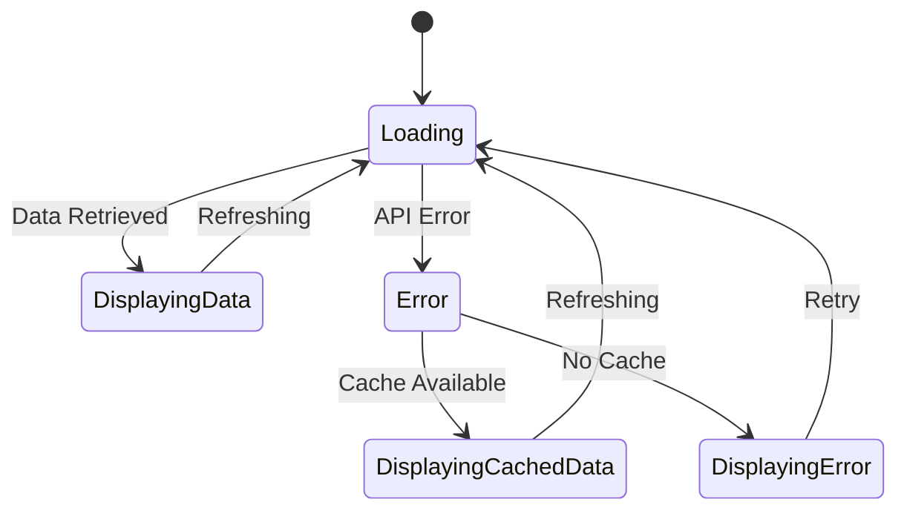
```mermaid
stateDiagram-v2
    [*] --> Loading
    Loading --> DisplayingData: Data Retrieved
    Loading --> Error: API Error
    Error --> DisplayingCachedData: Cache Available
    Error --> DisplayingError: No Cache
    DisplayingData --> Loading: Refreshing
    DisplayingCachedData --> Loading: Refreshing
    DisplayingError --> Loading: Retry
```

#### ViewModel

- **Purpose**: Manages UI state and coordinates data operations
- **Technologies**: Android ViewModel, Kotlin Coroutines, StateFlow
- **Key Interfaces**: Exposes observable state to UI, requests data from Repository
- **Data Persistence**: Survives configuration changes through Android ViewModel architecture
- **Scaling Considerations**: Minimal resource usage to ensure smooth operation

The ViewModel maintains a single source of truth for the UI state and handles the logic for refreshing data at regular intervals.

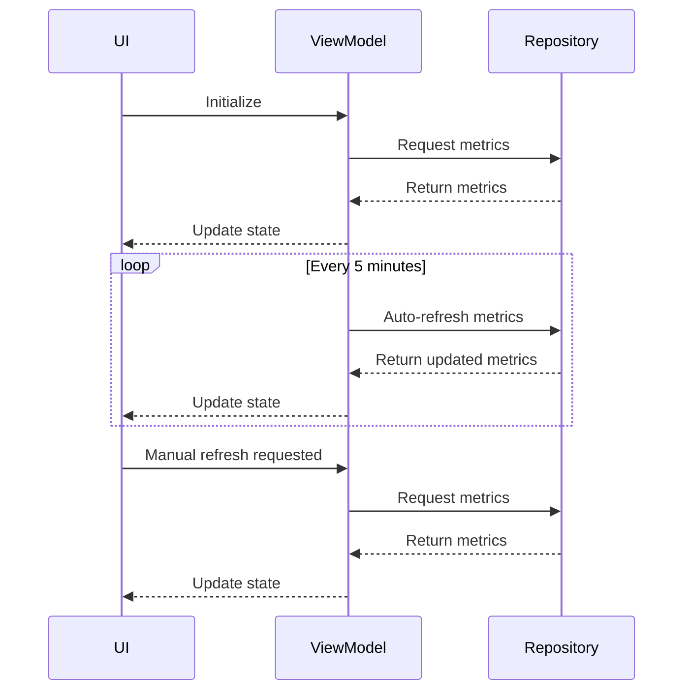
```mermaid
sequenceDiagram
    participant UI
    participant VM as ViewModel
    participant Repo as Repository
    
    UI->>VM: Initialize
    VM->>Repo: Request metrics
    Repo-->>VM: Return metrics
    VM-->>UI: Update state
    
    loop Every 5 minutes
        VM->>Repo: Auto-refresh metrics
        Repo-->>VM: Return updated metrics
        VM-->>UI: Update state
    end
    
    UI->>VM: Manual refresh requested
    VM->>Repo: Request metrics
    Repo-->>VM: Return metrics
    VM-->>UI: Update state
```

#### Repository

- **Purpose**: Coordinates data retrieval from API and cache
- **Technologies**: Kotlin Coroutines
- **Key Interfaces**: Provides data access methods to ViewModel, coordinates API and Cache services
- **Data Persistence**: None directly (delegates to Cache Service)
- **Scaling Considerations**: Implements efficient data retrieval patterns

The Repository implements the strategy for data retrieval, including fallback to cached data when the API is unavailable.

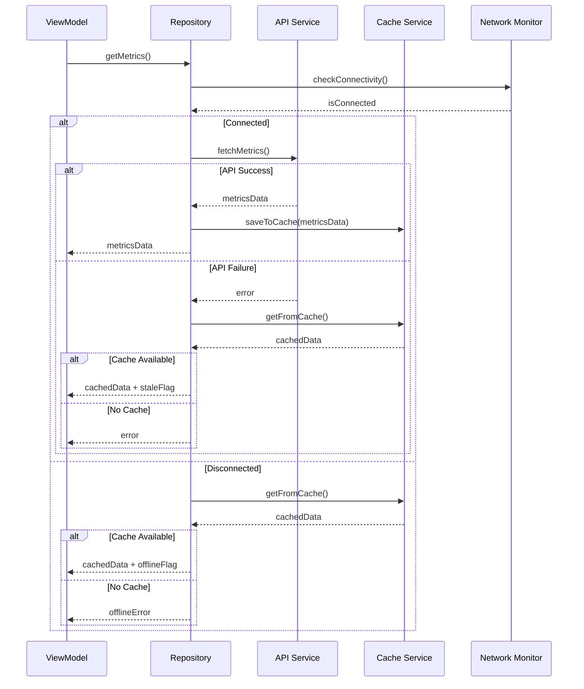
```mermaid
sequenceDiagram
    participant VM as ViewModel
    participant Repo as Repository
    participant API as API Service
    participant Cache as Cache Service
    participant Network as Network Monitor
    
    VM->>Repo: getMetrics()
    Repo->>Network: checkConnectivity()
    Network-->>Repo: isConnected
    
    alt Connected
        Repo->>API: fetchMetrics()
        
        alt API Success
            API-->>Repo: metricsData
            Repo->>Cache: saveToCache(metricsData)
            Repo-->>VM: metricsData
        else API Failure
            API-->>Repo: error
            Repo->>Cache: getFromCache()
            Cache-->>Repo: cachedData
            
            alt Cache Available
                Repo-->>VM: cachedData + staleFlag
            else No Cache
                Repo-->>VM: error
            end
        end
    else Disconnected
        Repo->>Cache: getFromCache()
        Cache-->>Repo: cachedData
        
        alt Cache Available
            Repo-->>VM: cachedData + offlineFlag
        else No Cache
            Repo-->>VM: offlineError
        end
    end
```

#### API Service

- **Purpose**: Handles direct communication with Datadog API
- **Technologies**: Retrofit, OkHttp, Moshi
- **Key Interfaces**: Provides methods to fetch metrics from Datadog
- **Data Persistence**: None
- **Scaling Considerations**: Implements connection pooling and timeout handling

The API Service encapsulates all logic related to constructing and executing requests to the Datadog API.

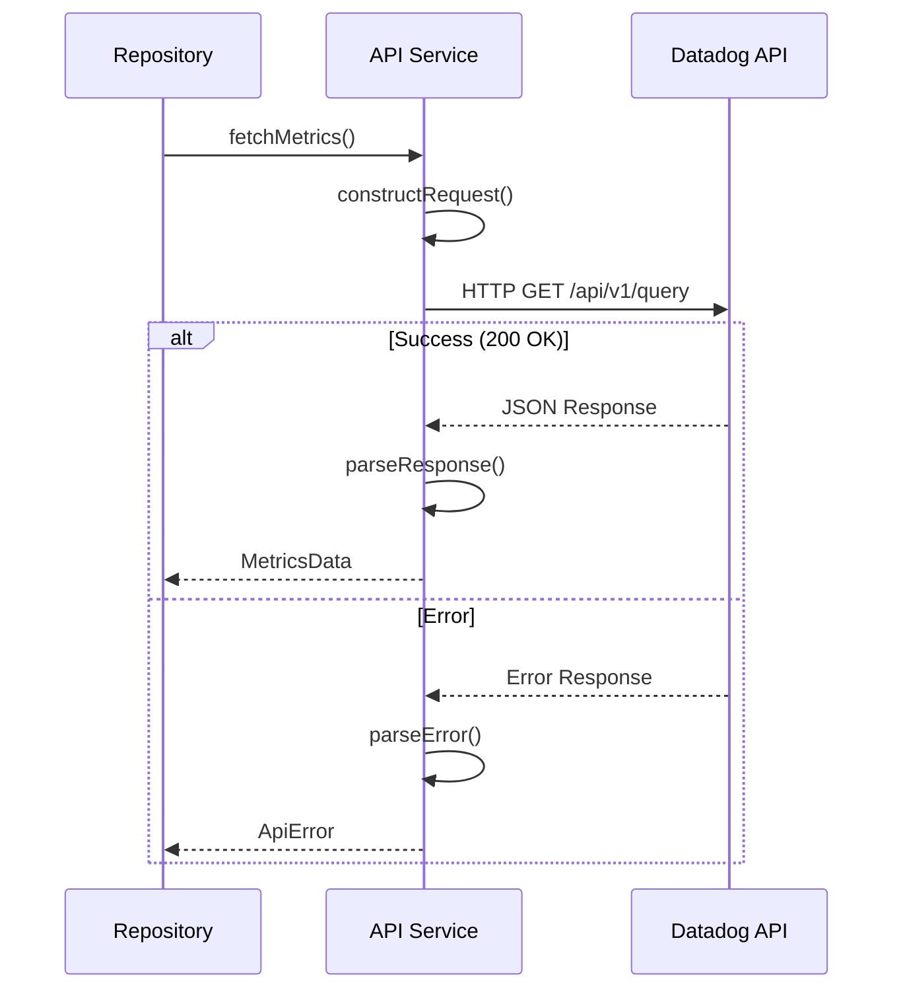
```mermaid
sequenceDiagram
    participant Repo as Repository
    participant API as API Service
    participant Datadog as Datadog API
    
    Repo->>API: fetchMetrics()
    API->>API: constructRequest()
    API->>Datadog: HTTP GET /api/v1/query
    
    alt Success (200 OK)
        Datadog-->>API: JSON Response
        API->>API: parseResponse()
        API-->>Repo: MetricsData
    else Error
        Datadog-->>API: Error Response
        API->>API: parseError()
        API-->>Repo: ApiError
    end
```

#### Cache Service

- **Purpose**: Stores and retrieves local copies of metrics
- **Technologies**: SharedPreferences
- **Key Interfaces**: Provides methods to save and retrieve cached data
- **Data Persistence**: Persists data across app restarts
- **Scaling Considerations**: Minimal data storage requirements

The Cache Service provides a simple mechanism for storing the most recent metrics data locally.

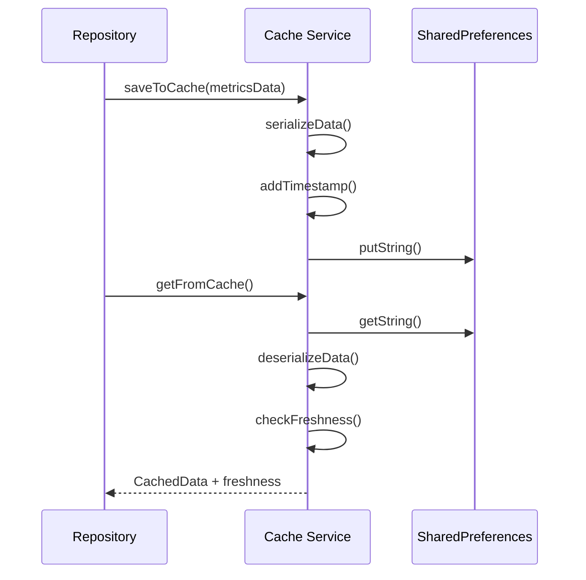
```mermaid
sequenceDiagram
    participant Repo as Repository
    participant Cache as Cache Service
    participant Storage as SharedPreferences
    
    Repo->>Cache: saveToCache(metricsData)
    Cache->>Cache: serializeData()
    Cache->>Cache: addTimestamp()
    Cache->>Storage: putString()
    
    Repo->>Cache: getFromCache()
    Cache->>Storage: getString()
    Cache->>Cache: deserializeData()
    Cache->>Cache: checkFreshness()
    Cache-->>Repo: CachedData + freshness
```

#### Network Monitor

- **Purpose**: Tracks connectivity status
- **Technologies**: Android ConnectivityManager
- **Key Interfaces**: Provides methods to check current connectivity and register for updates
- **Data Persistence**: None
- **Scaling Considerations**: Minimal resource usage

The Network Monitor provides real-time information about network connectivity to guide data retrieval strategies.

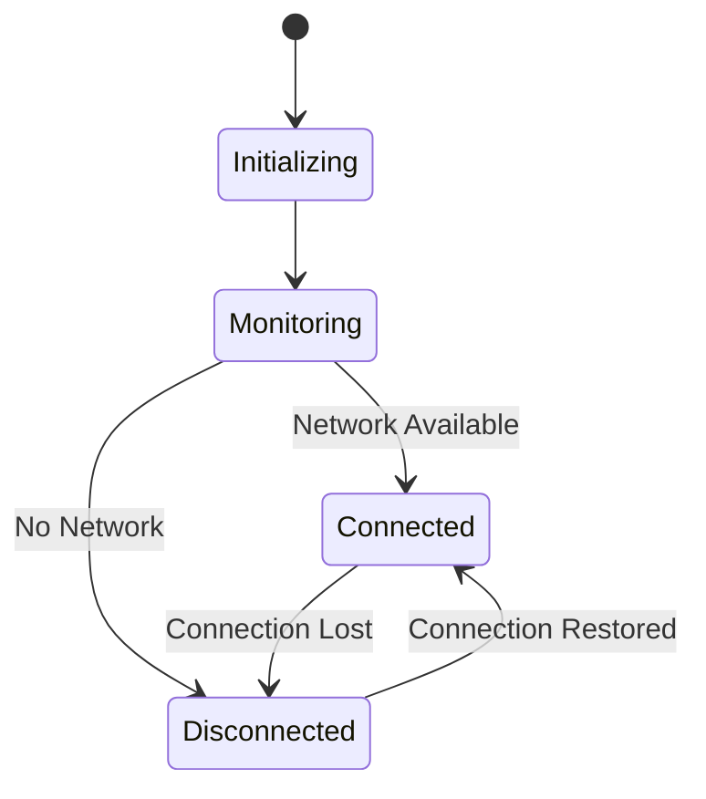
```mermaid
stateDiagram-v2
    [*] --> Initializing
    Initializing --> Monitoring
    Monitoring --> Connected: Network Available
    Monitoring --> Disconnected: No Network
    Connected --> Disconnected: Connection Lost
    Disconnected --> Connected: Connection Restored
```

### TECHNICAL DECISIONS

#### Architecture Style Decisions

| Decision | Selected Approach | Alternatives Considered | Rationale |
| --- | --- | --- | --- |
| Overall Architecture | Client-only | Client-server, Serverless | Simplicity and direct integration with Datadog eliminate need for backend |
| UI Architecture | MVVM | MVC, MVP | Better separation of concerns and lifecycle management |
| Data Flow Pattern | Unidirectional | Bidirectional | Simplifies state management and debugging |
| API Integration | Direct from client | Backend proxy | Reduces complexity and latency for this simple use case |

#### Communication Pattern Choices

| Pattern | Implementation | Justification |
| --- | --- | --- |
| API Requests | REST with Retrofit | Industry standard, well-supported, and appropriate for simple data retrieval |
| Error Handling | Result wrapper | Provides type-safe error handling without exceptions |
| UI Updates | StateFlow | Reactive pattern that works well with modern Android development |
| Background Processing | Coroutines | Lightweight threading model ideal for mobile applications |

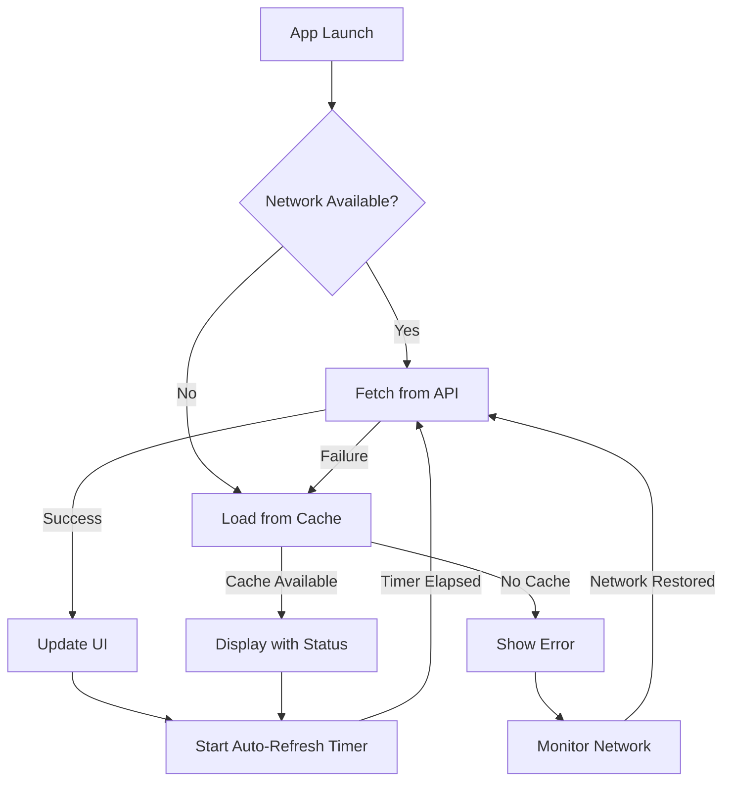
```mermaid
flowchart TD
    A[App Launch] --> B{Network Available?}
    B -->|Yes| C[Fetch from API]
    B -->|No| D[Load from Cache]
    C -->|Success| E[Update UI]
    C -->|Failure| D
    D -->|Cache Available| F[Display with Status]
    D -->|No Cache| G[Show Error]
    E --> H[Start Auto-Refresh Timer]
    F --> H
    G --> I[Monitor Network]
    I -->|Network Restored| C
    H -->|Timer Elapsed| C
```

#### Data Storage Solution Rationale

| Requirement | Selected Solution | Justification |
| --- | --- | --- |
| Metrics Caching | SharedPreferences | Simple key-value storage sufficient for small data payload |
| Persistence Duration | Session + limited history | Only need most recent successful data fetch |
| Data Structure | Serialized JSON | Matches API response format for simplicity |
| Cache Invalidation | Timestamp-based | Simple approach for determining data freshness |

#### Caching Strategy Justification

| Aspect | Approach | Rationale |
| --- | --- | --- |
| Cache Duration | Indefinite with freshness flag | Allow showing stale data with warning when fresh data unavailable |
| Refresh Policy | Time-based (5 minutes) + manual | Balance between data freshness and API load |
| Cache Location | Device local storage | No sensitive data, simple persistence needs |
| Cache Size | Single latest response | Minimal storage requirements for this use case |

#### Security Mechanism Selection

| Security Concern | Approach | Justification |
| --- | --- | --- |
| API Authentication | Embedded API key | Simple approach for read-only access to non-sensitive data |
| API Key Storage | BuildConfig constants | Prevents exposure in source control while avoiding complex key management |
| Data Sensitivity | None required | Scan count metrics are not sensitive or personally identifiable |
| Network Security | HTTPS only | Industry standard for API communication |

### CROSS-CUTTING CONCERNS

#### Monitoring and Observability Approach

The application implements a lightweight monitoring approach focused on ensuring reliable operation:

- Crash reporting using Firebase Crashlytics to identify unexpected failures
- Basic analytics to track app usage patterns and feature engagement
- Performance monitoring for API response times and UI rendering
- Structured logging for troubleshooting and debugging

#### Logging and Tracing Strategy

| Log Level | Usage | Example |
| --- | --- | --- |
| ERROR | Application failures | API authentication failures, parsing errors |
| WARN | Operational issues | Slow API responses, stale data usage |
| INFO | Key user actions | App launch, manual refresh |
| DEBUG | Development details | API request/response details (development builds only) |

All logs include:

- Timestamp
- Component identifier
- Correlation ID for related events
- Contextual information relevant to the event

#### Error Handling Patterns

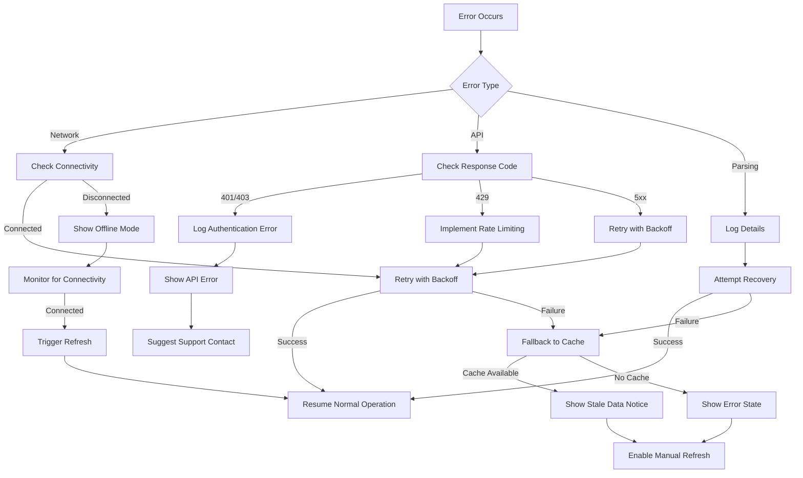
```mermaid
flowchart TD
    A[Error Occurs] --> B{Error Type}
    B -->|Network| C[Check Connectivity]
    B -->|API| D[Check Response Code]
    B -->|Parsing| E[Log Details]
    
    C -->|Connected| F[Retry with Backoff]
    C -->|Disconnected| G[Show Offline Mode]
    
    D -->|401/403| H[Log Authentication Error]
    D -->|429| I[Implement Rate Limiting]
    D -->|5xx| J[Retry with Backoff]
    
    E --> K[Attempt Recovery]
    H --> L[Show API Error]
    I --> F
    J --> F
    
    F -->|Success| M[Resume Normal Operation]
    F -->|Failure| N[Fallback to Cache]
    G --> O[Monitor for Connectivity]
    K -->|Success| M
    K -->|Failure| N
    L --> P[Suggest Support Contact]
    
    N -->|Cache Available| Q[Show Stale Data Notice]
    N -->|No Cache| R[Show Error State]
    O -->|Connected| S[Trigger Refresh]
    
    Q --> T[Enable Manual Refresh]
    R --> T
    S --> M
```

#### Performance Requirements and SLAs

| Metric | Target | Critical Threshold | Measurement Method |
| --- | --- | --- | --- |
| App Launch Time | \< 2 seconds | \> 4 seconds | Firebase Performance |
| API Response Time | \< 2 seconds | \> 5 seconds | In-app timing |
| UI Render Time | \< 100ms | \> 250ms | Frame timing metrics |
| Data Freshness | \< 5 minutes | \> 15 minutes | Timestamp comparison |

#### Disaster Recovery Procedures

Given the application's simplicity and lack of backend components, disaster recovery focuses on client-side resilience:

- Graceful degradation when API is unavailable
- Clear user communication about data staleness
- Automatic retry mechanisms with exponential backoff
- Cache invalidation only after successful new data retrieval

## 6. SYSTEM COMPONENTS DESIGN

### COMPONENT ARCHITECTURE

#### UI Components

| Component | Purpose | Interactions | Technical Implementation |
| --- | --- | --- | --- |
| Main Activity | Primary container for the application | Hosts the main fragment, manages lifecycle | Kotlin class extending AppCompatActivity |
| Metrics Dashboard Fragment | Displays scanning metrics | Observes ViewModel state, handles user gestures | Kotlin class using Jetpack Compose |
| Error State View | Displays error messages | Provides retry functionality | Composable function with error details and action button |
| Loading Indicator | Shows data loading state | Indicates background operations | Circular progress indicator composable |
| Refresh Control | Enables manual data refresh | Triggers refresh in ViewModel | Pull-to-refresh gesture implementation |
| Status Bar | Shows connectivity and data freshness | Displays network status and last update time | Composable status bar with icons and text |

#### Data Components

| Component | Purpose | Interactions | Technical Implementation |
| --- | --- | --- | --- |
| ScanMetricsViewModel | Manages UI state and data operations | Communicates with Repository, exposes state to UI | AndroidViewModel with StateFlow for state management |
| ScanMetricsRepository | Coordinates data retrieval | Interacts with API and Cache services | Repository pattern implementation with coroutines |
| DatadogApiService | Handles API communication | Makes requests to Datadog API | Retrofit interface with API endpoints |
| MetricsCache | Stores and retrieves cached data | Provides data persistence | SharedPreferences wrapper with serialization |
| NetworkMonitor | Tracks connectivity status | Notifies repository of network changes | ConnectivityManager wrapper with flow |
| MetricsMapper | Transforms API data to domain models | Converts between data formats | Pure Kotlin utility class |

#### Domain Models

| Model | Purpose | Properties | Behavior |
| --- | --- | --- | --- |
| ScanMetrics | Represents scanning metrics data | count: Int, timestamp: Long | Immutable data class |
| UiState | Represents UI state | loading: Boolean, data: ScanMetrics?, error: Error?, isStale: Boolean | Immutable data class |
| ApiResponse | Represents Datadog API response | series: List\<Series\>, metadata: Metadata | Parsing and validation |
| Series | Represents a data series from API | pointlist: List\<Point\>, queryIndex: Int | Data extraction |
| Point | Represents a single data point | timestamp: Long, value: Double | Value formatting |
| NetworkStatus | Represents connectivity state | isConnected: Boolean, type: ConnectionType | Connection type detection |

### COMPONENT INTERACTIONS

#### Data Flow Diagram

```mermaid
flowchart TD
    UI[UI Components] <-->|Observes/Actions| VM[ScanMetricsViewModel]
    VM <-->|Data Requests/Responses| Repo[ScanMetricsRepository]
    Repo -->|API Requests| API[DatadogApiService]
    API -->|HTTP Requests| DD[Datadog API]
    DD -->|JSON Responses| API
    API -->|Raw Data| Repo
    Repo -->|Cache Operations| Cache[MetricsCache]
    Cache <-->|Read/Write| SP[SharedPreferences]
    Repo -->|Network Checks| NM[NetworkMonitor]
    NM <-->|Status Updates| CM[ConnectivityManager]
    Repo -->|Data Transformation| Mapper[MetricsMapper]
```

#### Sequence Diagram: App Launch and Data Retrieval

```mermaid
sequenceDiagram
    participant User
    participant UI as UI Components
    participant VM as ScanMetricsViewModel
    participant Repo as ScanMetricsRepository
    participant API as DatadogApiService
    participant Cache as MetricsCache
    participant Network as NetworkMonitor
    participant Datadog as Datadog API
    
    User->>UI: Opens app
    UI->>VM: Initialize
    VM->>VM: Create initial loading state
    VM->>UI: Update UI with loading state
    VM->>Repo: getLatestMetrics()
    Repo->>Network: checkConnectivity()
    Network->>Repo: Return connection status
    
    alt Connected to network
        Repo->>API: fetchMetrics()
        API->>Datadog: HTTP GET request
        Datadog->>API: JSON response
        API->>Repo: Return parsed response
        Repo->>Cache: saveToCache(metrics)
        Repo->>VM: Return metrics
        VM->>VM: Update state with data
        VM->>UI: Update UI with metrics
    else Not connected
        Repo->>Cache: getFromCache()
        Cache->>Repo: Return cached metrics
        Repo->>VM: Return cached metrics with offline flag
        VM->>VM: Update state with cached data and offline indicator
        VM->>UI: Update UI with cached metrics and offline notice
    end
    
    VM->>VM: Start auto-refresh timer
```

#### Sequence Diagram: Auto-Refresh Process

```mermaid
sequenceDiagram
    participant VM as ScanMetricsViewModel
    participant Timer as Auto-Refresh Timer
    participant Repo as ScanMetricsRepository
    participant API as DatadogApiService
    participant Cache as MetricsCache
    participant Datadog as Datadog API
    
    Timer->>VM: 5-minute interval elapsed
    VM->>Repo: refreshMetrics()
    Repo->>API: fetchMetrics()
    API->>Datadog: HTTP GET request
    
    alt Successful API call
        Datadog->>API: JSON response
        API->>Repo: Return parsed response
        Repo->>Cache: saveToCache(metrics)
        Repo->>VM: Return fresh metrics
        VM->>VM: Update state with new data
    else API failure
        Datadog->>API: Error response
        API->>Repo: Return error
        Repo->>VM: Return error with last successful data
        VM->>VM: Update state with error and last data
    end
    
    Timer->>VM: Reset timer for next interval
```

### COMPONENT SPECIFICATIONS

#### UI Component Details

**Metrics Dashboard Fragment**

```kotlin
@Composable
fun MetricsDashboard(
    uiState: UiState,
    onRefresh: () -> Unit
) {
    Box(modifier = Modifier.fillMaxSize()) {
        when {
            uiState.loading && uiState.data == null -> LoadingIndicator()
            uiState.error != null && uiState.data == null -> ErrorState(
                error = uiState.error,
                onRetry = onRefresh
            )
            else -> {
                Column {
                    StatusBar(
                        isOffline = !uiState.isConnected,
                        isStale = uiState.isStale,
                        lastUpdated = uiState.data?.timestamp
                    )
                    
                    PullToRefresh(
                        refreshing = uiState.loading,
                        onRefresh = onRefresh
                    ) {
                        MetricsDisplay(metrics = uiState.data)
                    }
                }
            }
        }
    }
}
```

**Metrics Display**

```kotlin
@Composable
fun MetricsDisplay(metrics: ScanMetrics?) {
    Column(
        modifier = Modifier
            .fillMaxWidth()
            .padding(16.dp),
        horizontalAlignment = Alignment.CenterHorizontally
    ) {
        Text(
            text = "TOTAL SCANS",
            style = MaterialTheme.typography.h6,
            color = MaterialTheme.colors.onSurface.copy(alpha = 0.6f)
        )
        
        Spacer(modifier = Modifier.height(8.dp))
        
        Text(
            text = metrics?.count?.toString() ?: "0",
            style = MaterialTheme.typography.h1,
            color = MaterialTheme.colors.primary,
            fontWeight = FontWeight.Bold
        )
        
        Spacer(modifier = Modifier.height(8.dp))
        
        Text(
            text = "Last 2 Hours",
            style = MaterialTheme.typography.subtitle1,
            color = MaterialTheme.colors.onSurface.copy(alpha = 0.8f)
        )
    }
}
```

**Status Bar**

```kotlin
@Composable
fun StatusBar(
    isOffline: Boolean,
    isStale: Boolean,
    lastUpdated: Long?
) {
    Row(
        modifier = Modifier
            .fillMaxWidth()
            .background(
                when {
                    isOffline -> MaterialTheme.colors.error.copy(alpha = 0.1f)
                    isStale -> MaterialTheme.colors.secondary.copy(alpha = 0.1f)
                    else -> MaterialTheme.colors.surface
                }
            )
            .padding(horizontal = 16.dp, vertical = 8.dp),
        verticalAlignment = Alignment.CenterVertically
    ) {
        Icon(
            imageVector = when {
                isOffline -> Icons.Filled.CloudOff
                isStale -> Icons.Filled.AccessTime
                else -> Icons.Filled.CloudDone
            },
            contentDescription = null,
            tint = when {
                isOffline -> MaterialTheme.colors.error
                isStale -> MaterialTheme.colors.secondary
                else -> MaterialTheme.colors.primary
            }
        )
        
        Spacer(modifier = Modifier.width(8.dp))
        
        Text(
            text = when {
                isOffline -> "Offline Mode"
                isStale -> "Data may be outdated"
                else -> "Live Data"
            },
            style = MaterialTheme.typography.caption,
            color = when {
                isOffline -> MaterialTheme.colors.error
                isStale -> MaterialTheme.colors.secondary
                else -> MaterialTheme.colors.primary
            }
        )
        
        Spacer(modifier = Modifier.weight(1f))
        
        if (lastUpdated != null) {
            Text(
                text = "Updated: ${formatTimestamp(lastUpdated)}",
                style = MaterialTheme.typography.caption,
                color = MaterialTheme.colors.onSurface.copy(alpha = 0.6f)
            )
        }
    }
}
```

#### Data Component Details

**ScanMetricsViewModel**

```kotlin
class ScanMetricsViewModel(
    private val repository: ScanMetricsRepository,
    private val networkMonitor: NetworkMonitor
) : ViewModel() {
    
    private val _uiState = MutableStateFlow(UiState(loading = true))
    val uiState: StateFlow<UiState> = _uiState.asStateFlow()
    
    private val refreshJob: Job? = null
    
    init {
        viewModelScope.launch {
            // Monitor network status
            networkMonitor.networkStatus.collect { status ->
                _uiState.update { it.copy(isConnected = status.isConnected) }
                if (status.isConnected && _uiState.value.error != null) {
                    // Retry when connection is restored
                    refreshMetrics()
                }
            }
        }
        
        // Initial data load
        loadMetrics()
        
        // Start auto-refresh
        startAutoRefresh()
    }
    
    fun refreshMetrics() {
        viewModelScope.launch {
            _uiState.update { it.copy(loading = true) }
            
            when (val result = repository.getMetrics(forceRefresh = true)) {
                is Result.Success -> {
                    _uiState.update { 
                        it.copy(
                            loading = false,
                            data = result.data,
                            error = null,
                            isStale = false
                        )
                    }
                }
                is Result.Error -> {
                    _uiState.update { 
                        it.copy(
                            loading = false,
                            error = result.exception,
                            isStale = it.data != null
                        )
                    }
                }
            }
        }
    }
    
    private fun loadMetrics() {
        viewModelScope.launch {
            when (val result = repository.getMetrics()) {
                is Result.Success -> {
                    _uiState.update { 
                        it.copy(
                            loading = false,
                            data = result.data,
                            error = null,
                            isStale = result.isFromCache
                        )
                    }
                }
                is Result.Error -> {
                    _uiState.update { 
                        it.copy(
                            loading = false,
                            error = result.exception
                        )
                    }
                }
            }
        }
    }
    
    private fun startAutoRefresh() {
        refreshJob?.cancel()
        refreshJob = viewModelScope.launch {
            while (isActive) {
                delay(5 * 60 * 1000) // 5 minutes
                refreshMetrics()
            }
        }
    }
    
    override fun onCleared() {
        refreshJob?.cancel()
        super.onCleared()
    }
}
```

**ScanMetricsRepository**

```kotlin
class ScanMetricsRepository(
    private val apiService: DatadogApiService,
    private val cache: MetricsCache,
    private val mapper: MetricsMapper
) {
    
    suspend fun getMetrics(forceRefresh: Boolean = false): Result<ScanMetrics> {
        // Check cache first if not forcing refresh
        if (!forceRefresh) {
            cache.getMetrics()?.let { cachedMetrics ->
                // Check if cache is recent enough (less than 10 minutes old)
                val isFresh = (System.currentTimeMillis() - cachedMetrics.timestamp) < 10 * 60 * 1000
                return Result.Success(cachedMetrics, isFromCache = true, isStale = !isFresh)
            }
        }
        
        // Fetch from API
        return try {
            val response = apiService.getScanMetrics(
                query = "sum:ticket.scans.count{*}",
                from = System.currentTimeMillis() - 2 * 60 * 60 * 1000, // 2 hours ago
                to = System.currentTimeMillis()
            )
            
            val metrics = mapper.mapApiResponseToMetrics(response)
            
            // Cache the result
            cache.saveMetrics(metrics)
            
            Result.Success(metrics)
        } catch (e: Exception) {
            Result.Error(e)
        }
    }
}
```

**DatadogApiService**

```kotlin
interface DatadogApiService {
    
    @GET("api/v1/query")
    suspend fun getScanMetrics(
        @Query("query") query: String,
        @Query("from") from: Long,
        @Query("to") to: Long
    ): ApiResponse
}

// Retrofit implementation
class DatadogApiServiceImpl(
    private val apiKey: String,
    private val applicationKey: String
) {
    
    private val retrofit: Retrofit by lazy {
        Retrofit.Builder()
            .baseUrl("https://api.datadoghq.com/")
            .addConverterFactory(MoshiConverterFactory.create())
            .client(createOkHttpClient())
            .build()
    }
    
    private fun createOkHttpClient(): OkHttpClient {
        return OkHttpClient.Builder()
            .addInterceptor { chain ->
                val original = chain.request()
                val requestBuilder = original.newBuilder()
                    .header("DD-API-KEY", apiKey)
                    .header("DD-APPLICATION-KEY", applicationKey)
                    .method(original.method, original.body)
                
                chain.proceed(requestBuilder.build())
            }
            .connectTimeout(15, TimeUnit.SECONDS)
            .readTimeout(15, TimeUnit.SECONDS)
            .build()
    }
    
    fun create(): DatadogApiService {
        return retrofit.create(DatadogApiService::class.java)
    }
}
```

**MetricsCache**

```kotlin
class MetricsCache(private val context: Context) {
    
    private val sharedPreferences: SharedPreferences by lazy {
        context.getSharedPreferences(PREFS_NAME, Context.MODE_PRIVATE)
    }
    
    fun saveMetrics(metrics: ScanMetrics) {
        sharedPreferences.edit()
            .putString(KEY_METRICS, Json.encodeToString(metrics))
            .putLong(KEY_TIMESTAMP, System.currentTimeMillis())
            .apply()
    }
    
    fun getMetrics(): ScanMetrics? {
        val metricsJson = sharedPreferences.getString(KEY_METRICS, null) ?: return null
        return try {
            Json.decodeFromString<ScanMetrics>(metricsJson)
        } catch (e: Exception) {
            null
        }
    }
    
    fun getLastUpdateTime(): Long {
        return sharedPreferences.getLong(KEY_TIMESTAMP, 0)
    }
    
    fun clear() {
        sharedPreferences.edit().clear().apply()
    }
    
    companion object {
        private const val PREFS_NAME = "scan_metrics_cache"
        private const val KEY_METRICS = "metrics_data"
        private const val KEY_TIMESTAMP = "last_update_time"
    }
}
```

**NetworkMonitor**

```kotlin
class NetworkMonitor(private val context: Context) {
    
    private val connectivityManager = context.getSystemService(Context.CONNECTIVITY_SERVICE) as ConnectivityManager
    
    private val _networkStatus = MutableStateFlow(getInitialNetworkStatus())
    val networkStatus: StateFlow<NetworkStatus> = _networkStatus.asStateFlow()
    
    private val networkCallback = object : ConnectivityManager.NetworkCallback() {
        override fun onAvailable(network: Network) {
            _networkStatus.value = NetworkStatus(isConnected = true, type = getConnectionType())
        }
        
        override fun onLost(network: Network) {
            _networkStatus.value = NetworkStatus(isConnected = false, type = ConnectionType.NONE)
        }
        
        override fun onCapabilitiesChanged(
            network: Network,
            networkCapabilities: NetworkCapabilities
        ) {
            _networkStatus.value = NetworkStatus(isConnected = true, type = getConnectionType(networkCapabilities))
        }
    }
    
    init {
        val request = NetworkRequest.Builder().build()
        connectivityManager.registerNetworkCallback(request, networkCallback)
    }
    
    fun isConnected(): Boolean {
        return networkStatus.value.isConnected
    }
    
    private fun getInitialNetworkStatus(): NetworkStatus {
        val network = connectivityManager.activeNetwork
        val capabilities = connectivityManager.getNetworkCapabilities(network)
        val isConnected = capabilities != null
        val type = if (isConnected) getConnectionType(capabilities) else ConnectionType.NONE
        
        return NetworkStatus(isConnected = isConnected, type = type)
    }
    
    private fun getConnectionType(capabilities: NetworkCapabilities? = null): ConnectionType {
        val caps = capabilities ?: connectivityManager.getNetworkCapabilities(connectivityManager.activeNetwork)
        
        return when {
            caps == null -> ConnectionType.NONE
            caps.hasTransport(NetworkCapabilities.TRANSPORT_WIFI) -> ConnectionType.WIFI
            caps.hasTransport(NetworkCapabilities.TRANSPORT_CELLULAR) -> ConnectionType.CELLULAR
            else -> ConnectionType.OTHER
        }
    }
    
    fun cleanup() {
        connectivityManager.unregisterNetworkCallback(networkCallback)
    }
}

enum class ConnectionType {
    NONE, WIFI, CELLULAR, OTHER
}

data class NetworkStatus(
    val isConnected: Boolean,
    val type: ConnectionType
)
```

#### Domain Models

```kotlin
// Core data model for scan metrics
data class ScanMetrics(
    val count: Int,
    val timestamp: Long = System.currentTimeMillis()
)

// UI state representation
data class UiState(
    val loading: Boolean = false,
    val data: ScanMetrics? = null,
    val error: Exception? = null,
    val isConnected: Boolean = true,
    val isStale: Boolean = false
)

// API response models
data class ApiResponse(
    val series: List<Series>,
    val metadata: Metadata
)

data class Series(
    val pointlist: List<List<Double>>,
    val queryIndex: Int,
    val aggr: String
) {
    fun getLatestPoint(): Point? {
        return pointlist.lastOrNull()?.let { 
            Point(it[0].toLong(), it[1]) 
        }
    }
    
    fun getTotalCount(): Int {
        return getLatestPoint()?.value?.toInt() ?: 0
    }
}

data class Point(
    val timestamp: Long,
    val value: Double
)

data class Metadata(
    val status: String,
    val requestId: String,
    val aggr: String
)

// Result wrapper for repository operations
sealed class Result<out T> {
    data class Success<T>(
        val data: T, 
        val isFromCache: Boolean = false,
        val isStale: Boolean = false
    ) : Result<T>()
    
    data class Error(val exception: Exception) : Result<Nothing>()
}
```

### COMPONENT DEPENDENCIES

#### Dependency Injection Setup

```kotlin
// Koin module definitions
val appModule = module {
    // ViewModels
    viewModel { ScanMetricsViewModel(get(), get()) }
    
    // Repositories
    single { ScanMetricsRepository(get(), get(), get()) }
    
    // Services
    single { 
        DatadogApiServiceImpl(
            apiKey = BuildConfig.DATADOG_API_KEY,
            applicationKey = BuildConfig.DATADOG_APP_KEY
        ).create() 
    }
    
    // Utilities
    single { MetricsCache(androidContext()) }
    single { NetworkMonitor(androidContext()) }
    single { MetricsMapper() }
}

// Application class
class ScanMonitorApplication : Application() {
    override fun onCreate() {
        super.onCreate()
        
        startKoin {
            androidContext(this@ScanMonitorApplication)
            modules(appModule)
        }
        
        // Initialize Timber for logging
        if (BuildConfig.DEBUG) {
            Timber.plant(Timber.DebugTree())
        }
    }
}
```

#### Component Dependency Graph

```mermaid
graph TD
    A[MainActivity] --> B[ScanMetricsViewModel]
    B --> C[ScanMetricsRepository]
    B --> D[NetworkMonitor]
    C --> E[DatadogApiService]
    C --> F[MetricsCache]
    C --> G[MetricsMapper]
    E --> H[Retrofit]
    H --> I[OkHttpClient]
    F --> J[SharedPreferences]
    D --> K[ConnectivityManager]
```

### COMPONENT TESTING STRATEGY

#### Unit Testing Approach

| Component | Testing Focus | Mocking Strategy | Key Test Cases |
| --- | --- | --- | --- |
| ScanMetricsViewModel | State management, data flow | Mock Repository and NetworkMonitor | Initial state, refresh behavior, error handling |
| ScanMetricsRepository | Data retrieval logic | Mock API and Cache services | Cache fallback, API error handling, data transformation |
| DatadogApiService | API interaction | Mock Retrofit responses | Request formatting, response parsing, error handling |
| MetricsCache | Data persistence | Mock SharedPreferences | Save/retrieve operations, data serialization |
| NetworkMonitor | Connectivity detection | Mock ConnectivityManager | Status changes, initial state detection |
| MetricsMapper | Data transformation | None (pure function) | Mapping accuracy, edge cases, null handling |

**Example ViewModel Test**

```kotlin
@RunWith(AndroidJUnit4::class)
class ScanMetricsViewModelTest {
    
    @get:Rule
    val instantTaskExecutorRule = InstantTaskExecutorRule()
    
    @get:Rule
    val coroutineRule = MainCoroutineRule()
    
    private lateinit var viewModel: ScanMetricsViewModel
    private lateinit var repository: FakeScanMetricsRepository
    private lateinit var networkMonitor: FakeNetworkMonitor
    
    @Before
    fun setup() {
        repository = FakeScanMetricsRepository()
        networkMonitor = FakeNetworkMonitor()
        viewModel = ScanMetricsViewModel(repository, networkMonitor)
    }
    
    @Test
    fun initialState_isLoading() = runTest {
        val initialState = viewModel.uiState.first()
        assertThat(initialState.loading).isTrue()
        assertThat(initialState.data).isNull()
        assertThat(initialState.error).isNull()
    }
    
    @Test
    fun loadMetrics_success_updatesState() = runTest {
        // Arrange
        val expectedMetrics = ScanMetrics(count = 100)
        repository.setNextResult(Result.Success(expectedMetrics))
        
        // Act - init will trigger loading
        viewModel = ScanMetricsViewModel(repository, networkMonitor)
        
        // Assert - skip initial loading state
        val loadedState = viewModel.uiState.drop(1).first()
        assertThat(loadedState.loading).isFalse()
        assertThat(loadedState.data).isEqualTo(expectedMetrics)
        assertThat(loadedState.error).isNull()
    }
    
    @Test
    fun loadMetrics_error_updatesState() = runTest {
        // Arrange
        val expectedException = IOException("Network error")
        repository.setNextResult(Result.Error(expectedException))
        
        // Act
        viewModel = ScanMetricsViewModel(repository, networkMonitor)
        
        // Assert
        val errorState = viewModel.uiState.drop(1).first()
        assertThat(errorState.loading).isFalse()
        assertThat(errorState.data).isNull()
        assertThat(errorState.error).isEqualTo(expectedException)
    }
    
    @Test
    fun refreshMetrics_triggersRepositoryRefresh() = runTest {
        // Arrange
        viewModel = ScanMetricsViewModel(repository, networkMonitor)
        repository.clearInvocations()
        
        // Act
        viewModel.refreshMetrics()
        
        // Assert
        assertThat(repository.getMetricsCalledWithForceRefresh).isTrue()
    }
    
    @Test
    fun networkStatusChange_triggersRefreshWhenReconnected() = runTest {
        // Arrange
        repository.setNextResult(Result.Error(IOException("Network error")))
        viewModel = ScanMetricsViewModel(repository, networkMonitor)
        repository.clearInvocations()
        repository.setNextResult(Result.Success(ScanMetrics(count = 100)))
        
        // Act
        networkMonitor.setNetworkStatus(NetworkStatus(isConnected = true, type = ConnectionType.WIFI))
        
        // Assert
        assertThat(repository.getMetricsCallCount).isGreaterThan(0)
    }
}
```

#### Integration Testing Approach

| Test Scenario | Components Involved | Test Focus | Validation Criteria |
| --- | --- | --- | --- |
| End-to-end data flow | ViewModel, Repository, Cache | Data retrieval and display | Correct metrics displayed in UI |
| Offline handling | NetworkMonitor, Repository, Cache | Fallback to cached data | Offline indicator shown, cached data displayed |
| Auto-refresh | ViewModel, Repository | Periodic data updates | Data refreshed at correct intervals |
| Error recovery | ViewModel, Repository, NetworkMonitor | Recovery from transient errors | Error state shown, automatic retry on reconnection |

**Example Integration Test**

```kotlin
@RunWith(AndroidJUnit4::class)
class DataFlowIntegrationTest {
    
    @get:Rule
    val composeTestRule = createComposeRule()
    
    private lateinit var repository: TestScanMetricsRepository
    private lateinit var networkMonitor: TestNetworkMonitor
    
    @Before
    fun setup() {
        // Set up the test environment
        repository = TestScanMetricsRepository()
        networkMonitor = TestNetworkMonitor()
        
        // Initialize with test dependencies
        val testAppModule = module {
            viewModel { ScanMetricsViewModel(repository, networkMonitor) }
        }
        
        loadKoinModules(testAppModule)
    }
    
    @Test
    fun metricsDisplayed_whenDataLoaded() {
        // Arrange
        val testMetrics = ScanMetrics(count = 250)
        repository.setMetricsResult(Result.Success(testMetrics))
        
        // Act
        composeTestRule.setContent {
            val viewModel: ScanMetricsViewModel = getViewModel()
            MetricsDashboard(
                uiState = viewModel.uiState.collectAsState().value,
                onRefresh = { viewModel.refreshMetrics() }
            )
        }
        
        // Assert
        composeTestRule.onNodeWithText("250").assertIsDisplayed()
        composeTestRule.onNodeWithText("TOTAL SCANS").assertIsDisplayed()
        composeTestRule.onNodeWithText("Last 2 Hours").assertIsDisplayed()
    }
    
    @Test
    fun offlineIndicator_shownWhenDisconnected() {
        // Arrange
        val testMetrics = ScanMetrics(count = 100)
        repository.setMetricsResult(Result.Success(testMetrics, isFromCache = true))
        networkMonitor.setNetworkStatus(NetworkStatus(isConnected = false, type = ConnectionType.NONE))
        
        // Act
        composeTestRule.setContent {
            val viewModel: ScanMetricsViewModel = getViewModel()
            MetricsDashboard(
                uiState = viewModel.uiState.collectAsState().value,
                onRefresh = { viewModel.refreshMetrics() }
            )
        }
        
        // Assert
        composeTestRule.onNodeWithText("Offline Mode").assertIsDisplayed()
        composeTestRule.onNodeWithText("100").assertIsDisplayed()
    }
    
    @Test
    fun errorState_showsRetryButton() {
        // Arrange
        repository.setMetricsResult(Result.Error(IOException("Test error")))
        
        // Act
        composeTestRule.setContent {
            val viewModel: ScanMetricsViewModel = getViewModel()
            MetricsDashboard(
                uiState = viewModel.uiState.collectAsState().value,
                onRefresh = { viewModel.refreshMetrics() }
            )
        }
        
        // Assert
        composeTestRule.onNodeWithText("Retry").assertIsDisplayed()
        
        // Act - press retry
        composeTestRule.onNodeWithText("Retry").performClick()
        
        // Assert - repository was called again
        assertThat(repository.refreshCallCount).isEqualTo(1)
    }
}
```

### COMPONENT OPTIMIZATION

#### Performance Considerations

| Component | Optimization Strategy | Implementation Approach | Expected Impact |
| --- | --- | --- | --- |
| UI Rendering | Minimize recompositions | Use stable keys and remember | Smoother UI updates, reduced battery usage |
| API Requests | Efficient query parameters | Limit data points, specify exact timeframe | Reduced data transfer, faster responses |
| Background Refresh | Adaptive refresh intervals | Adjust based on app state and network | Battery optimization, reduced API load |
| Data Caching | Smart cache invalidation | Time-based with network awareness | Reduced API calls, better offline experience |
| Network Monitoring | Event-based updates | Use callbacks instead of polling | Reduced battery impact |

#### Memory Management

| Component | Memory Consideration | Implementation Approach |
| --- | --- | --- |
| UI Components | View recycling | Use LazyColumn for potential future lists |
| Data Models | Immutable data classes | Prevent unexpected modifications and threading issues |
| Image Resources | Proper sizing | Use appropriate resolution for device density |
| Cache Size | Limit stored data | Only cache essential metrics, not full API responses |
| Background Processing | Proper coroutine scoping | Use appropriate dispatchers and cancel when not needed |

#### Battery Optimization

| Feature | Battery Impact | Optimization Strategy |
| --- | --- | --- |
| Auto-refresh | Medium | Suspend when app in background, adjust interval based on usage patterns |
| Network Monitoring | Low-Medium | Use system callbacks instead of active polling |
| Location Services | N/A | Not used in this application |
| Background Processing | Low | Use coroutines with appropriate dispatchers |
| UI Updates | Low | Minimize recompositions and animations |

## 6.1 CORE SERVICES ARCHITECTURE

Core Services Architecture is not applicable for this system. The ScanMonitorApps application employs a simple client-only architecture that does not require microservices, distributed architecture, or distinct service components for the following reasons:

1. **Simplified Architecture**: The application is designed as a standalone Android mobile client that directly communicates with the Datadog API without intermediary services.

2. **No Backend Requirements**: As specified in the project requirements, no backend development is needed. The application retrieves data directly from Datadog's existing APIs.

3. **Limited Functionality Scope**: The application has a focused purpose of displaying scan count metrics with minimal features, eliminating the need for complex service architecture.

4. **Single User Type**: The application serves only Jump staff members with identical access needs, requiring no user-specific services or authentication.

Instead of a microservices architecture, the application uses a layered architecture within the Android client:

```mermaid
graph TD
    A[UI Layer] --> B[ViewModel Layer]
    B --> C[Repository Layer]
    C --> D[API Service: Datadog Integration]
    C --> E[Cache Service: Local Storage]
```

### Alternative Considerations

While a microservices architecture is not implemented, the application does incorporate several resilience patterns at the client level:

| Pattern | Implementation | Purpose |
| --- | --- | --- |
| Local Caching | SharedPreferences storage | Provides offline functionality when network is unavailable |
| Retry Mechanism | Exponential backoff | Handles transient API failures gracefully |
| Graceful Degradation | Stale data indicators | Clearly communicates when fresh data cannot be retrieved |
| Network Monitoring | ConnectivityManager integration | Adapts behavior based on network availability |

### Scaling Considerations

Although traditional service scaling is not applicable, the application is designed to handle potential increases in data volume:

| Aspect | Approach |
| --- | --- |
| API Efficiency | Optimized query parameters to minimize data transfer |
| Response Handling | Efficient parsing of potentially large datasets |
| UI Performance | Composition-based UI with minimal recompositions |

The client-only architecture provides inherent scalability advantages as each installation operates independently without shared infrastructure dependencies, making it suitable for the specified use case of monitoring scanning operations during sports games.

## 6.2 DATABASE DESIGN

Database Design is not applicable to this system for the following reasons:

1. **Client-Only Architecture**: ScanMonitorApps is designed as a standalone Android mobile application that directly communicates with the Datadog API without requiring a dedicated database.

2. **Minimal Persistence Requirements**: The application only needs to cache the most recent scan metrics data temporarily, which is efficiently handled through Android's SharedPreferences mechanism rather than a formal database.

3. **Read-Only Data Flow**: The application exclusively consumes data from Datadog without needing to store or modify complex data structures.

4. **Stateless Operation**: No user-specific state or historical data needs to be maintained across sessions beyond the most recent metrics.

### Minimal Data Persistence Implementation

While a formal database is not required, the application does implement lightweight data persistence through the following mechanisms:

| Persistence Mechanism | Purpose | Implementation |
| --- | --- | --- |
| SharedPreferences | Temporary metrics caching | Key-value storage for the most recent scan count data |
| Timestamp Storage | Data freshness tracking | Records when data was last retrieved from Datadog |
| Serialization | Data structure preservation | JSON serialization of simple metrics objects |

### Data Flow for Cached Content

```mermaid
flowchart TD
    A[Datadog API] -->|JSON Response| B[API Service]
    B -->|Parsed Data| C[Repository]
    C -->|Serialized Data| D[SharedPreferences]
    D -->|Retrieved Cache| C
    C -->|Metrics with Timestamp| E[ViewModel]
    E -->|Display Data| F[UI]
```

### Cache Management Strategy

| Aspect | Strategy | Rationale |
| --- | --- | --- |
| Cache Duration | Indefinite with freshness flag | Allow showing stale data with warning when fresh data unavailable |
| Invalidation Policy | Soft invalidation based on timestamp | Data is marked as stale rather than deleted |
| Storage Limit | Single metrics object | Minimal storage footprint with no historical data requirements |
| Backup Approach | None required | Non-critical cached data that can be refreshed from source |

For more complex data persistence needs that might arise in future versions, the application architecture is designed to easily incorporate Room persistence library, which would provide a more structured SQLite-based approach while maintaining the client-only architecture.

## 6.3 INTEGRATION ARCHITECTURE

### API DESIGN

The ScanMonitorApps application integrates exclusively with the Datadog API to retrieve ticket scanning metrics. This integration follows a simple, direct approach that aligns with the application's minimal requirements.

#### Protocol Specifications

| Aspect | Specification | Details |
| --- | --- | --- |
| Protocol | HTTPS | Secure communication required for all API interactions |
| Format | JSON | Standard data interchange format for request/response payloads |
| Method | GET | Read-only access to metrics data |
| Endpoint | `/api/v1/query` | Datadog metrics query endpoint |

#### Authentication Methods

| Method | Implementation | Purpose |
| --- | --- | --- |
| API Key | HTTP Header: `DD-API-KEY` | Primary authentication mechanism for Datadog API |
| Application Key | HTTP Header: `DD-APPLICATION-KEY` | Secondary authentication for API access |
| Storage | BuildConfig Constants | API keys stored in build configuration, not in source code |

The application uses Datadog's standard API key authentication method. Since the application is read-only and accesses non-sensitive operational metrics, complex authentication flows are not required.

#### Authorization Framework

| Aspect | Implementation | Rationale |
| --- | --- | --- |
| Scope | Read-only metrics access | Application only needs to retrieve scan count data |
| User Context | None | No user-specific authorization required |
| Permissions | Minimal API key permissions | API key configured with only necessary permissions |

#### Rate Limiting Strategy

| Strategy | Implementation | Purpose |
| --- | --- | --- |
| Client-side throttling | 5-minute refresh interval | Prevents excessive API calls |
| Exponential backoff | Retry mechanism | Handles rate limit responses gracefully |
| Caching | Local storage of responses | Reduces need for repeated API calls |

#### Versioning Approach

| Aspect | Implementation | Details |
| --- | --- | --- |
| API Version | Fixed v1 endpoint | Using stable Datadog API version |
| Client Adaptation | Flexible parsing | Resilient to minor API response changes |
| Compatibility | Datadog versioning policy | Follows Datadog's API versioning guidelines |

#### Documentation Standards

| Documentation | Location | Purpose |
| --- | --- | --- |
| API Reference | Code comments | Documents API interaction details |
| Integration Guide | Project README | Explains Datadog API setup requirements |
| Error Handling | Code documentation | Documents error scenarios and responses |

### MESSAGE PROCESSING

Message processing architecture is minimal for this application as it follows a simple request-response pattern without complex event processing or message queuing requirements.

#### Event Processing Patterns

| Pattern | Implementation | Purpose |
| --- | --- | --- |
| Polling | Scheduled API calls | Retrieves updated metrics at regular intervals |
| Pull-based | On-demand refresh | Allows manual refresh of metrics data |
| State propagation | StateFlow | Efficiently updates UI when new data is available |

```mermaid
sequenceDiagram
    participant App as ScanMonitorApps
    participant API as Datadog API
    
    Note over App,API: Regular Polling Pattern
    
    loop Every 5 minutes
        App->>API: GET /api/v1/query (scan metrics)
        API-->>App: JSON Response
        App->>App: Update UI State
    end
    
    Note over App,API: Manual Refresh Pattern
    
    App->>API: GET /api/v1/query (scan metrics)
    API-->>App: JSON Response
    App->>App: Update UI State
```

#### Error Handling Strategy

| Error Type | Handling Approach | User Experience |
| --- | --- | --- |
| Network Failures | Retry with exponential backoff | Display offline indicator with cached data |
| Authentication Errors | Log error, display message | Show error with suggestion to contact support |
| Rate Limiting | Implement backoff, reschedule | Show temporary error with auto-retry |
| Parsing Errors | Graceful degradation | Display partial data if possible |

```mermaid
flowchart TD
    A[API Request] --> B{Response Status}
    B -->|200 Success| C[Process Data]
    B -->|401/403| D[Authentication Error]
    B -->|429| E[Rate Limit Error]
    B -->|5xx| F[Server Error]
    B -->|Network Error| G[Connection Error]
    
    C --> H[Update UI]
    D --> I[Log Error]
    E --> J[Implement Backoff]
    F --> K[Retry Later]
    G --> L[Check Connection]
    
    I --> M[Show Auth Error]
    J --> N[Schedule Retry]
    K --> N
    L -->|Connected| O[Retry Request]
    L -->|Disconnected| P[Show Offline Mode]
    
    N --> O
    O --> A
    P --> Q[Display Cached Data]
    Q --> R[Monitor Connection]
    R -->|Connected| O
```

### EXTERNAL SYSTEMS

The application integrates solely with the Datadog monitoring platform, which serves as the data source for scanning metrics.

#### Third-Party Integration Patterns

| Pattern | Implementation | Purpose |
| --- | --- | --- |
| Direct API Integration | REST Client | Retrieves metrics directly from Datadog |
| Resilient Requests | Timeout and retry handling | Ensures reliable data retrieval |
| Response Transformation | Data mapping | Converts API responses to application models |

#### External Service Contracts

| Service | Contract Type | Details |
| --- | --- | --- |
| Datadog API | REST API | Metrics query endpoint with JSON response |
| Query Parameters | Time-based filtering | Parameters to specify 2-hour window |
| Response Format | Series data structure | Contains timestamp and count values |

```mermaid
classDiagram
    class DatadogApiRequest {
        +String query
        +Long from
        +Long to
        +String api_key
        +String application_key
    }
    
    class DatadogApiResponse {
        +List~Series~ series
        +Metadata metadata
    }
    
    class Series {
        +List~Point~ pointlist
        +Integer queryIndex
        +String aggr
    }
    
    class Point {
        +Long timestamp
        +Double value
    }
    
    class Metadata {
        +String status
        +String requestId
    }
    
    DatadogApiRequest --> DatadogApiResponse : requests
    DatadogApiResponse --> Series : contains
    Series --> Point : contains
    DatadogApiResponse --> Metadata : includes
```

#### Integration Flow Diagram

```mermaid
flowchart TD
    subgraph "ScanMonitorApps"
        A[UI Layer] --> B[ViewModel]
        B --> C[Repository]
        C --> D[API Service]
        C --> E[Cache Service]
    end
    
    subgraph "External Systems"
        F[Datadog API]
    end
    
    D <-->|HTTPS/JSON| F
    
    subgraph "Data Flow"
        G[Construct Query] --> H[Send Request]
        H --> I[Process Response]
        I --> J[Transform Data]
        J --> K[Update Cache]
        K --> L[Update UI State]
    end
    
    C --> G
    D --> H
    D --> I
    C --> J
    E --> K
    B --> L
```

#### API Request/Response Flow

```mermaid
sequenceDiagram
    participant App as ScanMonitorApps
    participant API as Datadog API
    
    App->>App: Prepare API request
    App->>App: Set time range (last 2 hours)
    App->>App: Add authentication headers
    
    App->>API: GET /api/v1/query?query=sum:avg:fan.ticket.reservation.attempt{*}&from=<timestamp>&to=<timestamp>
    
    alt Successful Response
        API->>App: 200 OK with JSON payload
        App->>App: Parse response
        App->>App: Extract scan count from series data
        App->>App: Update local cache
        App->>App: Update UI with count
    else Authentication Error
        API->>App: 401/403 Error
        App->>App: Log authentication failure
        App->>App: Display error message
    else Rate Limiting
        API->>App: 429 Too Many Requests
        App->>App: Calculate backoff period
        App->>App: Schedule retry
        App->>App: Show temporary error
    else Server Error
        API->>App: 5xx Server Error
        App->>App: Log server error
        App->>App: Retry with backoff
        App->>App: Show error with retry option
    else Network Failure
        App->>App: Detect timeout/connection error
        App->>App: Display offline notice
        App->>App: Show cached data if available
        App->>App: Monitor for connectivity
    end
```

#### External Dependencies

| Dependency | Purpose | Version Constraints | Contingency Plan |
| --- | --- | --- | --- |
| Datadog API | Metrics retrieval | v1 API | Cache last known good data |
| Android Network | API connectivity | Android API 24+ | Offline mode with cached data |
| Retrofit | HTTP client | 2.9.0+ | Fallback to HttpURLConnection if needed |
| Moshi | JSON parsing | 1.15.0+ | Alternative JSON parser if needed |

The integration architecture for ScanMonitorApps is intentionally simple, focusing on reliable data retrieval from a single external system (Datadog) with appropriate error handling and offline capabilities. This approach aligns with the application's core purpose of providing Jump staff with immediate access to scanning metrics during sports games.

## 6.4 SECURITY ARCHITECTURE

Detailed Security Architecture is not applicable for this system due to the following characteristics:

1. **No User Authentication Required**: As specified in the requirements, the application does not require user authentication, eliminating the need for complex identity management, session handling, or credential storage.

2. **Read-Only Access**: The application only retrieves non-sensitive operational metrics from Datadog without modifying any data.

3. **Single User Type**: All users (Jump staff) have identical access to the same information without differentiated permissions.

4. **No Sensitive Data**: The application processes only aggregate scanning metrics without any personally identifiable information or sensitive business data.

Instead, the application will implement the following standard security practices appropriate for its limited scope:

### API AUTHENTICATION

| Security Control | Implementation | Purpose | Risk Mitigation |
| --- | --- | --- | --- |
| Datadog API Key | Embedded in build configuration | Authenticate API requests | Prevents unauthorized API access |
| API Key Protection | Not stored in source code | Protect credentials | Prevents credential exposure |
| HTTPS Communication | TLS 1.2+ | Secure data transmission | Prevents data interception |

### DATA HANDLING

| Security Control | Implementation | Purpose | Risk Mitigation |
| --- | --- | --- | --- |
| Local Storage | SharedPreferences with private mode | Cache metrics data | Restricts access to application only |
| No Sensitive Data | Process only aggregate metrics | Minimize data exposure | Reduces impact of potential breach |
| Data Minimization | Store only required metrics | Reduce attack surface | Limits exploitable information |

### SECURE DEVELOPMENT

| Security Control | Implementation | Purpose | Risk Mitigation |
| --- | --- | --- | --- |
| Input Validation | Validate API responses | Prevent injection attacks | Protects against malformed data |
| Dependency Management | Regular updates of libraries | Address vulnerabilities | Reduces known security issues |
| Code Obfuscation | ProGuard/R8 | Protect application logic | Complicates reverse engineering |

### OPERATIONAL SECURITY

| Security Control | Implementation | Purpose | Risk Mitigation |
| --- | --- | --- | --- |
| Error Handling | Non-revealing error messages | Prevent information disclosure | Limits attacker reconnaissance |
| Logging | Non-sensitive operational logs | Troubleshooting | Avoids logging sensitive information |
| Network Security | Network security monitoring | Detect anomalies | Identifies potential attacks |

### API SECURITY FLOW

```mermaid
sequenceDiagram
    participant App as ScanMonitorApps
    participant API as Datadog API
    
    App->>App: Prepare API request
    App->>App: Add API key to headers
    App->>API: HTTPS GET request
    API->>API: Validate API key
    
    alt Valid API Key
        API->>App: Return metrics data (200 OK)
        App->>App: Process and display data
    else Invalid API Key
        API->>App: Authentication error (401)
        App->>App: Display error message
        App->>App: Log authentication failure
    end
```

### DATA PROTECTION FLOW

```mermaid
flowchart TD
    A[Retrieve Data from API] -->|HTTPS| B[Process Data in Memory]
    B --> C{Cache Data?}
    C -->|Yes| D[Store in SharedPreferences]
    C -->|No| E[Display Only]
    D --> F[Set Private Mode]
    F --> G[Apply Data Minimization]
    G --> H[Store Only Required Fields]
    E --> I[Display in UI]
    H --> I
```

### SECURITY CONSIDERATIONS FOR FUTURE ENHANCEMENTS

If the application scope expands in the future to include more sensitive features, the following security enhancements should be considered:

1. **User Authentication**: Implement proper authentication if user-specific data or actions are added
2. **Authorization Framework**: Develop role-based access control if different permission levels are needed
3. **Secure Storage**: Use Android Keystore for sensitive credentials if required
4. **Data Encryption**: Implement encryption for any sensitive data that might be stored locally
5. **Certificate Pinning**: Add certificate pinning to prevent man-in-the-middle attacks

The current security architecture is intentionally minimal to match the application's limited scope while still following security best practices for the specific use case of displaying non-sensitive operational metrics to staff members.

## 6.5 MONITORING AND OBSERVABILITY

### MONITORING INFRASTRUCTURE

While ScanMonitorApps is a simple mobile application without a backend component, implementing appropriate monitoring is essential to ensure reliable operation. The monitoring approach focuses on client-side telemetry to track application health and usage patterns.

#### Metrics Collection

| Metric Category | Implementation | Purpose | Collection Frequency |
| --- | --- | --- | --- |
| Application Performance | Firebase Performance Monitoring | Track app startup time, UI rendering, API response times | Real-time with batched uploads |
| API Interaction | Custom instrumentation | Monitor Datadog API call success/failure rates | Per API call |
| Error Tracking | Firebase Crashlytics | Capture and analyze application crashes | On crash occurrence |
| Usage Analytics | Firebase Analytics | Track feature usage and user engagement | Event-based |

#### Log Aggregation

| Log Type | Storage Location | Retention Period | Access Control |
| --- | --- | --- | --- |
| Application Logs | Firebase Crashlytics | 90 days | Jump development team |
| Debug Logs | Local storage (debug builds only) | Session duration | Developer devices only |
| API Interaction Logs | Firebase Analytics | 14 months | Jump development team |
| Performance Logs | Firebase Performance | 30 days | Jump development team |

#### Distributed Tracing

Not applicable for this client-only application as there are no distributed services to trace. However, the application implements request ID tracking for Datadog API calls to correlate client requests with server logs if needed for troubleshooting.

#### Alert Management

| Alert Type | Trigger Condition | Notification Channel | Priority |
| --- | --- | --- | --- |
| Crash Rate | \>2% of sessions crash | Email to development team | High |
| API Failure | \>10% API call failure rate | Email to development team | Medium |
| Performance Degradation | App start time \>5 seconds | Dashboard indicator | Low |
| Version Adoption | \<80% on latest version after 1 week | Email to operations team | Low |

#### Dashboard Design

The monitoring dashboard will be implemented in Firebase console with the following structure:

```mermaid
graph TD
    A[Main Dashboard] --> B[Crash-Free Users]
    A --> C[API Performance]
    A --> D[User Engagement]
    A --> E[Version Distribution]
    
    B --> B1[Crash Rate by Version]
    B --> B2[Top Crash Issues]
    
    C --> C1[API Success Rate]
    C --> C2[API Response Time]
    C --> C3[Network Errors]
    
    D --> D1[Daily Active Users]
    D --> D2[Session Duration]
    D --> D3[Feature Usage]
    
    E --> E1[Version Adoption]
    E --> E2[OS Version Distribution]
    E --> E3[Device Models]
```

### OBSERVABILITY PATTERNS

#### Health Checks

| Health Check | Implementation | Frequency | Success Criteria |
| --- | --- | --- | --- |
| API Connectivity | Background connectivity test | On app launch and network change | Successful API response |
| Cache Integrity | Validate cached data structure | On app launch | Valid data format |
| Resource Usage | Memory and CPU monitoring | Continuous during session | Within defined thresholds |
| Rendering Performance | Frame rate monitoring | During UI updates | \>45 fps |

#### Performance Metrics

| Metric | Collection Method | Threshold | Action on Breach |
| --- | --- | --- | --- |
| App Launch Time | Firebase Performance | \<3 seconds | Optimize initialization |
| API Response Time | Custom timing | \<2 seconds | Implement caching improvements |
| UI Render Time | Frame timing | \<16ms per frame | Optimize UI components |
| Memory Usage | Android profiling | \<100MB | Identify memory leaks |

#### Business Metrics

| Metric | Purpose | Collection Method | Reporting Frequency |
| --- | --- | --- | --- |
| Daily Active Users | Track adoption | Firebase Analytics | Daily |
| Session Duration | Measure engagement | Firebase Analytics | Weekly |
| Feature Usage | Identify valuable features | Custom events | Weekly |
| Error Impact | Quantify user experience issues | Error to session ratio | Daily |

#### SLA Monitoring

| SLA Component | Target | Measurement Method | Reporting |
| --- | --- | --- | --- |
| App Availability | 99.5% crash-free sessions | Firebase Crashlytics | Weekly report |
| Data Freshness | \<5 minutes | Timestamp comparison | Real-time in app |
| API Success Rate | \>98% | Success/failure tracking | Daily dashboard |
| UI Responsiveness | \<100ms response to input | Event timing | Weekly report |

#### Capacity Tracking

Not directly applicable for a client-only mobile application. However, the application monitors device resource usage to ensure optimal performance across the range of devices used by Jump staff.

### INCIDENT RESPONSE

#### Alert Routing

```mermaid
flowchart TD
    A[Alert Triggered] --> B{Alert Type}
    B -->|Crash| C[Development Team]
    B -->|API Failure| D[Development Team + Operations]
    B -->|Performance| E[Development Team]
    B -->|Adoption| F[Operations Team]
    
    C --> G[Slack #dev-alerts]
    D --> H[Slack #api-status]
    D --> I[Email to API Owner]
    E --> G
    F --> J[Slack #operations]
    
    G --> K[Incident Tracking System]
    H --> K
    I --> K
    J --> K
```

#### Escalation Procedures

| Incident Level | Initial Response | Escalation Trigger | Escalation Path |
| --- | --- | --- | --- |
| P1: Critical | Immediate investigation | Unresolved after 1 hour | Development Lead → CTO |
| P2: Major | Same-day investigation | Unresolved after 4 hours | Developer → Development Lead |
| P3: Minor | Next business day | Unresolved after 3 days | Developer → Development Lead |
| P4: Trivial | Backlog | N/A | N/A |

#### Runbooks

Basic runbooks will be maintained for common issues:

1. **API Connection Failures**

   - Verify Datadog API status
   - Check API key validity
   - Verify network connectivity
   - Review recent API changes

2. **Elevated Crash Rates**

   - Identify affected devices/OS versions
   - Review crash stack traces
   - Check for correlation with app version or user actions
   - Determine if rollback is needed

3. **Performance Degradation**

   - Identify slow components using profiling data
   - Check for memory leaks
   - Review API response times
   - Analyze UI rendering performance

#### Post-Mortem Processes

For significant incidents (P1 or P2), a post-mortem will be conducted with the following structure:

1. Incident timeline
2. Root cause analysis
3. Impact assessment
4. Resolution steps
5. Preventive measures
6. Action items with owners and deadlines

#### Improvement Tracking

```mermaid
flowchart LR
    A[Incident Occurs] --> B[Incident Response]
    B --> C[Post-Mortem Analysis]
    C --> D[Action Items Created]
    D --> E[Items Prioritized in Backlog]
    E --> F[Implementation]
    F --> G[Verification]
    G --> H[Documentation Update]
    H --> I[Team Knowledge Sharing]
    I --> J[Monitoring Improvement]
```

### MONITORING ARCHITECTURE DIAGRAM

```mermaid
graph TD
    subgraph "Mobile Application"
        A[User Interface] --> B[Performance Monitoring]
        A --> C[Error Tracking]
        A --> D[Analytics Events]
        E[API Client] --> F[API Metrics]
        E --> G[Network Monitoring]
    end
    
    subgraph "Firebase Platform"
        H[Crashlytics] 
        I[Performance Monitoring]
        J[Analytics]
    end
    
    subgraph "Monitoring Dashboards"
        K[Development Dashboard]
        L[Operations Dashboard]
    end
    
    B --> I
    C --> H
    D --> J
    F --> J
    G --> I
    
    H --> K
    I --> K
    J --> K
    J --> L
    
    subgraph "Alert System"
        M[Alert Rules]
        N[Notification Channels]
    end
    
    H --> M
    I --> M
    J --> M
    
    M --> N
    
    N --> O[Email]
    N --> P[Slack]
```

### ALERT FLOW DIAGRAM

```mermaid
sequenceDiagram
    participant App as ScanMonitorApps
    participant Firebase as Firebase Platform
    participant Rules as Alert Rules
    participant Channels as Notification Channels
    participant Team as Development Team
    
    App->>Firebase: Report crash or error
    App->>Firebase: Send performance metrics
    App->>Firebase: Log analytics events
    
    Firebase->>Rules: Process against thresholds
    
    alt Threshold Exceeded
        Rules->>Channels: Trigger alert
        Channels->>Team: Send notification
        Team->>Team: Acknowledge alert
        Team->>Team: Investigate issue
        
        alt Critical Issue
            Team->>App: Deploy hotfix
        else Non-Critical Issue
            Team->>Team: Schedule fix in next release
        end
    end
    
    Firebase->>Firebase: Aggregate data for dashboards
```

### DASHBOARD LAYOUT

```mermaid
graph TD
    subgraph "Application Health Dashboard"
        A[Crash-Free Users] --> A1[98.7%]
        B[API Success Rate] --> B1[99.2%]
        C[App Start Time] --> C1[2.3s]
        D[Active Users] --> D1[45 Today]
    end
    
    subgraph "Performance Metrics"
        E[API Response Time]
        F[UI Render Time]
        G[Memory Usage]
        H[Battery Impact]
    end
    
    subgraph "Error Breakdown"
        I[Top Crash Types]
        J[Error Distribution by Version]
        K[Error Distribution by Device]
        L[Error Trend]
    end
    
    subgraph "User Engagement"
        M[Session Duration]
        N[Session Frequency]
        O[Feature Usage]
        P[Retention Rate]
    end
```

### METRICS DEFINITION TABLE

| Metric Name | Definition | Collection Method | Alert Threshold |
| --- | --- | --- | --- |
| Crash-Free Rate | % of sessions without crashes | Crashlytics | \<98% |
| API Success Rate | % of successful API calls | Custom logging | \<95% |
| App Start Time | Time from launch to interactive | Performance API | \>4s |
| API Response Time | Time from request to response | Custom timing | \>3s |
| Memory Usage | Peak memory consumption | Android profiling | \>120MB |
| ANR Rate | Application Not Responding rate | Firebase | \>0.5% |
| Daily Active Users | Unique users per day | Analytics | \<20 users |
| Session Duration | Average time in app per session | Analytics | \<30s |

### ALERT THRESHOLD MATRIX

| Metric | Warning | Critical | Action Required |
| --- | --- | --- | --- |
| Crash Rate | 1-2% | \>2% | Investigate crashes, consider hotfix |
| API Failures | 5-10% | \>10% | Check API connectivity, verify credentials |
| App Start Time | 3-5s | \>5s | Optimize initialization process |
| Memory Usage | 100-120MB | \>120MB | Identify memory leaks, optimize resources |
| ANR Rate | 0.2-0.5% | \>0.5% | Optimize main thread operations |
| Battery Usage | Medium | High | Reduce background operations, optimize polling |

### SLA REQUIREMENTS

| Service Aspect | Target | Measurement | Reporting Period |
| --- | --- | --- | --- |
| Application Stability | 99% crash-free sessions | Crashlytics | Weekly |
| Data Freshness | 5 minutes | Timestamp delta | Real-time |
| UI Responsiveness | 100ms | Input to response time | Monthly |
| Offline Functionality | 100% core features | Feature availability test | Per release |

The monitoring and observability approach for ScanMonitorApps is designed to be lightweight yet effective, focusing on the most critical aspects of application performance and user experience. By leveraging Firebase services for telemetry collection and analysis, the application can maintain high quality with minimal infrastructure requirements, aligning with the overall simplicity of the client-only architecture.

## 6.6 TESTING STRATEGY

### TESTING APPROACH

#### Unit Testing

The unit testing strategy for ScanMonitorApps focuses on validating individual components in isolation to ensure they function correctly according to their specifications.

| Aspect | Approach | Details |
| --- | --- | --- |
| Testing Frameworks | JUnit 4, Turbine | Standard Android testing stack with Kotlin coroutines support |
| Test Organization | Mirror package structure | Tests follow same package structure as production code with "test" suffix |
| Mocking Strategy | Interface-based mocking | Use interfaces for dependencies to facilitate mocking with Mockito |
| Code Coverage | 80% minimum for business logic | Focus on ViewModel, Repository, and Service layers |

**Test Naming Convention**

Tests will follow the pattern: `methodName_testCondition_expectedResult`

Example:

```kotlin
@Test
fun getMetrics_whenApiSucceeds_returnsFormattedData() {
    // Test implementation
}
```

**Test Data Management**

| Data Type | Management Approach | Implementation |
| --- | --- | --- |
| API Responses | Static JSON files | Store sample responses in test resources directory |
| Test Objects | Factory methods | Create helper methods that generate test objects |
| Test Parameters | Parameterized tests | Use JUnit parameterized tests for multiple scenarios |

```mermaid
flowchart TD
    A[Unit Test] --> B{Component Type}
    B -->|ViewModel| C[Test with TestCoroutineDispatcher]
    B -->|Repository| D[Mock dependencies]
    B -->|Service| E[Mock external APIs]
    C --> F[Verify state changes]
    D --> G[Verify correct data flow]
    E --> H[Verify request/response handling]
```

#### Integration Testing

Integration testing verifies that components work together correctly, with a focus on data flow between layers and external service integration.

| Test Type | Focus Area | Tools |
| --- | --- | --- |
| Layer Integration | Repository + API Service | JUnit, MockWebServer |
| Component Integration | ViewModel + Repository | JUnit, TestCoroutineDispatcher |
| API Integration | Datadog API Client | MockWebServer, OkHttp |

**API Testing Strategy**

| Aspect | Approach | Implementation |
| --- | --- | --- |
| Request Validation | Verify correct parameters | Capture and inspect requests in MockWebServer |
| Response Handling | Test success and error cases | Provide mock responses for different scenarios |
| Authentication | Verify auth headers | Inspect request headers in tests |
| Error Handling | Test all error conditions | Simulate network errors, API errors, and timeouts |

**External Service Mocking**

```kotlin
// Example of MockWebServer setup for Datadog API testing
@Test
fun fetchMetrics_sendsCorrectRequest() {
    // Given
    val mockServer = MockWebServer()
    mockServer.enqueue(MockResponse().setBody(readJsonFromFile("datadog_response.json")))
    
    // When
    val service = createServiceWithMockServer(mockServer.url("/"))
    service.getScanMetrics("query", 1000L, 2000L)
    
    // Then
    val request = mockServer.takeRequest()
    assertThat(request.path).contains("query=query")
    assertThat(request.path).contains("from=1000")
    assertThat(request.path).contains("to=2000")
}
```

**Test Environment Management**

| Environment | Purpose | Configuration |
| --- | --- | --- |
| Local Integration | Developer testing | In-memory databases, MockWebServer |
| CI Integration | Automated verification | Isolated test environment with mocked external services |

#### End-to-End Testing

End-to-end testing validates the complete user journey through the application, ensuring all components work together correctly.

| Test Scenario | Description | Validation Criteria |
| --- | --- | --- |
| App Launch | Verify app starts correctly | App launches and shows loading state |
| Data Display | Verify metrics display | Correct metrics shown after data loads |
| Refresh Functionality | Test manual refresh | Data updates after pull-to-refresh |
| Offline Handling | Test offline behavior | App shows cached data with offline indicator |

**UI Automation Approach**

| Tool | Purpose | Implementation |
| --- | --- | --- |
| Espresso | UI interaction | Standard Android UI testing framework |
| Compose Testing | Compose UI testing | For testing Jetpack Compose UI elements |
| Screenshot Testing | Visual regression | Compare UI against baseline screenshots |

**Test Data Setup/Teardown**

```mermaid
sequenceDiagram
    participant Test as Test Case
    participant App as Application
    participant Mock as Mock Server
    
    Test->>Mock: Configure mock responses
    Test->>App: Launch application
    App->>Mock: Request data
    Mock-->>App: Return mock data
    Test->>App: Verify UI state
    Test->>App: Perform user actions
    App->>Mock: Request updated data
    Mock-->>App: Return updated mock data
    Test->>App: Verify updated UI state
    Test->>App: Terminate application
    Test->>Mock: Shutdown mock server
```

**Performance Testing Requirements**

| Metric | Threshold | Testing Method |
| --- | --- | --- |
| App Launch Time | \< 3 seconds | Instrumented timing test |
| API Response Processing | \< 1 second | Timed processing test |
| UI Rendering | 60 FPS | Frame timing analysis |
| Memory Usage | \< 100MB | Memory profiling during tests |

### TEST AUTOMATION

The test automation strategy ensures consistent verification of application quality through automated test execution integrated with the CI/CD pipeline.

| Aspect | Implementation | Details |
| --- | --- | --- |
| CI/CD Integration | GitHub Actions | Automated test execution on pull requests and merges |
| Test Triggers | Pull requests, scheduled runs | Tests run on code changes and nightly builds |
| Parallel Execution | Test sharding | Split test suites for faster execution |
| Test Reporting | JUnit XML, HTML reports | Generate readable reports for test results |

**Automated Test Flow**

```mermaid
flowchart TD
    A[Code Push] --> B[CI Trigger]
    B --> C[Build Application]
    C --> D[Run Unit Tests]
    D --> E{Tests Pass?}
    E -->|Yes| F[Run Integration Tests]
    E -->|No| G[Fail Build]
    F --> H{Tests Pass?}
    H -->|Yes| I[Run UI Tests]
    H -->|No| G
    I --> J{Tests Pass?}
    J -->|Yes| K[Generate Reports]
    J -->|No| G
    K --> L[Deploy to Test]
```

**Failed Test Handling**

| Scenario | Action | Responsibility |
| --- | --- | --- |
| Test Failure | Block PR merge | Automated by CI |
| Flaky Test | Mark as flaky, investigate | Developer who wrote test |
| Environment Issue | Retry test, investigate | DevOps team |

**Flaky Test Management**

| Strategy | Implementation | Purpose |
| --- | --- | --- |
| Test Quarantine | Separate flaky tests | Prevent blocking the pipeline |
| Retry Logic | Retry failed tests | Handle transient issues |
| Flaky Test Dashboard | Track flaky tests | Prioritize stabilization efforts |

### QUALITY METRICS

Quality metrics provide objective measures of code and test quality to ensure the application meets quality standards.

| Metric | Target | Measurement Tool |
| --- | --- | --- |
| Unit Test Coverage | 80% overall, 90% for business logic | JaCoCo |
| Integration Test Success | 100% | JUnit Reporter |
| UI Test Success | 100% | Espresso Reporter |
| Static Analysis | 0 critical issues | Detekt, Android Lint |

**Quality Gates**

| Gate | Requirement | Enforcement |
| --- | --- | --- |
| Pull Request | All tests pass, coverage maintained | Block merge if failed |
| Release Candidate | Performance tests pass | Manual verification |
| Production Release | Security scan passed | Block release if failed |

**Documentation Requirements**

| Document | Content | Update Frequency |
| --- | --- | --- |
| Test Plan | Test strategy and scope | Per major release |
| Test Cases | Detailed test scenarios | When features change |
| Test Reports | Results of test execution | Every CI run |

### TEST ENVIRONMENT ARCHITECTURE

```mermaid
graph TD
    subgraph "Developer Environment"
        A[Local Tests] --> B[Unit Tests]
        A --> C[Integration Tests]
        A --> D[UI Tests]
    end
    
    subgraph "CI Environment"
        E[Automated Tests] --> F[Unit Tests]
        E --> G[Integration Tests]
        E --> H[UI Tests]
        E --> I[Performance Tests]
    end
    
    subgraph "Test Tools"
        J[JUnit] --> B
        J --> C
        K[Espresso] --> D
        L[MockWebServer] --> C
        M[JaCoCo] --> F
        N[Detekt] --> F
    end
    
    subgraph "Mock Services"
        O[Datadog API Mock] --> C
        O --> G
        O --> H
    end
```

### TEST DATA FLOW

```mermaid
flowchart LR
    A[Test Data Sources] --> B[Static JSON Files]
    A --> C[Test Data Factories]
    A --> D[Mock Responses]
    
    B --> E[Unit Tests]
    C --> E
    C --> F[Integration Tests]
    D --> F
    D --> G[UI Tests]
    
    E --> H[Verification]
    F --> H
    G --> H
    
    H --> I[Test Reports]
    H --> J[Coverage Reports]
```

### SECURITY TESTING

| Test Type | Focus Area | Implementation |
| --- | --- | --- |
| API Security | Authentication headers | Verify proper API key handling |
| Data Storage | Local cache security | Verify proper data storage |
| Network Security | HTTPS enforcement | Verify secure connections |
| Dependency Scanning | Vulnerable libraries | OWASP dependency check |

### EXAMPLE TEST PATTERNS

**ViewModel Test Example**

```kotlin
@Test
fun refreshMetrics_whenSuccessful_updatesUiState() = runTest {
    // Given
    val repository = mock<ScanMetricsRepository>()
    val metrics = ScanMetrics(count = 100)
    whenever(repository.getMetrics(true)).thenReturn(Result.Success(metrics))
    
    val viewModel = ScanMetricsViewModel(repository, FakeNetworkMonitor())
    
    // When
    viewModel.refreshMetrics()
    
    // Then
    val state = viewModel.uiState.value
    assertThat(state.loading).isFalse()
    assertThat(state.data).isEqualTo(metrics)
    assertThat(state.error).isNull()
}
```

**Repository Test Example**

```kotlin
@Test
fun getMetrics_whenApiFailsAndCacheAvailable_returnsCachedData() = runTest {
    // Given
    val apiService = mock<DatadogApiService>()
    val cache = mock<MetricsCache>()
    val cachedMetrics = ScanMetrics(count = 50)
    
    whenever(apiService.getScanMetrics(any(), any(), any())).thenThrow(IOException())
    whenever(cache.getMetrics()).thenReturn(cachedMetrics)
    
    val repository = ScanMetricsRepository(apiService, cache, MetricsMapper())
    
    // When
    val result = repository.getMetrics()
    
    // Then
    assertThat(result).isInstanceOf(Result.Success::class.java)
    assertThat((result as Result.Success).data).isEqualTo(cachedMetrics)
    assertThat(result.isFromCache).isTrue()
    assertThat(result.isStale).isTrue()
}
```

**UI Test Example**

```kotlin
@Test
fun scanMetricsScreen_displaysCorrectData() {
    // Given - Set up fake data
    val metrics = ScanMetrics(count = 250)
    launchFragmentInContainer<MetricsFragment>(
        themeResId = R.style.AppTheme,
        factory = TestViewModelFactory(metrics)
    )
    
    // Then - Verify UI elements
    onView(withId(R.id.scan_count))
        .check(matches(withText("250")))
    
    onView(withId(R.id.scan_label))
        .check(matches(withText("TOTAL SCANS")))
    
    onView(withId(R.id.time_range))
        .check(matches(withText("Last 2 Hours")))
}
```

### RESOURCE REQUIREMENTS

| Resource | Requirement | Purpose |
| --- | --- | --- |
| CI Server | GitHub Actions | Automated test execution |
| Test Devices | Android API 24+ devices | UI and integration testing |
| Developer Tools | Android Studio | Local test execution |
| Test Data | Sample API responses | Consistent test scenarios |

The testing strategy for ScanMonitorApps is designed to be comprehensive yet appropriate for the application's scope. By focusing on thorough unit testing with strategic integration and UI testing, we can ensure high quality while maintaining development efficiency. The automated test pipeline will provide continuous verification of application functionality, helping to maintain reliability as the application evolves.

## 7. USER INTERFACE DESIGN

### 7.1 OVERVIEW

The ScanMonitorApps user interface is designed to be simple, intuitive, and focused on providing immediate visibility into ticket scanning metrics. The UI follows Material Design principles with high contrast and clear typography to ensure readability in various stadium environments, including outdoor settings with variable lighting conditions.

### 7.2 DESIGN PRINCIPLES

- **Simplicity**: Minimal UI with focus on the core scanning metrics
- **Readability**: Large, high-contrast text for visibility in stadium environments
- **Efficiency**: Information accessible within seconds of opening the app
- **Clarity**: Clear status indicators for data freshness and connectivity
- **Consistency**: Adherence to Android Material Design guidelines

### 7.3 COLOR PALETTE

```
Primary Color: #1976D2 (Blue)
Secondary Color: #FFA000 (Amber)
Background: #FFFFFF (White)
Surface: #F5F5F5 (Light Gray)
Error: #B00020 (Red)
Text Primary: #212121 (Dark Gray)
Text Secondary: #757575 (Medium Gray)
```

### 7.4 TYPOGRAPHY

```
Headings: Roboto Medium
Body Text: Roboto Regular
Metrics Display: Roboto Bold
```

### 7.5 WIREFRAMES

#### 7.5.1 Main Dashboard Screen

```
+-----------------------------------------------+
|                                               |
|  +-------------------------------------------+  |
|  |  [i] Connected • Updated: 2 min ago      |  |
|  +-------------------------------------------+  |
|                                               |
|                                               |
|                 TOTAL SCANS                   |
|                                               |
|                                               |
|                    1,247                      |
|                                               |
|                                               |
|               Last 2 Hours                    |
|                                               |
|                                               |
|  +-------------------------------------------+  |
|  |           [Pull down to refresh]          |  |
|  +-------------------------------------------+  |
|                                               |
+-----------------------------------------------+
```

**Key Components:**

- Status Bar: Shows connectivity status and last update time
- Metric Title: "TOTAL SCANS" in medium-sized text
- Metric Value: Large, bold number showing scan count
- Time Range: "Last 2 Hours" indicating the data timeframe
- Pull-to-refresh: Standard gesture to manually update data

#### 7.5.2 Loading State

```
+-----------------------------------------------+
|                                               |
|  +-------------------------------------------+  |
|  |  [i] Connected                            |  |
|  +-------------------------------------------+  |
|                                               |
|                                               |
|                                               |
|                                               |
|                                               |
|               [====]                          |
|                                               |
|             Loading Data...                   |
|                                               |
|                                               |
|                                               |
|                                               |
|                                               |
|                                               |
+-----------------------------------------------+
```

**Key Components:**

- Status Bar: Shows connectivity status
- Progress Indicator: Circular or horizontal progress bar
- Loading Message: Simple text indicating data retrieval in progress

#### 7.5.3 Offline State

```
+-----------------------------------------------+
|                                               |
|  +-------------------------------------------+  |
|  |  [!] Offline • Using cached data          |  |
|  +-------------------------------------------+  |
|                                               |
|                                               |
|                 TOTAL SCANS                   |
|                                               |
|                                               |
|                    1,247                      |
|                                               |
|                                               |
|               Last 2 Hours                    |
|               (Cached: 45 min ago)            |
|                                               |
|  +-------------------------------------------+  |
|  |           [Pull down to retry]            |  |
|  +-------------------------------------------+  |
|                                               |
+-----------------------------------------------+
```

**Key Components:**

- Status Bar: Shows offline status with warning icon
- Cached Data Notice: Indicates data is from cache
- Cache Timestamp: Shows when data was last successfully retrieved
- Retry Option: Pull-to-refresh gesture attempts to reconnect

#### 7.5.4 Error State

```
+-----------------------------------------------+
|                                               |
|  +-------------------------------------------+  |
|  |  [!] Error retrieving data                |  |
|  +-------------------------------------------+  |
|                                               |
|                                               |
|                                               |
|                    [!]                        |
|                                               |
|            Unable to load scan data           |
|                                               |
|         Check your network connection         |
|         or Datadog API configuration          |
|                                               |
|                                               |
|            [Retry]       [Help]               |
|                                               |
|                                               |
+-----------------------------------------------+
```

**Key Components:**

- Error Icon: Visual indicator of problem
- Error Message: Clear description of the issue
- Possible Solutions: Suggestions for resolving the problem
- Action Buttons: "Retry" to attempt data retrieval again, "Help" for troubleshooting

### 7.6 INTERACTION PATTERNS

#### 7.6.1 Gestures

| Gesture | Action |
| --- | --- |
| Pull down | Refresh data from Datadog API |
| Tap "Retry" | Attempt to reconnect and fetch fresh data |
| Tap "Help" | Display troubleshooting information |

#### 7.6.2 State Transitions

```mermaid
stateDiagram-v2
    [*] --> Loading: App Launch
    Loading --> DisplayingData: Data Retrieved
    Loading --> Error: API Failure
    Error --> Loading: Retry
    DisplayingData --> Loading: Pull to Refresh
    DisplayingData --> OfflineMode: Connection Lost
    OfflineMode --> Loading: Connection Restored
    OfflineMode --> Loading: Manual Refresh
```

### 7.7 RESPONSIVE DESIGN

The UI is designed to adapt to different screen sizes while maintaining readability:

- **Small Screens (4-5")**: Reduced padding, slightly smaller text while maintaining readability
- **Medium Screens (5-6")**: Optimal layout as shown in wireframes
- **Large Screens (6"+)**: Increased padding, potentially larger text for better visibility at a distance

### 7.8 ACCESSIBILITY CONSIDERATIONS

- **Color Contrast**: All text meets WCAG AA standards for contrast ratio
- **Touch Targets**: All interactive elements are at least 48dp in size
- **TalkBack Support**: All UI elements have appropriate content descriptions
- **Font Scaling**: UI supports system font size adjustments

### 7.9 UI COMPONENT SPECIFICATIONS

#### 7.9.1 Status Bar

```
Height: 48dp
Background: Varies by state (Normal: Surface, Offline: Error with 10% opacity, Stale: Secondary with 10% opacity)
Text: 14sp Roboto Medium
Icons: 24dp, matching text color
Padding: 16dp horizontal, 12dp vertical
```

#### 7.9.2 Metrics Display

```
Title: 16sp Roboto Medium, Text Secondary color
Value: 48sp Roboto Bold, Primary color
Time Range: 14sp Roboto Regular, Text Secondary color
Vertical Spacing: 8dp between elements
Alignment: Center
```

#### 7.9.3 Error State

```
Icon: 48dp, Error color
Message: 16sp Roboto Medium, Text Primary color
Suggestion: 14sp Roboto Regular, Text Secondary color
Button: Material Button, 14sp Roboto Medium, 8dp vertical padding, 16dp horizontal padding
```

### 7.10 ANIMATION AND TRANSITIONS

- **Refresh Indicator**: Standard Android SwipeRefreshLayout with primary color
- **Loading Animation**: Circular progress indicator with indeterminate animation
- **Data Update**: Subtle fade transition when new data is displayed
- **Error Appearance**: Gentle bounce animation to draw attention to error state

### 7.11 ICON LEGEND

```
[i] - Information/Status
[!] - Warning/Error
[====] - Progress indicator
```

### 7.12 IMPLEMENTATION NOTES

The UI will be implemented using Jetpack Compose for modern, declarative UI development. This approach allows for:

- Simplified state management
- Efficient UI updates
- Better separation of concerns
- Improved testability

Key Compose components to be used:

- `Scaffold` for overall screen structure
- `TopAppBar` for status information
- `Box` and `Column` for layout
- `Text` with appropriate styling for metrics display
- `SwipeRefresh` for pull-to-refresh functionality
- `CircularProgressIndicator` for loading states

## 8. INFRASTRUCTURE

### DEPLOYMENT ENVIRONMENT

Detailed Infrastructure Architecture is not applicable for this system for the following reasons:

1. **Client-Only Architecture**: ScanMonitorApps is designed as a standalone Android mobile application that directly communicates with the Datadog API without requiring server-side components.

2. **No Backend Requirements**: As specified in the project requirements, no backend development is needed. The application retrieves data directly from Datadog's existing APIs.

3. **Limited Distribution Scope**: The application will be distributed only to Jump staff members involved in game operations, not to the general public.

4. **Minimal Infrastructure Needs**: The application does not require databases, server environments, or complex deployment pipelines.

Instead, the following minimal build and distribution requirements apply:

#### Build Requirements

| Requirement | Specification | Purpose |
| --- | --- | --- |
| Development Environment | Android Studio Hedgehog (2023.1.1+) | IDE for application development |
| Build System | Gradle 8.0+ | Dependency management and build automation |
| JDK Version | JDK 17 | Required for Android development |
| Android SDK | API level 24+ (Android 7.0+) | Target platform compatibility |

#### Distribution Requirements

| Requirement | Specification | Purpose |
| --- | --- | --- |
| Distribution Method | Google Play Internal Testing | Controlled distribution to Jump staff |
| Alternative Distribution | APK direct installation | Backup distribution method if needed |
| Versioning Strategy | Semantic versioning (MAJOR.MINOR.PATCH) | Clear version identification |
| Update Mechanism | Google Play automatic updates | Ensure staff have latest version |

### CI/CD PIPELINE

While the application doesn't require complex infrastructure, a basic CI/CD pipeline is recommended to ensure quality and streamline delivery:

#### Build Pipeline

| Stage | Tools | Purpose |
| --- | --- | --- |
| Source Control | Git, GitHub | Version control and collaboration |
| Continuous Integration | GitHub Actions | Automated build and test execution |
| Static Analysis | Detekt, Android Lint | Code quality verification |
| Unit Testing | JUnit, Mockito | Automated testing of components |
| Artifact Generation | Gradle | APK and AAB file creation |

```mermaid
flowchart TD
    A[Code Push] --> B[GitHub Trigger]
    B --> C[Run Static Analysis]
    C --> D[Run Unit Tests]
    D --> E[Build Debug APK]
    E --> F[Build Release APK]
    F --> G[Sign APK]
    G --> H[Store Artifacts]
```

#### Deployment Pipeline

| Stage | Tools | Purpose |
| --- | --- | --- |
| Internal Testing | Google Play Console | Distribution to test users |
| Release Approval | Manual process | Verification before wider release |
| Production Release | Google Play Console | Distribution to all Jump staff |
| Release Notes | GitHub + Google Play | Documentation of changes |

```mermaid
flowchart TD
    A[Verified Build] --> B[Upload to Google Play]
    B --> C[Deploy to Internal Testing]
    C --> D[QA Testing]
    D --> E{Approved?}
    E -->|Yes| F[Promote to Production]
    E -->|No| G[Fix Issues]
    G --> A
    F --> H[Monitor Adoption]
```

### APPLICATION MONITORING

While traditional infrastructure monitoring is not applicable, application performance monitoring is still important:

| Monitoring Aspect | Implementation | Purpose |
| --- | --- | --- |
| Crash Reporting | Firebase Crashlytics | Track application stability |
| Performance Monitoring | Firebase Performance | Monitor app responsiveness |
| Usage Analytics | Firebase Analytics | Track feature usage patterns |
| API Monitoring | Custom logging | Track Datadog API reliability |

```mermaid
flowchart TD
    subgraph "Mobile Application"
        A[User Interface] --> B[Performance Monitoring]
        A --> C[Error Tracking]
        A --> D[Analytics Events]
        E[API Client] --> F[API Metrics]
    end
    
    subgraph "Monitoring Tools"
        G[Firebase Crashlytics]
        H[Firebase Performance]
        I[Firebase Analytics]
    end
    
    C --> G
    B --> H
    D --> I
    F --> I
```

### RESOURCE REQUIREMENTS

#### Device Compatibility

| Requirement | Specification | Justification |
| --- | --- | --- |
| Minimum Android Version | Android 7.0 (API 24) | Covers \>95% of active devices |
| Recommended RAM | 2GB+ | Ensures smooth operation |
| Storage Requirement | \<20MB | Minimal app footprint |
| Network Connectivity | WiFi or Cellular | Required for API access |

#### Development Resources

| Resource | Specification | Purpose |
| --- | --- | --- |
| Developer Workstations | 16GB RAM, i5/Ryzen 5+ | Android development environment |
| Test Devices | Various Android devices | Compatibility testing |
| CI Server | GitHub Actions (cloud-based) | Automated build and test |

### MAINTENANCE PROCEDURES

| Procedure | Frequency | Responsibility |
| --- | --- | --- |
| Dependency Updates | Monthly | Development team |
| Security Patch Review | Monthly | Development team |
| API Compatibility Check | Quarterly | Development team |
| Performance Review | Quarterly | Development team |

### DISASTER RECOVERY

Since the application is client-only with no persistent user data beyond cached metrics, disaster recovery is minimal:

| Scenario | Recovery Approach | Impact |
| --- | --- | --- |
| Application Crash | Auto-restart mechanism | Minimal - restart app |
| Corrupted Installation | Reinstall from Google Play | Minimal - reinstall required |
| API Changes | App update with compatibility fixes | Requires version update |

The application's simplicity and client-only architecture significantly reduce infrastructure requirements and associated risks. By focusing on a streamlined build and distribution process, the team can deliver a reliable tool for Jump staff while minimizing operational overhead.

## APPENDICES

### ADDITIONAL TECHNICAL INFORMATION

#### Datadog API Integration Details

| Aspect | Details | Notes |
| --- | --- | --- |
| API Endpoint | `/api/v1/query` | Used for retrieving metrics data |
| Authentication | API Key + Application Key | Required for all Datadog API requests |
| Query Format | `avg:fan.ticket.reservation.attempt{*}` | Aggregates all scan counts |
| Time Range | Rolling 2-hour window | Specified in milliseconds (now - 2 hours) |

#### Android Device Compatibility

| Android Version | Support Level | Notes |
| --- | --- | --- |
| Android 7.0-10.0 (API 24-29) | Full Support | Primary target versions |
| Android 11-13 (API 30-33) | Full Support | Modern devices |
| Android 14+ (API 34+) | Compatible | Future compatibility ensured |

#### Network Requirements

| Requirement | Specification | Purpose |
| --- | --- | --- |
| Bandwidth | Minimal (\<50KB per request) | Small data payload |
| Latency Tolerance | Medium | App remains usable with delays |
| Offline Capability | Limited functionality | Shows cached data when offline |

#### Stadium Environment Considerations

```mermaid
flowchart TD
    A[Stadium Environment Challenges] --> B[Variable Lighting]
    A --> C[Network Congestion]
    A --> D[Background Noise]
    A --> E[User Movement]
    
    B --> F[High Contrast UI]
    C --> G[Efficient API Calls]
    C --> H[Robust Error Handling]
    D --> I[Visual Feedback]
    E --> J[Simple Interface]
    
    F --> K[Readability in All Conditions]
    G --> L[Minimal Data Transfer]
    H --> M[Graceful Degradation]
    I --> N[Clear Status Indicators]
    J --> O[Large Touch Targets]
```

### GLOSSARY

| Term | Definition |
| --- | --- |
| Scan | The process of validating a ticket barcode or QR code at venue entry points |
| Scan Count | The total number of ticket scans processed by the scanning system |
| Metrics | Quantitative measurements of operational data, in this case scanning activity |
| Stale Data | Data that has not been refreshed recently and may not reflect current conditions |
| Cache | Temporary local storage of data to improve performance and provide offline functionality |
| API | Application Programming Interface, a set of rules allowing software components to communicate |

### ACRONYMS

| Acronym | Expanded Form | Context |
| --- | --- | --- |
| API | Application Programming Interface | Used for Datadog integration |
| UI | User Interface | The visual elements of the application |
| UX | User Experience | The overall experience of using the application |
| SDK | Software Development Kit | Tools for Android development |
| APK | Android Package Kit | The application installation file format |
| AAB | Android App Bundle | Publishing format for Google Play |
| CI/CD | Continuous Integration/Continuous Deployment | Automated build and release process |
| REST | Representational State Transfer | API architectural style used by Datadog |
| JSON | JavaScript Object Notation | Data format used for API responses |
| ANR | Application Not Responding | Android error condition to be avoided |
| FPS | Frames Per Second | Measure of UI rendering performance |
| SLA | Service Level Agreement | Performance and availability targets |