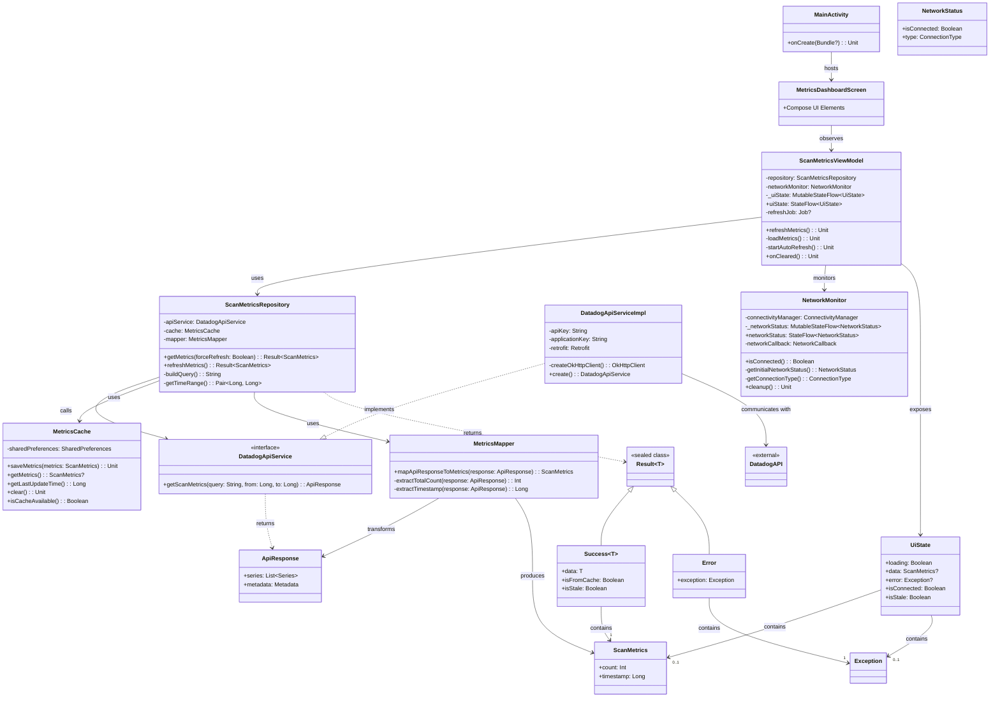

# ScanMonitorApps Component Diagrams

## Introduction

This document provides component diagrams for the ScanMonitorApps application, illustrating the relationships and interactions between different modules and classes. The diagrams follow the MVVM architecture pattern with Repository and use Mermaid notation for clarity.

This document complements the [High-Level Architecture](high_level_architecture.md) by providing more detailed views of specific components and their relationships. While the high-level architecture document focuses on the overall structure and patterns, this document delves into specific class relationships, methods, and interactions.

## High-Level Component Diagram

The following diagram shows the high-level components of the ScanMonitorApps application and their interactions.



## Dependency Injection

The following diagram illustrates the dependency injection structure using Koin.


## UI Component Diagram

The following diagram shows the UI component hierarchy and composition.


## Data Flow Diagram

The following diagram illustrates the data flow through the application components.


## Network Monitoring Flow

The following diagram shows how network connectivity changes are monitored and handled.


## Auto-Refresh Flow

The following diagram illustrates the auto-refresh mechanism for periodically updating metrics data.


## Offline Mode Flow

The following diagram shows how the application handles offline mode with cached data.


## Package Structure

The following diagram illustrates the package structure of the ScanMonitorApps application.

```mermaid
classDiagram
    namespace com.jump.scanmonitor {
        class ScanMonitorApplication
        class MainActivity
    }
    
    namespace com.jump.scanmonitor.viewmodel {
        class ScanMetricsViewModel
    }
    
    namespace com.jump.scanmonitor.repository {
        class ScanMetricsRepository
    }
    
    namespace com.jump.scanmonitor.repository.mapper {
        class MetricsMapper
    }
    
    namespace com.jump.scanmonitor.service.api {
        class DatadogApiService
        class DatadogApiServiceImpl
    }
    
    namespace com.jump.scanmonitor.service.cache {
        class MetricsCache
    }
    
    namespace com.jump.scanmonitor.service.network {
        class NetworkMonitor
    }
    
    namespace com.jump.scanmonitor.model {
        class ScanMetrics
        class UiState
        class ApiResponse
        class Result
        class NetworkStatus
    }
    
    namespace com.jump.scanmonitor.ui.screens {
        class MetricsDashboardScreen
    }
    
    namespace com.jump.scanmonitor.ui.components {
        class StatusBar
        class MetricsDisplay
        class ErrorState
        class LoadingIndicator
    }
    
    namespace com.jump.scanmonitor.di {
        class AppModule
    }
    
    com.jump.scanmonitor --|> com.jump.scanmonitor.viewmodel
    com.jump.scanmonitor --|> com.jump.scanmonitor.ui.screens
    com.jump.scanmonitor.viewmodel --|> com.jump.scanmonitor.repository
    com.jump.scanmonitor.viewmodel --|> com.jump.scanmonitor.service.network
    com.jump.scanmonitor.viewmodel --|> com.jump.scanmonitor.model
    com.jump.scanmonitor.repository --|> com.jump.scanmonitor.service.api
    com.jump.scanmonitor.repository --|> com.jump.scanmonitor.service.cache
    com.jump.scanmonitor.repository --|> com.jump.scanmonitor.repository.mapper
    com.jump.scanmonitor.repository --|> com.jump.scanmonitor.model
    com.jump.scanmonitor.repository.mapper --|> com.jump.scanmonitor.model
    com.jump.scanmonitor.ui.screens --|> com.jump.scanmonitor.ui.components
    com.jump.scanmonitor.ui.screens --|> com.jump.scanmonitor.viewmodel
    com.jump.scanmonitor.ui.screens --|> com.jump.scanmonitor.model
    com.jump.scanmonitor.service.api --|> com.jump.scanmonitor.model
    com.jump.scanmonitor.service.cache --|> com.jump.scanmonitor.model
    com.jump.scanmonitor.service.network --|> com.jump.scanmonitor.model
    com.jump.scanmonitor.di --|> com.jump.scanmonitor.viewmodel
    com.jump.scanmonitor.di --|> com.jump.scanmonitor.repository
    com.jump.scanmonitor.di --|> com.jump.scanmonitor.service.api
    com.jump.scanmonitor.di --|> com.jump.scanmonitor.service.cache
    com.jump.scanmonitor.di --|> com.jump.scanmonitor.service.network
    com.jump.scanmonitor.di --|> com.jump.scanmonitor.repository.mapper
```

## State Management

The following diagram shows how state flows through the application using Kotlin StateFlow.


## Conclusion

The component diagrams presented in this document illustrate the MVVM architecture of the ScanMonitorApps application with a Repository pattern. The application follows a client-only architecture with direct integration to the Datadog API and implements robust offline capabilities through local caching. The reactive UI updates are handled through StateFlow, providing a clean separation of concerns and a responsive user experience.

These diagrams serve as a comprehensive reference for developers working on the application, making it easier to understand the component relationships and data flows. They complement the high-level architecture document by providing more detailed views of specific components and their interactions.