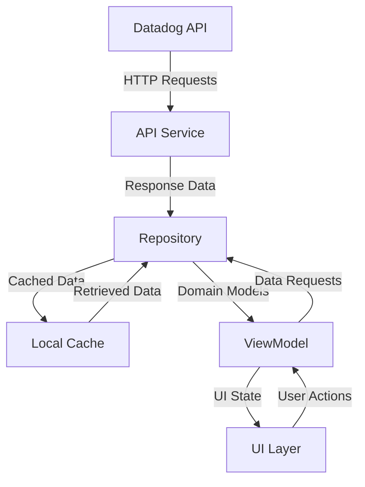
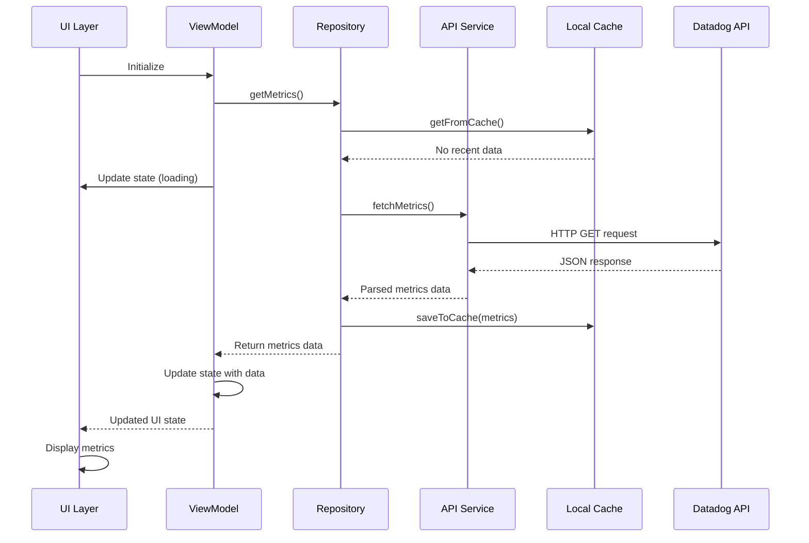
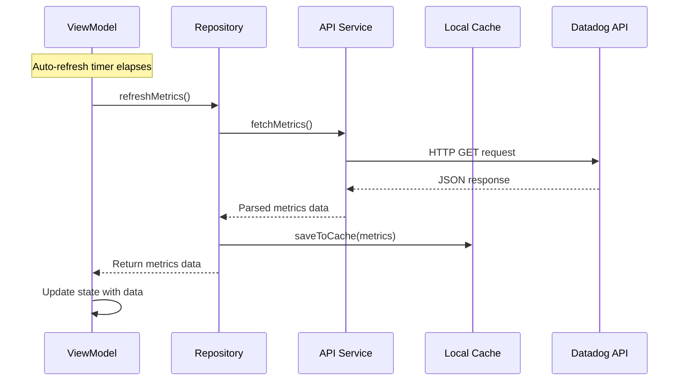
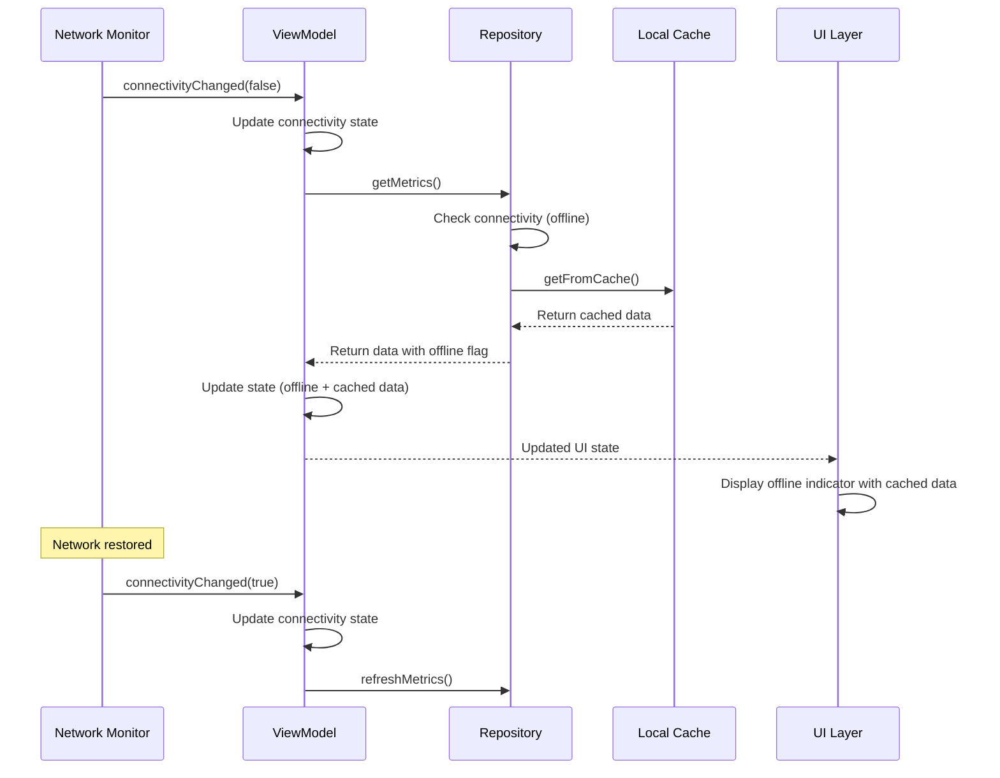
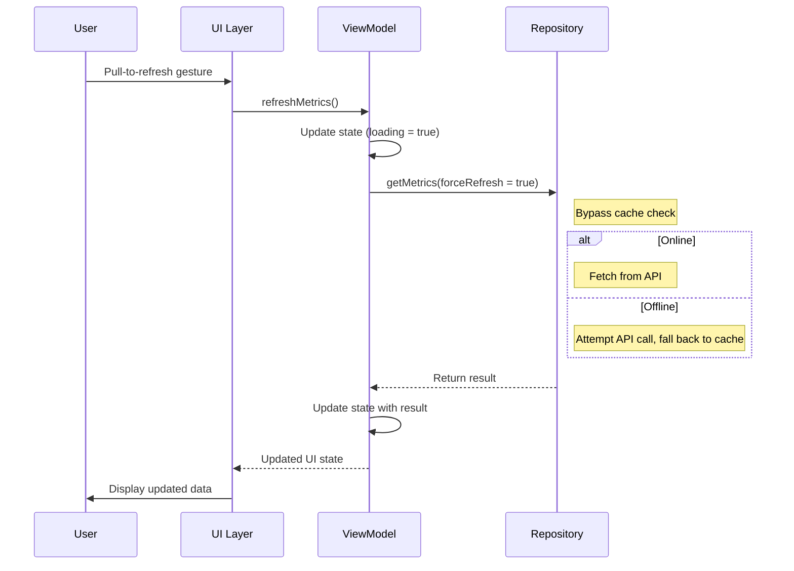
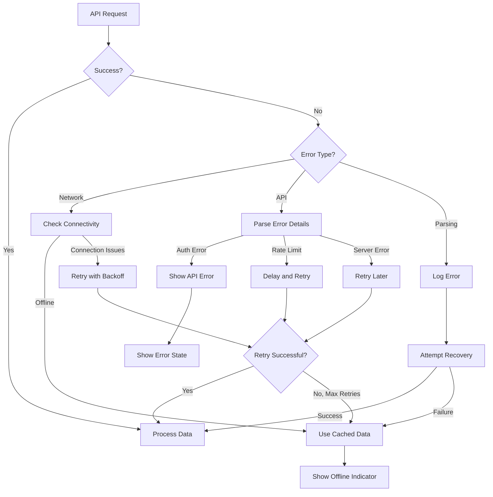
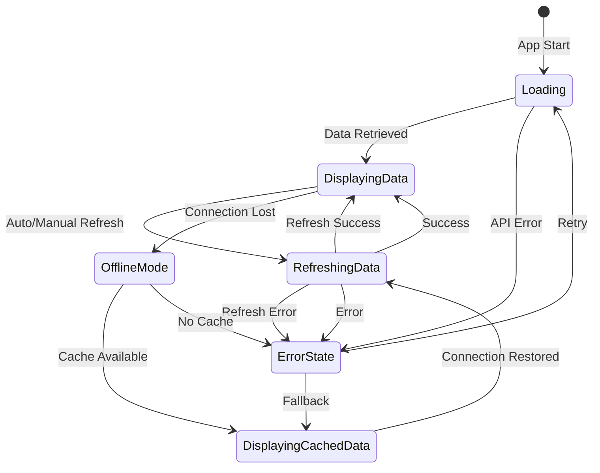

# ScanMonitorApps Data Flow Architecture

## 1. Overview

ScanMonitorApps implements a unidirectional data flow architecture based on the MVVM (Model-View-ViewModel) pattern. This architecture provides clear separation of concerns, making the application easier to develop, test, and maintain. The data flow is designed to ensure users have access to scanning metrics even in challenging network environments common at stadium venues.



## 2. Key Components

The application's data flow involves several key components:

### 2.1 Data Sources

- **Datadog API**: External source for real-time scanning metrics
- **Local Cache**: SharedPreferences storage for offline access to previously fetched data

### 2.2 Data Flow Components

- **API Service**: Handles communication with the Datadog API
- **Repository**: Coordinates between data sources and implements data retrieval strategy
- **ViewModel**: Processes data and exposes UI state
- **UI Layer**: Displays data and captures user actions

### 2.3 Data Models

- **API Models**: Representations of Datadog API responses
- **Domain Models**: Internal data structures used across the application
- **UI State**: Representation of the current UI state including data, loading, and error states

## 3. Normal Data Flow (Online)

Under normal circumstances with network connectivity, data flows through the application as follows:

1. The UI Layer initializes the ViewModel when the application starts
2. The ViewModel requests data from the Repository
3. The Repository checks for fresh cached data (< 5 minutes old)
   - If fresh cache exists, returns it immediately while fetching updated data in the background
   - If no fresh cache exists, shows loading state while fetching data
4. The Repository requests data from the API Service
5. The API Service constructs an HTTP request to the Datadog API with:
   - Authentication headers (API key and Application key)
   - Query parameters for scan metrics over the last 2 hours
6. The Datadog API returns metrics data in JSON format
7. The API Service parses the response and transforms it into domain models
8. The Repository stores the retrieved data in the local cache with a timestamp
9. The Repository returns the formatted data to the ViewModel
10. The ViewModel updates its state with the new data
11. The UI observes state changes and updates the display



## 4. Auto-Refresh Data Flow

The application automatically refreshes data at regular intervals (every 5 minutes):

1. The ViewModel initializes a coroutine-based timer when created
2. When the timer elapses, the ViewModel initiates a refresh operation
3. The Repository fetches fresh data from the Datadog API
4. The UI is updated with new data while maintaining a smooth user experience



## 5. Offline Mode Data Flow

When network connectivity is unavailable, the application gracefully degrades to offline mode:

1. The Network Monitor detects lack of connectivity and updates the ViewModel
2. The ViewModel updates its state to reflect offline status
3. When data is requested, the Repository detects offline status
4. The Repository retrieves the most recent data from the local cache
5. The Repository returns cached data with an "offline" flag
6. The ViewModel updates its state with cached data and offline status
7. The UI displays cached data with appropriate offline indicators
8. The Network Monitor continues to observe connectivity status
9. When connectivity is restored, the application automatically refreshes data



## 6. Manual Refresh Data Flow

Users can manually refresh data with a pull-to-refresh gesture:

1. User performs pull-to-refresh gesture in the UI
2. The UI triggers a refresh action in the ViewModel
3. The ViewModel initiates a forced refresh operation
4. The Repository bypasses its caching logic and directly requests fresh data
5. The UI displays a loading indicator during the refresh
6. When data is retrieved, the normal data flow resumes



## 7. Data Caching Strategy

The application implements a strategic caching approach to balance data freshness with network efficiency:

### 7.1 Cache Storage

- **Storage Mechanism**: Android SharedPreferences
- **Cache Format**: JSON-serialized metrics data with timestamp
- **Cache Size**: Minimal (single metrics object with count and timestamp)

### 7.2 Cache Policies

- **Cache Duration**: Indefinite (never expires, but freshness is tracked)
- **Freshness Window**: Data less than 5 minutes old is considered "fresh"
- **Stale Data Handling**: Data older than 5 minutes is marked as "stale" with UI indicators
- **Cache Invalidation**: Only upon successful retrieval of fresh data
- **Cache Initialization**: Empty on first install

### 7.3 Cache Access Patterns

- **Cache-First Strategy**: Check cache before API for faster initial display
- **Cache-While-Revalidate**: Return cached data while fetching fresh data in background
- **Cache-As-Fallback**: Use cached data when API requests fail
- **Forced Refresh**: Bypass cache check for manual refresh operations

## 8. Error Handling in Data Flow

The application implements robust error handling to maintain functionality despite network issues, API failures, or other errors:

### 8.1 Error Types

- **Network Errors**: Connectivity issues, timeouts
- **API Errors**: Authentication failures, rate limiting, server errors
- **Parsing Errors**: Malformed responses, unexpected data formats
- **Cache Errors**: Storage access failures, corrupted data

### 8.2 Error Handling Strategies

- **Graceful Degradation**: Fall back to cached data when errors occur
- **Retry Mechanism**: Implement exponential backoff for transient errors
- **Error Propagation**: Pass error states through the data flow for UI feedback
- **Recovery Actions**: Provide user-initiated retry options



## 9. State Management and UI Updates

The application uses a unidirectional data flow pattern for state management:

### 9.1 State Objects

```kotlin
// Example State definition
data class UiState(
    val loading: Boolean = false,
    val data: ScanMetrics? = null,
    val error: Exception? = null,
    val isConnected: Boolean = true,
    val isStale: Boolean = false
)

data class ScanMetrics(
    val count: Int,
    val timestamp: Long = System.currentTimeMillis()
)
```

### 9.2 State Flow

1. The ViewModel maintains a single source of truth for UI state using StateFlow
2. All state modifications happen within the ViewModel
3. The UI observes state changes and reacts accordingly
4. User actions in the UI trigger ViewModel methods
5. The ViewModel updates state based on Repository responses



## 10. Complete Data Flow Sequence

This sequence diagram illustrates the complete data flow from application launch through various scenarios:

```mermaid
sequenceDiagram
    participant User
    participant UI as UI Layer
    participant VM as ViewModel
    participant Repo as Repository
    participant API as API Service
    participant Cache as Local Cache
    participant NM as Network Monitor
    participant Datadog as Datadog API
    
    User->>UI: Opens application
    UI->>VM: Initialize
    VM->>NM: Register for updates
    VM->>VM: Set initial loading state
    VM->>Repo: getMetrics()
    
    Repo->>Cache: getFromCache()
    
    alt Cache available and fresh
        Cache-->>Repo: Return cached data
        Repo-->>VM: Return data (from cache)
        VM->>VM: Update state with data
        VM-->>UI: Updated state
        UI-->>User: Display metrics
        
        Note over Repo: Refresh in background
        Repo->>API: fetchMetrics()
        API->>Datadog: HTTP GET request
        Datadog-->>API: JSON response
        API-->>Repo: Parsed metrics data
        Repo->>Cache: saveToCache(metrics)
    else No cache or stale
        Cache-->>Repo: No fresh data
        
        Repo->>API: fetchMetrics()
        
        alt API Success
            API->>Datadog: HTTP GET request
            Datadog-->>API: JSON response
            API-->>Repo: Parsed metrics data
            Repo->>Cache: saveToCache(metrics)
            Repo-->>VM: Return fresh data
            VM->>VM: Update state with data
            VM-->>UI: Updated state
            UI-->>User: Display metrics
        else API Failure
            API->>Datadog: HTTP GET request
            Datadog-->>API: Error response
            API-->>Repo: Error
            
            Repo->>Cache: getFromCache()
            
            alt Any cache available
                Cache-->>Repo: Return cached data
                Repo-->>VM: Return data with stale flag
                VM->>VM: Update state (data + stale)
                VM-->>UI: Updated state
                UI-->>User: Display metrics with stale indicator
            else No cache available
                Cache-->>Repo: No data
                Repo-->>VM: Return error
                VM->>VM: Update state (error)
                VM-->>UI: Updated state
                UI-->>User: Display error
            end
        end
    end
    
    NM->>NM: Monitor connectivity
    
    alt Connection lost
        NM->>VM: connectivityChanged(false)
        VM->>VM: Update state (offline)
        VM-->>UI: Updated state
        UI-->>User: Display offline indicator
    else Connection restored
        NM->>VM: connectivityChanged(true)
        VM->>VM: Update state (online)
        VM->>Repo: refreshMetrics()
        
        Repo->>API: fetchMetrics()
        API->>Datadog: HTTP GET request
        Datadog-->>API: JSON response
        API-->>Repo: Parsed metrics data
        Repo->>Cache: saveToCache(metrics)
        Repo-->>VM: Return fresh data
        VM->>VM: Update state with data
        VM-->>UI: Updated state
        UI-->>User: Display updated metrics
    end
    
    loop Every 5 minutes
        VM->>Repo: refreshMetrics()
        
        Repo->>API: fetchMetrics()
        API->>Datadog: HTTP GET request
        Datadog-->>API: JSON response
        API-->>Repo: Parsed metrics data
        Repo->>Cache: saveToCache(metrics)
        Repo-->>VM: Return fresh data
        VM->>VM: Update state with data
        VM-->>UI: Updated state
        UI-->>User: Display updated metrics
    end
    
    User->>UI: Pull-to-refresh gesture
    UI->>VM: refreshMetrics()
    VM->>VM: Update state (loading = true)
    VM-->>UI: Updated state
    UI-->>User: Display refresh indicator
    
    VM->>Repo: getMetrics(forceRefresh = true)
    Repo->>API: fetchMetrics()
    API->>Datadog: HTTP GET request
    Datadog-->>API: JSON response
    API-->>Repo: Parsed metrics data
    Repo->>Cache: saveToCache(metrics)
    Repo-->>VM: Return fresh data
    VM->>VM: Update state with data
    VM-->>UI: Updated state
    UI-->>User: Display updated metrics
```



## 11. Conclusion

The data flow architecture of ScanMonitorApps is designed to provide a robust, responsive experience for Jump staff monitoring scanning operations during sports games. Key characteristics include:

- **Unidirectional Data Flow**: Clear, predictable state updates
- **Resilient Operation**: Graceful handling of network issues and API errors
- **Offline Support**: Continued functionality even without connectivity
- **Efficient Updates**: Balanced approach to data freshness and network usage
- **Responsive UI**: Clear feedback on data status and network conditions

This architecture ensures that staff members have reliable access to scanning metrics, enabling them to monitor operations effectively regardless of the challenging network conditions often encountered in stadium environments.