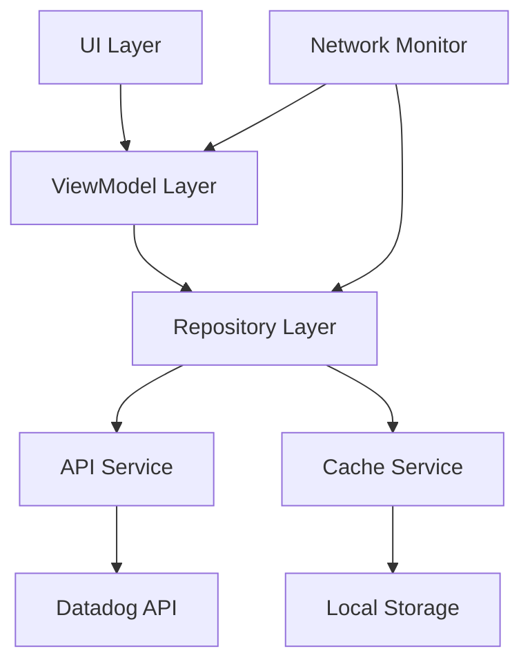
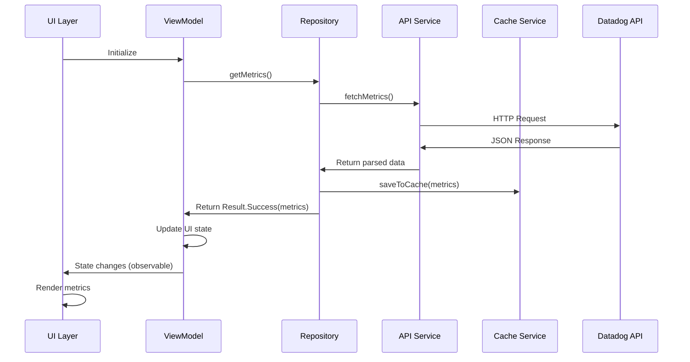
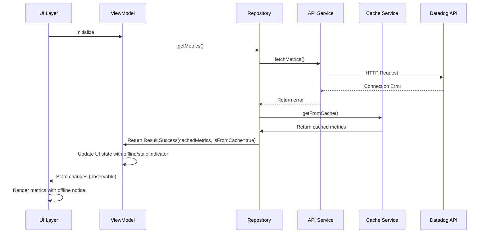
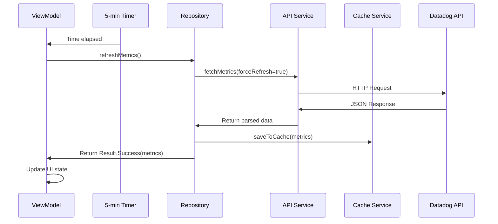
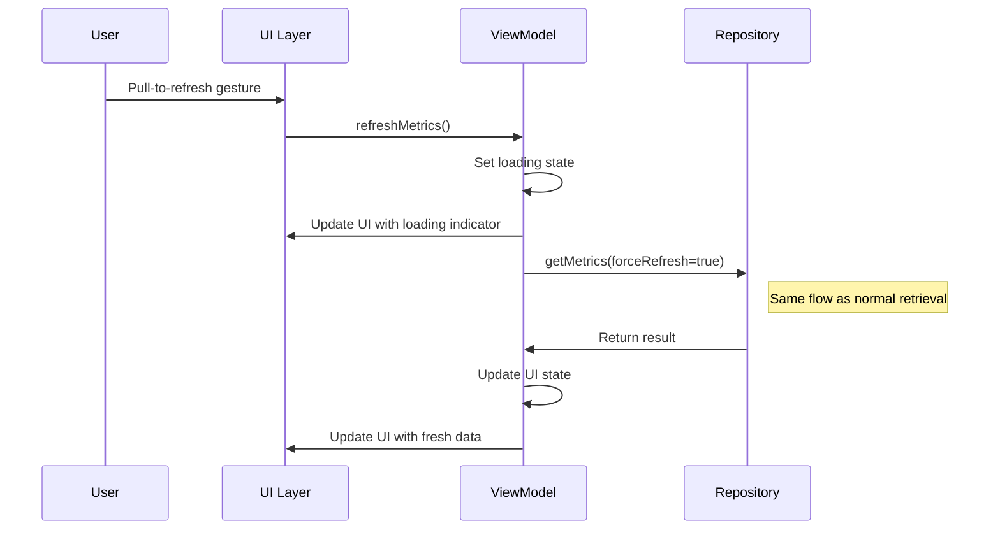
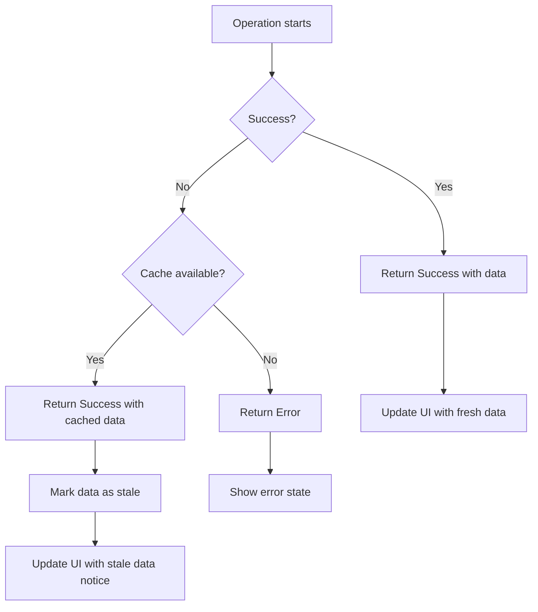
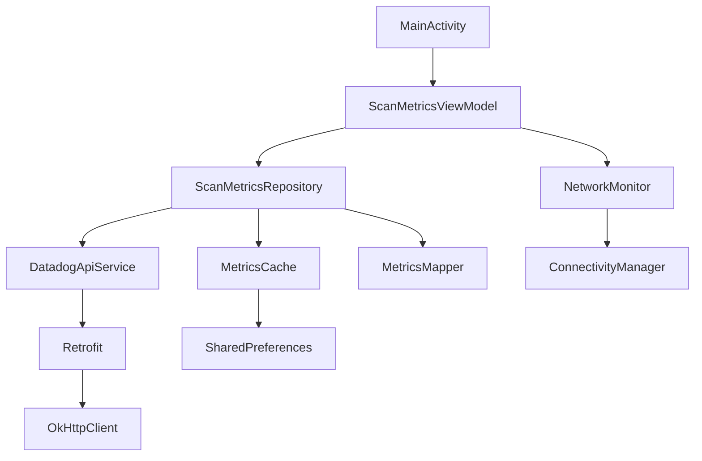
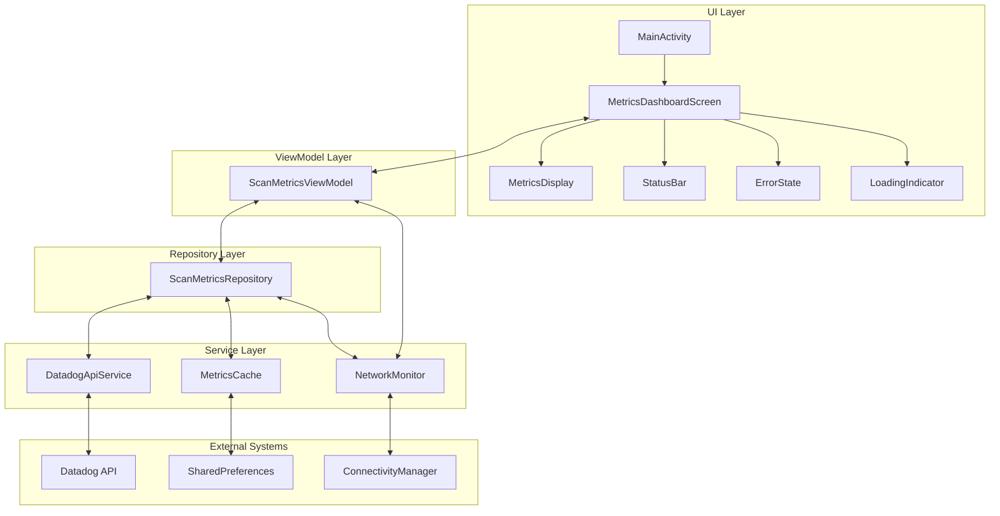
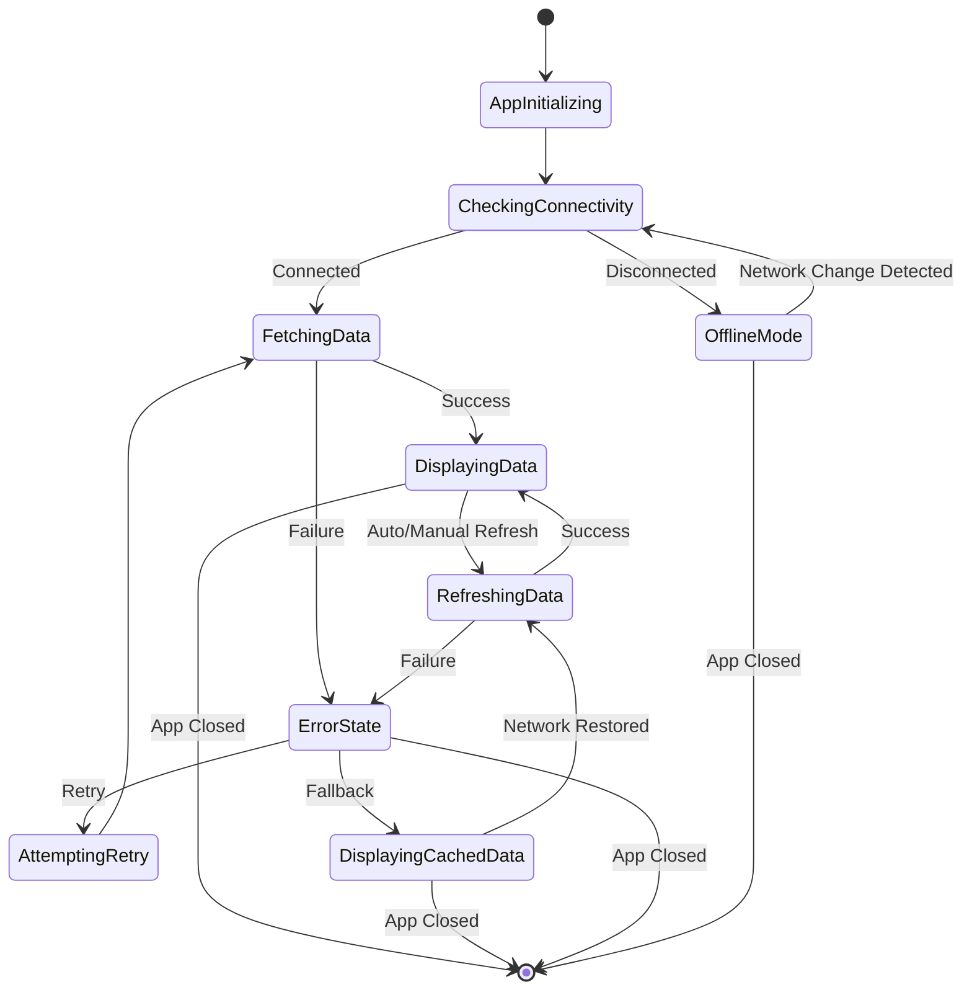
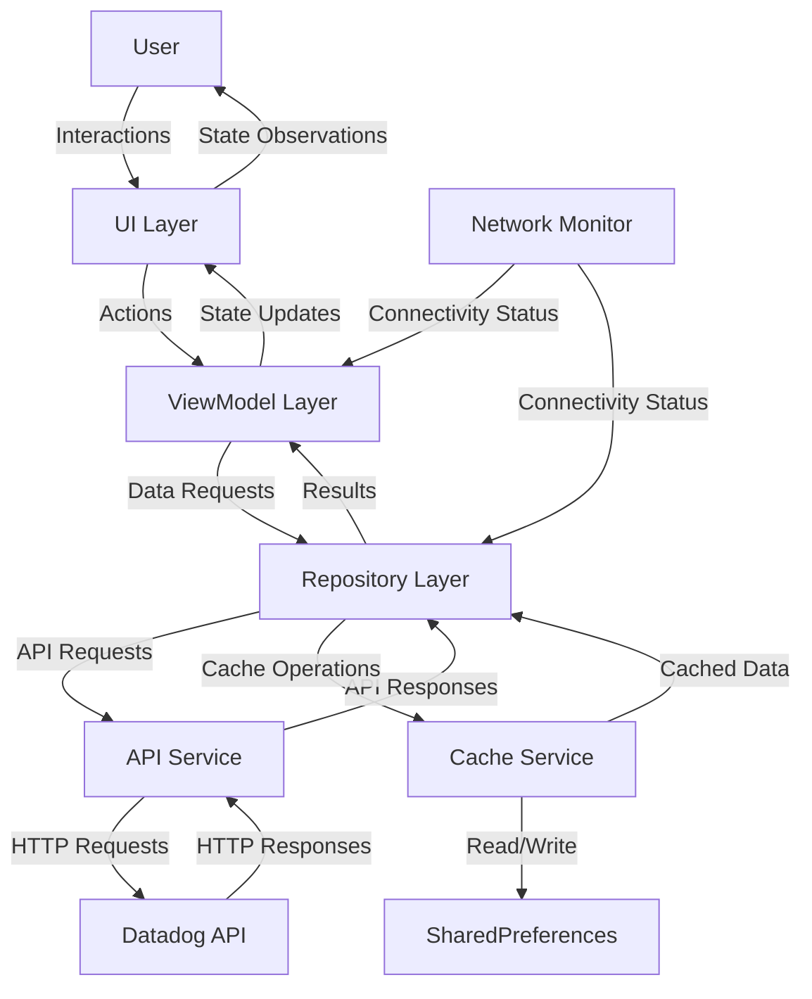

# ScanMonitorApps High-Level Architecture

## 1. Introduction

This document provides a comprehensive overview of the ScanMonitorApps architecture. ScanMonitorApps is an Android mobile application designed to help Jump staff monitor ticket scanner activities during sports games. The application addresses the critical need for real-time visibility into scanning operations, enabling staff to ensure smooth entry processes and quickly identify potential issues.

The architecture is designed with the following key goals:
- Simplicity and immediate utility
- Reliability in stadium environments
- Offline resilience
- Minimal resource consumption
- Clean separation of concerns

## 2. Architectural Overview

### 2.1 Architectural Style

ScanMonitorApps follows a client-only architecture, eliminating the need for a dedicated backend service. This lightweight approach was selected to minimize complexity while meeting the core requirement of displaying ticket scanning metrics from Datadog.

The application implements the **MVVM (Model-View-ViewModel)** architectural pattern with a **Repository Pattern** for data handling. This combination provides several benefits:

- **Separation of concerns**: Clear boundaries between UI, business logic, and data operations
- **Testability**: Components can be tested in isolation
- **Lifecycle awareness**: ViewModel survives configuration changes
- **Unidirectional data flow**: Predictable state management
- **Single source of truth**: Repository as the central point for data access

### 2.2 Key Architectural Principles

1. **Simplicity First**: Minimalist design focused on core functionality
2. **Direct Integration**: Mobile app communicates directly with Datadog API
3. **Offline Resilience**: Local caching for limited functionality when offline
4. **Reactive UI**: UI reacts to state changes in the ViewModel
5. **Immutable Data**: Immutable data structures for predictable behavior
6. **Decoupled Components**: Components interact through well-defined interfaces

### 2.3 High-Level Architecture Diagram



## 3. Core Components

The application is structured into the following layers and components:

### 3.1 UI Layer

The UI layer is responsible for displaying data to the user and handling user interactions.

**Components:**
- **MainActivity**: Entry point to the application, hosts the main UI
- **MetricsDashboardScreen**: Primary UI component displaying scan metrics
- **UI Components (Composables)**: Reusable UI elements for metrics display, status bar, loading indicators, etc.

**Key Characteristics:**
- Implemented using Jetpack Compose
- Observes ViewModel state and reacts to changes
- Handles user interactions like pull-to-refresh
- Provides visual feedback for different application states

### 3.2 ViewModel Layer

The ViewModel layer manages UI state and coordinates data operations.

**Components:**
- **ScanMetricsViewModel**: Primary ViewModel that manages the state for the metrics dashboard

**Key Characteristics:**
- Extends AndroidViewModel for lifecycle awareness
- Exposes UI state as StateFlow for reactive updates
- Coordinates data retrieval from the Repository
- Handles background refresh operations
- Manages error states and loading indicators

### 3.3 Repository Layer

The Repository layer acts as the single source of truth for data, coordinating between remote and local data sources.

**Components:**
- **ScanMetricsRepository**: Coordinates data retrieval from API and cache

**Key Characteristics:**
- Abstracts data sources from the ViewModel
- Implements data retrieval strategy (API first, cache fallback)
- Handles data caching and refreshing
- Returns results using a Result wrapper pattern
- Coordinates with NetworkMonitor for connectivity awareness

### 3.4 Service Layer

The Service layer contains components that interact with external systems and device capabilities.

**Components:**
- **DatadogApiService**: Handles communication with Datadog API
- **MetricsCache**: Manages local caching of metrics data
- **NetworkMonitor**: Tracks network connectivity status

**Key Characteristics:**
- DatadogApiService uses Retrofit for type-safe API calls
- MetricsCache implements shared preferences-based caching with timestamps
- NetworkMonitor provides real-time connectivity information via Flow

### 3.5 Model Layer

The Model layer defines the data structures used throughout the application.

**Components:**
- **ScanMetrics**: Core data model for scan metrics
- **UiState**: Represents the UI state for the metrics dashboard
- **ApiResponse**: Models for Datadog API responses
- **NetworkStatus**: Represents network connectivity state
- **Result**: Generic wrapper for operation results

**Key Characteristics:**
- Immutable data classes
- Clear separation between API models and domain models
- Type safety through sealed classes where appropriate

### 3.6 Utility Layer

The Utility layer provides helper functions and cross-cutting concerns.

**Components:**
- **MetricsMapper**: Transforms data between API and domain models
- **TimeUtils**: Utilities for time formatting and calculations

**Key Characteristics:**
- Pure functions without side effects
- Focused on specific transformation or utility tasks

## 4. Data Flow

ScanMonitorApps implements a unidirectional data flow pattern, which simplifies state management and debugging.

### 4.1 Normal Data Retrieval Flow



### 4.2 Offline/Error Flow



### 4.3 Auto-Refresh Flow



### 4.4 Manual Refresh Flow



## 5. Error Handling and Resilience

ScanMonitorApps implements robust error handling to ensure the application remains useful even in challenging network environments.

### 5.1 Error Handling Strategy

The application uses a **Result wrapper pattern** to handle operation outcomes in a type-safe manner:

```kotlin
sealed class Result<out T> {
    data class Success<T>(
        val data: T, 
        val isFromCache: Boolean = false,
        val isStale: Boolean = false
    ) : Result<T>()
    
    data class Error(val exception: Exception) : Result<Nothing>()
}
```

This pattern enables consistent error handling throughout the application.

### 5.2 Error Handling Flow



### 5.3 Offline Capabilities

The application maintains offline functionality through:

1. **Local data caching**: Metrics are stored in SharedPreferences with timestamps
2. **Connectivity monitoring**: Real-time tracking of network state changes
3. **Graceful degradation**: Clear indication when displaying cached data
4. **Automatic retry**: Attempting to refresh when connectivity is restored

### 5.4 Resilience Patterns

1. **Exponential backoff**: For API retry attempts
2. **Cache invalidation control**: Timestamps to identify stale data
3. **Network change detection**: Dynamic response to connectivity changes
4. **Graceful UI degradation**: Informative UI states for all error conditions

## 6. Dependency Management

ScanMonitorApps uses Koin for lightweight dependency injection, providing:

- Simple setup with minimal boilerplate
- Runtime dependency resolution
- Clean separation of component creation and usage
- Testability through dependency substitution

### 6.1 Dependency Injection Setup

```kotlin
// Koin module definitions
val appModule = module {
    // ViewModels
    viewModel { ScanMetricsViewModel(get(), get()) }
    
    // Repositories
    single { ScanMetricsRepository(get(), get(), get()) }
    
    // Services
    single { 
        DatadogApiServiceImpl(
            apiKey = BuildConfig.DATADOG_API_KEY,
            applicationKey = BuildConfig.DATADOG_APP_KEY
        ).create() 
    }
    
    // Utilities
    single { MetricsCache(androidContext()) }
    single { NetworkMonitor(androidContext()) }
    single { MetricsMapper() }
}
```

### 6.2 Dependency Graph



## 7. Architecture Diagrams

### 7.1 Component Interaction Diagram



### 7.2 State Transition Diagram



### 7.3 Data Flow Between Components



## 8. Conclusion

The ScanMonitorApps architecture is designed to be simple yet robust, focusing on the core requirement of providing Jump staff with real-time visibility into ticket scanning operations. By using modern Android development practices and a clean architectural approach, the application achieves:

- **Simplicity**: A focused design that addresses the specific needs of Jump staff
- **Reliability**: Robust error handling and offline capabilities
- **Maintainability**: Clear separation of concerns and well-defined component responsibilities
- **Testability**: Components that can be easily tested in isolation
- **Performance**: Efficient data handling and UI updates

This architecture supports the immediate requirements while providing flexibility for potential future enhancements, all within a lightweight client-only approach that eliminates the need for backend development.